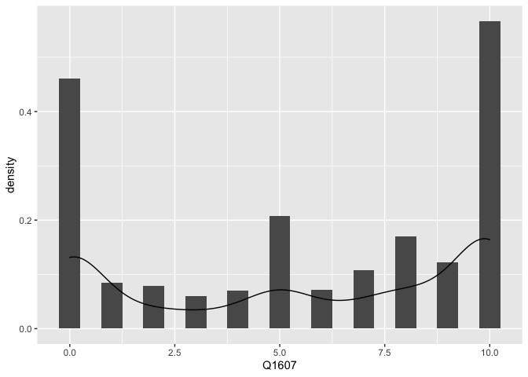
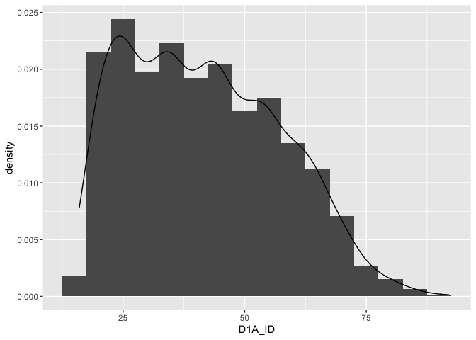
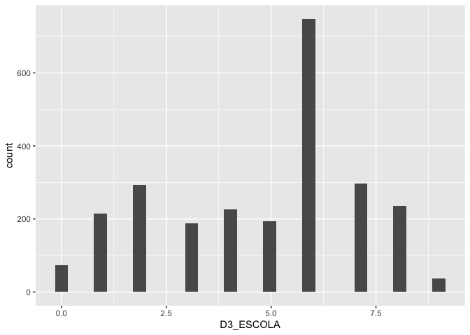
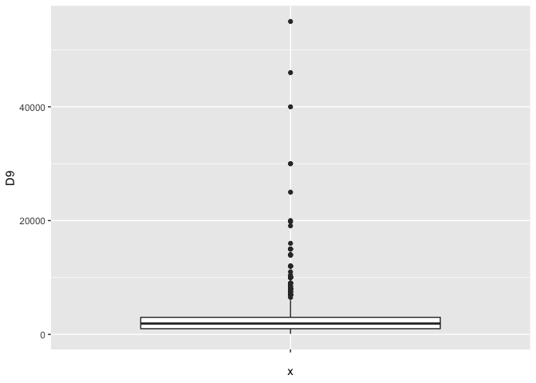
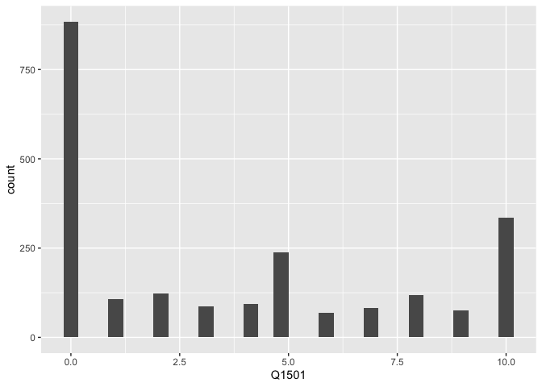
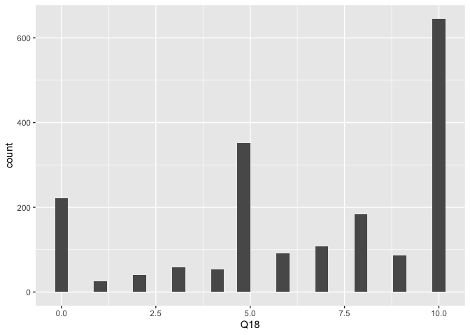

Exercicio 6
================
Gabriela Vilela

### Neste exercício usaremos o banco de dados do ESEB 2018. Para maiores detalhes sobre o survey, ver neste [link](https://www.cesop.unicamp.br/por/eseb). O questionário da pesquisa de 2018 está [aqui](https://www.cesop.unicamp.br/vw/1IMr0S64wNQ_MDA_91ea3_/quest_04622.pdf) e pode ser consultado para ter maiores detalhes sobre as variáveis.

### O banco de dados está disponível no site do CESOP para usuários cadastrados. Para facilitar o acesso, deixei o banco de dados dispónivel no seguinte endereço: <https://github.com/MartinsRodrigo/Analise-de-dados/raw/master/04622.sav>

### Baixe o banco de dados pelo R

### setwd(Macintosh HD\\Usuários\\gabrielavilela\\Pública\\Exercícios Análise de Dados)

### O banco foi feito em SPSS e está em formato SAV. Carregue-o

``` r
url <- "https://github.com/MartinsRodrigo/Analise-de-dados/raw/master/04622.sav"

library(poliscidata)

library(tidyverse)
```

    ## ── Attaching packages ─────────────────────────────────────────────────────────────────────────────── tidyverse 1.3.0 ──

    ## ✓ ggplot2 3.3.2     ✓ purrr   0.3.4
    ## ✓ tibble  3.0.1     ✓ dplyr   1.0.0
    ## ✓ tidyr   1.1.0     ✓ stringr 1.4.0
    ## ✓ readr   1.3.1     ✓ forcats 0.5.0

    ## ── Conflicts ────────────────────────────────────────────────────────────────────────────────── tidyverse_conflicts() ──
    ## x dplyr::filter() masks stats::filter()
    ## x dplyr::lag()    masks stats::lag()

``` r
library(haven)

download.file(url, "banco.sav", mode = "wb")

banco <- read_sav("banco.sav")
```

### Utilize as funções para observar o banco de dados

``` r
glimpse(banco) 
```

    ## Rows: 2,506
    ## Columns: 286
    ## $ A1_Nquest           <dbl> 1, 2, 3, 4, 5, 6, 7, 8, 9, 10, 11, 12, 13, 14, 15…
    ## $ DIAENTR             <dbl> 15, 15, 15, 16, 16, 16, 16, 17, 17, 17, 17, 17, 1…
    ## $ MESENTR             <dbl+lbl> 11, 11, 11, 11, 11, 11, 11, 11, 11, 11, 11, 1…
    ## $ ANOENTR             <dbl> 2018, 2018, 2018, 2018, 2018, 2018, 2018, 2018, 2…
    ## $ D1A_ID              <dbl> 41, 23, 21, 39, 64, 45, 18, 29, 25, 31, 23, 45, 5…
    ## $ D1A_FAIXAID         <dbl+lbl> 4, 2, 2, 4, 6, 5, 2, 3, 3, 3, 2, 5, 6, 3, 6, …
    ## $ D2_SEXO             <dbl+lbl> 2, 1, 2, 1, 1, 2, 2, 1, 2, 1, 1, 1, 2, 2, 1, …
    ## $ D3_ESCOLA           <dbl+lbl> 5, 5, 6, 3, 0, 0, 4, 8, 8, 6, 2, 2, 1, 2, 6, …
    ## $ RAMOATIV            <dbl+lbl>  6,  4, 10,  3,  1,  7, 10,  5,  4,  7, 10, 1…
    ## $ RAMOCHEFEF          <dbl+lbl> 99, 99, 99, 99, 99, 99, 99, 99, 99, 99, 99, 9…
    ## $ OCUPA               <dbl+lbl> 2, 1, 4, 3, 3, 1, 4, 2, 1, 1, 4, 4, 4, 4, 3, …
    ## $ UF                  <dbl+lbl> 12, 12, 12, 12, 12, 12, 12, 12, 12, 12, 12, 1…
    ## $ CID                 <dbl+lbl> 1, 1, 1, 1, 1, 1, 1, 1, 1, 1, 1, 1, 1, 1, 2, …
    ## $ REG                 <dbl+lbl> 1, 1, 1, 1, 1, 1, 1, 1, 1, 1, 1, 1, 1, 1, 1, …
    ## $ Q1                  <dbl+lbl> 4, 4, 4, 4, 1, 4, 4, 3, 4, 2, 3, 3, 3, 4, 3, …
    ## $ Q2                  <dbl+lbl> 3, 3, 4, 3, 4, 3, 4, 3, 4, 2, 3, 3, 4, 4, 3, …
    ## $ Q3                  <dbl+lbl> 2, 3, 3, 2, 1, 2, 4, 2, 4, 1, 5, 2, 3, 5, 1, …
    ## $ Q401                <dbl+lbl> 3, 2, 5, 1, 4, 2, 2, 1, 2, 3, 4, 1, 2, 1, 1, …
    ## $ Q402                <dbl+lbl> 1, 1, 3, 1, 1, 1, 1, 1, 1, 1, 1, 1, 1, 2, 1, …
    ## $ Q403                <dbl+lbl> 5, 1, 5, 3, 5, 3, 5, 5, 1, 5, 4, 5, 2, 5, 5, …
    ## $ Q404                <dbl+lbl> 1, 1, 1, 1, 1, 1, 2, 1, 1, 1, 4, 1, 3, 1, 1, …
    ## $ Q405                <dbl+lbl> 3, 3, 3, 1, 1, 3, 4, 5, 1, 5, 2, 2, 5, 5, 1, …
    ## $ Q406                <dbl+lbl> 1, 1, 3, 1, 4, 1, 2, 1, 2, 1, 1, 1, 2, 1, 4, …
    ## $ Q407                <dbl+lbl> 1, 1, 1, 1, 1, 1, 1, 1, 1, 1, 1, 1, 1, 1, 1, …
    ## $ Q501                <dbl+lbl> 3, 3, 3, 3, 4, 2, 4, 1, 2, 2, 2, 5, 3, 1, 1, …
    ## $ Q502                <dbl+lbl> 1, 4, 2, 2, 2, 4, 3, 1, 1, 1, 5, 5, 2, 3, 5, …
    ## $ Q503                <dbl+lbl> 2, 2, 1, 3, 1, 8, 3, 5, 2, 2, 2, 5, 3, 2, 5, …
    ## $ Q504                <dbl+lbl> 3, 5, 1, 3, 3, 2, 5, 1, 4, 4, 4, 1, 3, 1, 1, …
    ## $ Q505                <dbl+lbl> 3, 3, 3, 3, 4, 5, 4, 1, 5, 4, 5, 4, 3, 1, 1, …
    ## $ Q601                <dbl+lbl> 1, 1, 1, 1, 1, 1, 4, 4, 2, 1, 3, 1, 2, 4, 1, …
    ## $ Q602                <dbl+lbl> 1, 3, 1, 3, 3, 1, 2, 1, 1, 3, 1, 2, 4, 3, 1, …
    ## $ Q603                <dbl+lbl> 1, 3, 1, 1, 1, 1, 3, 1, 1, 2, 2, 3, 3, 4, 1, …
    ## $ Q604                <dbl+lbl> 1, 2, 2, 1, 1, 1, 1, 1, 2, 1, 1, 1, 4, 2, 1, …
    ## $ Q7                  <dbl+lbl> 1, 1, 1, 1, 1, 1, 1, 1, 1, 1, 1, 1, 2, 3, 4, …
    ## $ Q8                  <dbl+lbl> 1, 2, 3, 2, 1, 1, 3, 1, 1, 1, 1, 1, 3, 1, 1, …
    ## $ Q9                  <dbl+lbl> 5, 5, 5, 5, 5, 5, 5, 5, 4, 5, 4, 5, 4, 5, 5, …
    ## $ Q10A                <dbl+lbl> 5, 5, 5, 1, 1, 5, 5, 1, 5, 5, 5, 5, 5, 5, 5, …
    ## $ Q10B                <dbl+lbl> 99, 99, 99, 17, 13, 99, 99, 17, 99, 99, 99, 9…
    ## $ Q11                 <dbl+lbl> 5, 3, 5, 5, 5, 5, 5, 5, 5, 4, 4, 4, 3, 5, 5, …
    ## $ Q12P1_A             <dbl+lbl> 1, 1, 1, 1, 1, 1, 1, 1, 1, 7, 6, 1, 1, 1, 1, …
    ## $ Q12P1_B             <dbl+lbl>  9,  9,  9,  9,  9,  9,  9,  9,  9, 99, 99,  …
    ## $ Q12P2_A             <dbl+lbl> 1, 1, 1, 1, 1, 1, 1, 1, 1, 4, 6, 1, 1, 1, 1, …
    ## $ Q12P2_B             <dbl+lbl>  2,  2,  2,  2,  2,  2,  2,  2,  2, 99, 99,  …
    ## $ Q12G_1A             <dbl+lbl> 9950, 1203, 9998, 1203, 1203, 1203, 1203, 120…
    ## $ Q12G_2              <dbl+lbl> 9999, 9999, 9999, 9999, 9999, 9999, 9999, 999…
    ## $ Q12S1               <dbl+lbl> 1206, 1203, 9998, 1206, 1206, 1201, 1204, 120…
    ## $ Q12S2               <dbl+lbl> 9998, 1202, 9998, 1202, 1202, 1206, 1201, 120…
    ## $ Q12CD               <dbl+lbl> 2037, 9950, 9998, 9998, 9998, 2038, 9960,  76…
    ## $ Q12CD_recode        <dbl+lbl>   1,   4,   3,   3,   3,   1,   4,   1,   1, …
    ## $ Q12AL               <dbl+lbl> 9998, 2084, 9998, 1174, 9998, 1092, 9960,  76…
    ## $ Q12AL_recode        <dbl+lbl>   3,   1,   3,   1,   3,   1,   4,   1,   1, …
    ## $ Q13A                <dbl+lbl>  1,  5,  1,  1,  1,  1,  3,  1,  1,  1,  1,  …
    ## $ Q13B                <dbl+lbl>  2, 99,  2,  2,  7, 98, 99,  2, 98,  1,  2,  …
    ## $ Q13B_2              <dbl+lbl>  4,  5,  1,  1,  1,  1,  3,  1,  1,  1,  1,  …
    ## $ Q13B2A              <dbl+lbl> 99, 99,  2,  2,  1,  2, 99,  2, 60,  1,  2,  …
    ## $ Q13G1               <dbl+lbl> 9950, 9999, 1204, 1204, 1203, 1204, 9999, 120…
    ## $ Q13G2               <dbl+lbl> 9999, 9999, 1204, 1204, 1203, 1204, 9999, 120…
    ## $ Q13S                <dbl+lbl> 9950, 9999, 1203, 1201, 1203, 1202, 9999, 120…
    ## $ Q13CD               <dbl+lbl> 9950, 9999, 9998, 1175, 9998, 9998, 9999, 999…
    ## $ Q13CD_recode        <dbl+lbl>   4, 999,   3,   2,   3,   3, 999,   3,   1, …
    ## $ Q13AL               <dbl+lbl> 9950, 9999, 9998, 9998,  770, 9998, 9999,  83…
    ## $ Q13AL_recode        <dbl+lbl>   4, 999,   3,   3,   3,   3, 999,   3,   3, …
    ## $ Q14A                <dbl+lbl> 5, 5, 4, 5, 5, 5, 5, 5, 3, 5, 5, 2, 3, 5, 3, …
    ## $ Q14B                <dbl+lbl> 5, 5, 5, 5, 5, 5, 4, 5, 4, 5, 5, 5, 1, 5, 5, …
    ## $ Q1501               <dbl+lbl>  1,  0,  0,  0,  0, 10,  0, 96,  2,  0,  0,  …
    ## $ Q1502               <dbl+lbl> 96,  5, 96,  0,  5,  5, 96, 96, 96,  4,  0,  …
    ## $ Q1503               <dbl+lbl> 96, 96,  2, 96,  8, 96, 98, 96,  5,  2,  0, 9…
    ## $ Q1504               <dbl+lbl> 96, 96, 96,  0, 96, 96, 96, 96, 96,  2,  0,  …
    ## $ Q1505               <dbl+lbl>  1,  0,  3,  0, 10, 10,  0, 96,  8,  5,  6,  …
    ## $ Q1506               <dbl+lbl> 98, 96, 96,  0, 96,  5,  0, 96,  5,  8,  0,  …
    ## $ Q1507               <dbl+lbl> 96, 96, 96,  0, 96, 96,  0, 96, 96,  6,  0, 9…
    ## $ Q1508               <dbl+lbl>  1,  0, 96,  0,  7, 96,  0, 96,  8,  8,  4,  …
    ## $ Q1509               <dbl+lbl> 96,  0, 96,  0, 96, 96, 96, 96, 96, 96,  0, 9…
    ## $ Q1510               <dbl+lbl> 96, 96, 96, 96, 96, 96, 96, 96, 96, 96,  0, 9…
    ## $ Q1511               <dbl+lbl>  1, 96, 96,  0, 10, 96,  0, 96,  3, 96,  5, 9…
    ## $ Q1512               <dbl+lbl> 96,  9,  2, 10, 96,  5, 96, 10,  7,  8,  5,  …
    ## $ Q1513               <dbl+lbl>  1, 96, 96,  0, 96, 96,  0, 96, 96,  1,  0, 9…
    ## $ Q1514               <dbl+lbl> 96, 96,  3,  0,  8, 96, 10, 96,  4,  0,  0,  …
    ## $ Q1515               <dbl+lbl> 96, 96, 96,  0, 96, 96, 96, 96, 96,  0,  0,  …
    ## $ Q1516               <dbl+lbl> 96, 96, 96, 96, 96, 96, 96, 96, 96,  8,  0, 9…
    ## $ Q1517               <dbl+lbl> 96, 96,  2,  0, 96, 96,  7, 96,  5, 96,  6, 9…
    ## $ Q1518               <dbl+lbl>  1, 96, 96,  0, 96,  5, 96, 96,  5,  5,  0,  …
    ## $ Q1519               <dbl+lbl> 96, 96, 96, 96, 96, 96,  0, 96,  5,  2,  0, 9…
    ## $ Q1520               <dbl+lbl> 96, 96, 96, 96,  5,  5,  0, 96,  7,  5,  4, 9…
    ## $ Q1521               <dbl+lbl> 96, 96, 96,  0,  8, 96,  4, 96,  4,  8,  0, 9…
    ## $ Q1522               <dbl+lbl> 96, 96, 96,  0, 96, 96,  1, 96,  6,  5,  0, 9…
    ## $ Q1523               <dbl+lbl> 96, 96, 96, 96,  4, 96, 98, 96,  4,  2,  0,  …
    ## $ Q1524               <dbl+lbl> 96, 96, 96,  0, 96, 96,  0, 96, 96,  1,  0, 9…
    ## $ Q1525               <dbl+lbl> 96, 96, 96,  0, 10, 96, 96, 96, 96, 96,  0, 9…
    ## $ Q1526               <dbl+lbl> 96, 96, 96, 96, 96, 96, 96, 96, 96,  2,  5, 9…
    ## $ Q1601               <dbl+lbl>  1,  0,  0,  0, 96,  5,  8,  0,  1,  8,  0,  …
    ## $ Q1602               <dbl+lbl>  0,  0, 96, 96, 96, 96, 96,  0, 96,  0,  0,  …
    ## $ Q1603               <dbl+lbl>  1,  0, 96,  0, 96, 96,  0,  0, 96,  0,  0,  …
    ## $ Q1604               <dbl+lbl>  0,  3,  3,  0, 10,  5,  0,  5,  5,  8,  0,  …
    ## $ Q1605               <dbl+lbl> 0, 0, 2, 0, 8, 5, 0, 0, 5, 0, 0, 0, 0, 0, 5, …
    ## $ Q1606               <dbl+lbl>  1,  0,  0,  0, 96, 96, 98,  6,  7,  0,  7,  …
    ## $ Q1607               <dbl+lbl> 10, 10,  3, 10, 10, 10, 10, 10,  8, 10, 10, 1…
    ## $ Q1608               <dbl+lbl>  1,  0,  0,  0, 10, 96,  6,  0,  2,  5,  8,  …
    ## $ Q1609               <dbl+lbl>  1,  0, 96, 96, 96, 96, 96,  0, 96,  0,  7,  …
    ## $ Q1610               <dbl+lbl>  1,  0,  1,  0, 10,  5,  0,  0,  0,  0,  0,  …
    ## $ Q1611               <dbl+lbl>  1,  0, 96,  0, 96, 96,  7,  0,  3,  0,  6,  …
    ## $ Q1612               <dbl+lbl>  1,  0, 96,  0, 96, 96, 96,  0, 96,  2, 96,  …
    ## $ Q1613               <dbl+lbl>  1,  3, 96,  6, 96, 96,  9, 10, 96,  0,  0,  …
    ## $ Q1614               <dbl+lbl>  1,  0, 96,  0, 96, 96, 96,  0, 96, 96,  0,  …
    ## $ Q1615               <dbl+lbl>  1, 96, 96, 96, 96, 96, 96,  3, 96, 96, 96,  …
    ## $ Q1616               <dbl+lbl>  1,  0,  1,  0, 96, 96, 96,  0, 96, 96, 96,  …
    ## $ Q1617               <dbl+lbl>  1,  0,  1,  0,  8, 96, 98,  0,  3,  8,  0,  …
    ## $ Q1618               <dbl+lbl>  0,  0,  0,  0,  0,  5,  0,  0,  0,  0,  0,  …
    ## $ Q1619               <dbl+lbl>  1,  0, 96,  0, 96, 96, 96,  0, 96, 96, 96,  …
    ## $ Q1620               <dbl+lbl>  1,  0, 96,  0, 96, 96, 96,  0,  3,  0,  0,  …
    ## $ Q1621               <dbl+lbl> 1, 0, 0, 0, 8, 0, 0, 0, 1, 0, 0, 0, 0, 0, 0, …
    ## $ Q1701               <dbl+lbl>  0,  0,  0,  0,  0,  5,  0,  0,  2, 10,  1,  …
    ## $ Q1702               <dbl+lbl>  0,  0, 96, 96,  5,  0, 96, 96,  8,  8, 96,  …
    ## $ Q1703               <dbl+lbl>  1,  0,  0,  0,  5,  0,  4, 96, 10,  7,  3,  …
    ## $ Q1704               <dbl+lbl>  0, 96, 96,  0, 96,  0, 96, 96,  5, 96,  6, 9…
    ## $ Q1705               <dbl+lbl>  0,  0, 10,  4,  5,  5,  2, 96,  8,  7,  7,  …
    ## $ Q1706               <dbl+lbl>  2, 96, 96,  0, 96,  0, 96,  2,  4,  5,  6, 9…
    ## $ Q1707               <dbl+lbl>  2,  0, 96, 96, 96,  0, 96, 96,  3,  5, 96, 9…
    ## $ Q1708               <dbl+lbl>  2,  0, 96,  0,  4,  0,  3,  5,  1,  1,  5,  …
    ## $ Q1709               <dbl+lbl>  3,  0, 96, 96, 96,  0, 96,  5,  2, 96,  6, 9…
    ## $ Q1710               <dbl+lbl>  0, 96, 96,  0,  5,  0, 96, 96,  6, 96, 96, 9…
    ## $ Q1711               <dbl+lbl>  2,  0, 96,  0, 10,  0, 96, 96,  6,  6,  7, 9…
    ## $ Q1712               <dbl+lbl>  4,  8,  0, 10,  5,  5, 96, 10,  3,  3,  5, 1…
    ## $ Q1713               <dbl+lbl>  2,  0, 96,  1, 96,  0, 96,  2,  5, 96, 96, 9…
    ## $ Q1714               <dbl+lbl>  2,  0,  0,  1,  5,  5,  8,  0, 10, 10,  3,  …
    ## $ Q1715               <dbl+lbl> 96, 96, 96, 96, 96,  0, 96, 96,  3, 96, 96,  …
    ## $ Q1716               <dbl+lbl>  2,  0, 96,  0,  4,  0, 96, 96,  4,  8, 96, 9…
    ## $ Q1717               <dbl+lbl>  2,  0,  0,  3,  4,  5,  4, 96,  6,  6,  6, 9…
    ## $ Q1718               <dbl+lbl>  2,  0, 96,  0,  4,  0, 96, 96,  3,  5, 96, 1…
    ## $ Q1719               <dbl+lbl>  2,  0, 96,  0, 96,  0, 96, 96,  7,  7, 96, 1…
    ## $ Q1720               <dbl+lbl>  2,  0, 10,  0,  5,  0,  9, 96,  8,  8,  4,  …
    ## $ Q1721               <dbl+lbl>  2,  0, 96,  0,  0,  0,  5, 96,  2, 96,  4, 9…
    ## $ Q1722               <dbl+lbl>  2,  0, 96, 96,  0,  0, 96, 96,  1,  3, 96, 9…
    ## $ Q1723               <dbl+lbl>  2,  0, 96,  6,  8,  0,  7,  2,  7,  3, 96,  …
    ## $ Q1724               <dbl+lbl>  0,  0,  0, 96, 96,  0, 96,  0,  5, 96, 96, 9…
    ## $ Q1725               <dbl+lbl>  2, 96, 96, 96, 96,  0, 96, 96,  7, 96, 96, 9…
    ## $ Q1726               <dbl+lbl>  1,  0, 96,  0, 96,  0, 96,  2,  4, 96,  4, 9…
    ## $ Q18                 <dbl+lbl> 10, 10, 10, 10, 10, 10,  7,  0, 10, 10, 10, 1…
    ## $ Q21                 <dbl+lbl> 5, 4, 5, 4, 5, 5, 5, 5, 4, 5, 2, 4, 4, 4, 5, …
    ## $ Q22A                <dbl+lbl> 2, 2, 2, 2, 1, 2, 2, 2, 2, 2, 2, 2, 2, 2, 2, …
    ## $ Q22B                <dbl+lbl>  2,  1,  2,  1, 99,  1,  2,  2,  2,  1,  2,  …
    ## $ Q22C                <dbl+lbl> 99, 17, 99, 17, 17, 98, 99, 99, 99, 50, 99, 1…
    ## $ Q22D                <dbl+lbl> 99,  2, 99,  2,  2, 99, 99, 99, 99,  2, 99,  …
    ## $ P1                  <dbl+lbl> 1, 1, 1, 1, 1, 2, 1, 1, 1, 1, 1, 1, 1, 1, 2, …
    ## $ P1A                 <dbl+lbl>  13,  13,  13,  13,  13, 999,  13,  13,  13, …
    ## $ D5_1                <dbl+lbl> 2, 2, 2, 2, 2, 2, 2, 1, 2, 1, 2, 2, 2, 2, 2, …
    ## $ D5_2                <dbl+lbl> 2, 2, 2, 2, 2, 2, 2, 2, 2, 1, 2, 2, 2, 2, 2, …
    ## $ P201                <dbl+lbl> 2, 2, 2, 2, 1, 2, 2, 2, 2, 2, 2, 2, 2, 2, 2, …
    ## $ P202                <dbl+lbl> 2, 2, 2, 2, 1, 2, 2, 2, 2, 2, 2, 2, 2, 2, 2, …
    ## $ P203                <dbl+lbl> 2, 2, 2, 2, 1, 2, 2, 2, 2, 2, 2, 2, 2, 2, 2, …
    ## $ P204                <dbl+lbl> 2, 2, 2, 2, 2, 2, 2, 2, 2, 1, 2, 2, 2, 2, 2, …
    ## $ P205                <dbl+lbl> 2, 2, 1, 2, 2, 2, 2, 2, 2, 2, 2, 2, 2, 2, 2, …
    ## $ P206                <dbl+lbl> 1, 2, 1, 2, 1, 1, 1, 2, 2, 1, 1, 2, 2, 2, 2, …
    ## $ P207                <dbl+lbl> 2, 2, 2, 2, 1, 2, 2, 2, 2, 2, 2, 1, 2, 2, 1, …
    ## $ P208                <dbl+lbl> 2, 2, 2, 2, 2, 2, 2, 2, 2, 1, 2, 2, 2, 2, 2, …
    ## $ P209                <dbl+lbl> 2, 2, 2, 2, 2, 2, 1, 2, 2, 2, 2, 2, 2, 2, 1, …
    ## $ P210                <dbl+lbl> 2, 2, 2, 2, 2, 2, 2, 2, 2, 2, 2, 2, 2, 2, 2, …
    ## $ P211                <dbl+lbl> 2, 2, 2, 2, 2, 2, 2, 2, 2, 2, 2, 2, 2, 2, 2, …
    ## $ P212                <dbl+lbl> 2, 2, 2, 2, 2, 2, 2, 2, 2, 1, 2, 2, 2, 2, 2, …
    ## $ P213                <dbl+lbl> 2, 2, 2, 2, 2, 2, 2, 2, 2, 2, 2, 2, 2, 2, 2, …
    ## $ P214                <dbl+lbl> 2, 2, 2, 2, 1, 2, 2, 2, 2, 2, 2, 1, 2, 2, 2, …
    ## $ P215                <dbl+lbl> 2, 2, 2, 2, 2, 2, 2, 2, 2, 2, 2, 2, 2, 2, 2, …
    ## $ P216                <dbl+lbl> 2, 2, 2, 2, 2, 2, 2, 2, 2, 2, 2, 2, 2, 2, 2, …
    ## $ P217                <dbl+lbl> 2, 2, 1, 2, 1, 2, 2, 2, 2, 2, 2, 1, 2, 2, 2, …
    ## $ P301                <dbl+lbl> 5, 2, 1, 2, 2, 1, 3, 6, 2, 2, 2, 5, 2, 2, 6, …
    ## $ P302                <dbl+lbl> 1, 2, 1, 2, 2, 2, 1, 1, 2, 2, 2, 4, 2, 1, 1, …
    ## $ P303                <dbl+lbl> 1, 2, 2, 2, 2, 1, 1, 2, 1, 2, 1, 2, 2, 2, 6, …
    ## $ P304                <dbl+lbl> 6, 2, 6, 6, 6, 6, 6, 6, 2, 6, 2, 5, 3, 6, 6, …
    ## $ P305                <dbl+lbl> 6, 1, 6, 6, 2, 6, 6, 6, 1, 6, 2, 4, 2, 6, 6, …
    ## $ P306                <dbl+lbl> 5, 2, 2, 6, 2, 2, 3, 6, 5, 2, 1, 4, 2, 5, 2, …
    ## $ P307                <dbl+lbl> 5, 6, 2, 6, 5, 6, 2, 6, 6, 5, 5, 6, 5, 6, 6, …
    ## $ P308                <dbl+lbl> 6, 5, 5, 6, 6, 6, 2, 6, 6, 6, 5, 6, 5, 6, 6, …
    ## $ P309                <dbl+lbl> 1, 2, 2, 2, 2, 1, 1, 1, 2, 6, 2, 3, 2, 2, 6, …
    ## $ P310                <dbl+lbl> 6, 2, 6, 6, 2, 6, 4, 6, 5, 6, 5, 2, 3, 2, 6, …
    ## $ P311                <dbl+lbl> 5, 6, 6, 6, 2, 1, 2, 6, 6, 6, 6, 6, 3, 6, 6, …
    ## $ P312                <dbl+lbl> 1, 2, 2, 6, 2, 1, 1, 1, 5, 2, 2, 2, 2, 1, 6, …
    ## $ P401                <dbl+lbl> 3, 1, 1, 4, 1, 1, 3, 4, 3, 3, 2, 4, 3, 3, 3, …
    ## $ P402                <dbl+lbl> 1, 3, 1, 4, 1, 3, 1, 1, 3, 3, 2, 3, 2, 1, 3, …
    ## $ P403                <dbl+lbl> 1, 1, 4, 1, 1, 1, 3, 1, 2, 4, 1, 2, 2, 1, 3, …
    ## $ P404                <dbl+lbl> 3, 1, 3, 4, 3, 4, 4, 4, 3, 4, 2, 4, 4, 3, 3, …
    ## $ P405                <dbl+lbl> 4, 3, 3, 4, 1, 4, 2, 3, 3, 4, 2, 3, 2, 3, 3, …
    ## $ P406                <dbl+lbl> 3, 3, 3, 4, 1, 1, 4, 4, 3, 4, 2, 3, 2, 3, 3, …
    ## $ P407                <dbl+lbl> 4, 3, 4, 4, 3, 4, 4, 4, 4, 4, 3, 4, 4, 3, 3, …
    ## $ P408                <dbl+lbl> 4, 3, 4, 4, 3, 4, 4, 4, 4, 4, 2, 4, 4, 3, 3, …
    ## $ P409                <dbl+lbl> 1, 1, 3, 1, 1, 1, 1, 1, 2, 4, 2, 2, 3, 1, 3, …
    ## $ P410                <dbl+lbl> 3, 3, 3, 4, 1, 4, 2, 4, 3, 4, 2, 2, 3, 3, 3, …
    ## $ P411                <dbl+lbl> 3, 4, 4, 4, 1, 4, 3, 4, 4, 4, 4, 4, 3, 3, 3, …
    ## $ P412                <dbl+lbl> 1, 3, 3, 4, 1, 4, 2, 1, 4, 3, 2, 3, 2, 3, 3, …
    ## $ P5                  <dbl+lbl> 2, 2, 2, 2, 1, 1, 2, 2, 2, 2, 1, 2, 2, 2, 2, …
    ## $ P601                <dbl+lbl> 0, 0, 0, 0, 0, 0, 9, 0, 1, 0, 4, 0, 0, 5, 0, …
    ## $ P602                <dbl+lbl> 3, 0, 0, 0, 0, 0, 5, 0, 0, 0, 3, 4, 0, 5, 0, …
    ## $ P603                <dbl+lbl> 0, 0, 0, 0, 0, 5, 1, 0, 4, 0, 4, 1, 0, 5, 0, …
    ## $ P604                <dbl+lbl>  0,  0,  0,  0,  0, 10,  7,  0,  5,  0,  3,  …
    ## $ P605                <dbl+lbl>  2,  0,  0,  0,  0, 10,  2,  0,  2,  0,  5,  …
    ## $ P606                <dbl+lbl>  0,  0,  0,  0, 10,  0,  1,  0,  2,  0,  2,  …
    ## $ P607                <dbl+lbl>  1,  3,  2,  0, 10, 10,  5,  0,  3,  8,  5,  …
    ## $ P608                <dbl+lbl>  1,  3,  1,  0, 10, 10,  2,  0,  3,  8,  5,  …
    ## $ P609                <dbl+lbl>  1,  5,  5,  0,  0,  5,  0,  0,  0,  5,  8,  …
    ## $ P610                <dbl+lbl>  0, 10,  0,  0,  0,  0,  0,  0,  4,  0,  3,  …
    ## $ P611                <dbl+lbl>  0,  0,  0,  0, 98,  0,  4,  0,  5,  0,  6,  …
    ## $ P612                <dbl+lbl>  3,  0,  0,  0, 99,  0,  9,  0,  2,  5,  5,  …
    ## $ P613                <dbl+lbl>  2,  0,  0,  0, 10, 10,  9,  0,  0,  0,  8,  …
    ## $ P614                <dbl+lbl> 2, 0, 0, 0, 0, 5, 6, 0, 0, 0, 6, 2, 0, 5, 0, …
    ## $ P615                <dbl+lbl>  0,  0,  0,  0,  0, 10,  2,  0,  0,  0,  5,  …
    ## $ P616                <dbl+lbl> 3, 0, 5, 0, 0, 0, 3, 0, 2, 0, 8, 0, 0, 5, 0, …
    ## $ P7_aberta_agregada  <dbl+lbl>  70, 998,  50,  72, 998, 998, 998,  72, 998, …
    ## $ P8                  <dbl+lbl> 8, 2, 2, 1, 2, 1, 8, 1, 3, 1, 1, 2, 8, 8, 8, …
    ## $ P9                  <dbl+lbl> 2, 1, 2, 1, 8, 2, 8, 2, 1, 1, 1, 2, 8, 8, 8, …
    ## $ P1001               <dbl+lbl> 1, 1, 2, 1, 5, 1, 2, 1, 1, 1, 5, 1, 2, 1, 1, …
    ## $ P1002               <dbl+lbl> 1, 2, 4, 1, 1, 1, 1, 1, 1, 2, 5, 1, 2, 1, 1, …
    ## $ P1003               <dbl+lbl> 1, 4, 1, 2, 3, 1, 3, 1, 2, 2, 1, 4, 4, 2, 2, …
    ## $ P1004               <dbl+lbl> 1, 1, 4, 5, 1, 1, 3, 1, 1, 1, 1, 1, 5, 2, 1, …
    ## $ P1101               <dbl+lbl> 1, 1, 2, 1, 1, 1, 2, 1, 2, 4, 1, 1, 2, 5, 1, …
    ## $ P1102               <dbl+lbl> 1, 1, 1, 1, 1, 1, 1, 1, 2, 1, 5, 1, 2, 1, 1, …
    ## $ P1103               <dbl+lbl> 1, 1, 4, 1, 5, 1, 3, 1, 4, 2, 4, 1, 3, 8, 1, …
    ## $ P1104               <dbl+lbl> 1, 1, 5, 1, 1, 1, 4, 5, 1, 1, 2, 1, 2, 5, 1, …
    ## $ P1105               <dbl+lbl> 1, 1, 5, 1, 5, 1, 4, 5, 1, 1, 5, 1, 4, 5, 5, …
    ## $ P12                 <dbl+lbl> 1, 1, 1, 1, 1, 1, 1, 1, 1, 1, 1, 1, 1, 1, 1, …
    ## $ P13_aberta_agregada <dbl+lbl>  20,  11,  10,  10,  10,  10,  25,  20, 998, …
    ## $ P14A                <dbl+lbl>  2, 99,  1, 99,  3, 99,  2, 99,  2, 99,  2, 9…
    ## $ P14B                <dbl+lbl> 99,  2, 99,  1, 99,  2, 99,  4, 99,  2, 99,  …
    ## $ P15                 <dbl+lbl> 2, 1, 1, 2, 8, 2, 8, 2, 2, 2, 1, 2, 8, 1, 2, …
    ## $ P1601               <dbl+lbl> 10, 10,  7,  9, 10, 10,  5,  7,  5,  5, 10,  …
    ## $ P1602               <dbl+lbl>  2,  1,  3,  1, 10,  5,  2,  1,  2,  2,  8,  …
    ## $ P1603               <dbl+lbl> 10,  1,  4,  1, 10,  5,  3,  1,  2,  6,  9,  …
    ## $ P1604               <dbl+lbl> 10,  1,  2,  1, 10, 10,  3,  1,  5,  3,  8,  …
    ## $ P1605               <dbl+lbl>  2, 10,  3,  1, 10,  5,  1,  1,  3,  3, 10,  …
    ## $ P1606               <dbl+lbl>  2, 10,  5,  1, 10,  5,  3,  1,  5,  4,  9,  …
    ## $ P1607               <dbl+lbl>  2, 10,  6,  1, 10, 10,  2,  1,  2,  4,  9,  …
    ## $ P1608               <dbl+lbl>  2,  1,  2,  1, 10, 10,  1,  1,  1,  6,  7,  …
    ## $ P1609               <dbl+lbl> 10, 10,  4,  1, 10,  5,  8,  1,  2,  6,  8,  …
    ## $ P1610               <dbl+lbl> 10, 10,  5,  1, 10, 10,  1,  1,  3,  5,  9,  …
    ## $ P1611               <dbl+lbl> 10,  1,  6,  1, 10,  5,  5,  1,  6,  6,  5,  …
    ## $ P1701               <dbl+lbl> 5, 5, 5, 5, 3, 4, 3, 5, 5, 1, 1, 5, 5, 5, 5, …
    ## $ P1702               <dbl+lbl> 1, 1, 1, 1, 3, 3, 1, 1, 1, 1, 1, 1, 1, 5, 1, …
    ## $ P1703               <dbl+lbl> 1, 5, 1, 5, 3, 4, 5, 5, 5, 5, 2, 5, 5, 5, 4, …
    ## $ P1704               <dbl+lbl> 5, 1, 5, 1, 3, 1, 5, 5, 1, 1, 4, 1, 2, 2, 1, …
    ## $ P1705               <dbl+lbl> 1, 2, 1, 1, 3, 1, 8, 5, 2, 3, 2, 5, 4, 5, 5, …
    ## $ P1706               <dbl+lbl> 1, 1, 2, 1, 1, 1, 8, 1, 1, 1, 1, 1, 1, 1, 5, …
    ## $ P1707               <dbl+lbl> 5, 2, 4, 5, 3, 2, 8, 2, 2, 4, 4, 5, 4, 1, 1, …
    ## $ P1708               <dbl+lbl> 1, 4, 1, 1, 3, 2, 8, 1, 2, 4, 4, 3, 2, 5, 5, …
    ## $ P1709               <dbl+lbl> 5, 5, 4, 5, 3, 2, 5, 5, 4, 4, 5, 4, 3, 5, 5, …
    ## $ P1710               <dbl+lbl> 5, 2, 4, 5, 1, 4, 8, 5, 2, 5, 2, 1, 5, 1, 5, …
    ## $ P1711               <dbl+lbl> 1, 1, 1, 1, 3, 4, 5, 5, 1, 1, 2, 1, 2, 1, 5, …
    ## $ P1712               <dbl+lbl> 1, 4, 1, 1, 3, 2, 8, 1, 2, 1, 2, 1, 2, 2, 5, …
    ## $ P1713               <dbl+lbl> 5, 2, 2, 5, 3, 2, 3, 1, 1, 1, 5, 1, 5, 2, 1, …
    ## $ P18                 <dbl+lbl> 5, 2, 2, 5, 8, 4, 1, 5, 2, 5, 1, 5, 8, 1, 5, …
    ## $ P19                 <dbl+lbl> 1, 1, 1, 1, 1, 1, 1, 1, 1, 3, 1, 1, 5, 5, 3, …
    ## $ P20                 <dbl+lbl> 1, 1, 1, 1, 1, 1, 1, 1, 2, 1, 1, 1, 2, 1, 1, …
    ## $ P2101               <dbl+lbl> 5, 1, 5, 5, 1, 2, 5, 5, 4, 5, 5, 5, 2, 5, 5, …
    ## $ P2102               <dbl+lbl> 5, 4, 5, 5, 3, 5, 5, 5, 5, 5, 5, 5, 1, 5, 1, …
    ## $ P2103               <dbl+lbl> 5, 5, 5, 5, 3, 2, 1, 5, 5, 5, 5, 5, 4, 5, 5, …
    ## $ P2104               <dbl+lbl> 5, 2, 5, 5, 1, 2, 5, 5, 5, 5, 5, 5, 5, 5, 5, …
    ## $ P2105               <dbl+lbl> 5, 5, 5, 5, 1, 2, 1, 5, 1, 5, 5, 5, 4, 5, 5, …
    ## $ P2106               <dbl+lbl> 1, 1, 2, 1, 5, 2, 8, 1, 2, 1, 4, 1, 2, 1, 1, …
    ## $ P22                 <dbl+lbl> 4, 4, 4, 4, 1, 4, 4, 4, 4, 4, 4, 4, 4, 4, 3, …
    ## $ P24                 <dbl+lbl> 1, 2, 2, 1, 1, 2, 2, 2, 2, 2, 1, 2, 2, 2, 2, …
    ## $ P25                 <dbl+lbl> 10,  1,  4,  1,  5,  2,  5,  8,  2,  1,  2,  …
    ## $ P26                 <dbl+lbl> 999,   1,   1,   3,   3,   7,   4,   3,   1, …
    ## $ P27                 <dbl+lbl>  2, 12,  2,  2,  2,  4, 98,  8,  4,  7,  1, 9…
    ## $ P28                 <dbl+lbl> 2, 2, 1, 2, 1, 2, 8, 2, 2, 2, 2, 1, 2, 1, 2, …
    ## $ P28A                <dbl+lbl> 3, 2, 4, 4, 2, 4, 3, 4, 4, 4, 4, 5, 4, 4, 3, …
    ## $ P28B                <dbl+lbl> 999, 999,   2, 999,   4, 999, 999, 999, 999, …
    ## $ P29                 <dbl+lbl> 2, 2, 1, 1, 2, 2, 2, 2, 1, 2, 1, 2, 2, 2, 2, …
    ## $ P30                 <dbl+lbl> 2, 1, 1, 2, 1, 1, 2, 2, 2, 1, 1, 1, 1, 2, 2, …
    ## $ D4                  <dbl+lbl> 1, 2, 3, 2, 3, 2, 3, 2, 2, 3, 3, 3, 3, 2, 3, …
    ## $ D7                  <dbl+lbl>  3, 10, 11,  3, 16,  1, 98,  3,  3,  1, 16, 1…
    ## $ D8                  <dbl+lbl>    5, 9999, 9999,    5, 9999,    2, 9999,    …
    ## $ D8A                 <dbl+lbl>   3, 999, 999,   3, 999,   3, 999,   3,   3, …
    ## $ D6                  <dbl+lbl>   1, 999, 999,   1, 999,   2, 999,   1,   1, …
    ## $ D9                  <dbl+lbl>    5000,   12000,   40000,    1500,     954, …
    ## $ D9A                 <dbl+lbl> 999, 999, 999, 999, 999, 999,  98, 999, 999, …
    ## $ D9B_FAIXA_RENDAF    <dbl+lbl>  4,  5,  7,  2,  1,  1, 98,  3,  3,  3,  2,  …
    ## $ D11                 <dbl+lbl> 3, 4, 2, 4, 3, 3, 2, 5, 5, 2, 2, 6, 4, 2, 5, …
    ## $ D10                 <dbl+lbl>  5,  3,  3,  3,  5,  3,  5,  5,  5,  5,  5,  …
    ## $ D10A                <dbl+lbl>  100, 9999, 9999, 9999,    1, 9999,    8,  99…
    ## $ D12                 <dbl+lbl> 1, 2, 8, 5, 5, 9, 8, 7, 8, 8, 8, 7, 8, 8, 8, …
    ## $ D12A                <dbl+lbl> 2, 2, 2, 2, 8, 1, 2, 5, 2, 2, 2, 1, 2, 2, 2, …
    ## $ D14                 <dbl+lbl> 1, 1, 1, 1, 1, 1, 1, 1, 1, 1, 1, 1, 1, 1, 1, …
    ## $ D15                 <dbl+lbl> 2, 2, 2, 2, 2, 2, 1, 2, 2, 2, 2, 2, 2, 2, 2, …
    ## $ D16                 <dbl+lbl> 7, 1, 8, 1, 1, 3, 1, 1, 1, 3, 1, 1, 7, 1, 1, …
    ## $ D20                 <dbl+lbl> 3, 3, 2, 5, 3, 3, 2, 4, 4, 3, 8, 1, 4, 2, 4, …
    ## $ DIAANIVER           <dbl> 5, 3, 11, 3, 17, 5, 4, 18, 25, 3, 15, 24, 7, 14, …
    ## $ MESANIVER           <dbl+lbl> 12,  3, 12, 11,  3,  2, 11,  4, 10, 12,  2,  …
    ## $ ANOANIVER           <dbl> 1977, 1995, 1997, 1979, 1954, 1973, 2000, 1989, 1…
    ## $ A3                  <dbl+lbl> 1, 1, 1, 1, 1, 1, 1, 1, 1, 1, 1, 1, 1, 1, 1, …

``` r
str(banco)
```

    ## tibble [2,506 × 286] (S3: tbl_df/tbl/data.frame)
    ##  $ A1_Nquest          : num [1:2506] 1 2 3 4 5 6 7 8 9 10 ...
    ##   ..- attr(*, "label")= chr "Número questionário"
    ##   ..- attr(*, "format.spss")= chr "F4.0"
    ##   ..- attr(*, "display_width")= int 9
    ##  $ DIAENTR            : num [1:2506] 15 15 15 16 16 16 16 17 17 17 ...
    ##   ..- attr(*, "label")= chr "DATA ENTREVISTA - DIA"
    ##   ..- attr(*, "format.spss")= chr "F8.0"
    ##   ..- attr(*, "display_width")= int 3
    ##  $ MESENTR            : dbl+lbl [1:2506] 11, 11, 11, 11, 11, 11, 11, 11, 11, 11, 11, 11, 11, 1...
    ##    ..@ label        : chr "DATA ENTREVISTA - MES"
    ##    ..@ format.spss  : chr "F8.0"
    ##    ..@ display_width: int 3
    ##    ..@ labels       : Named num 11
    ##    .. ..- attr(*, "names")= chr "Novembro"
    ##  $ ANOENTR            : num [1:2506] 2018 2018 2018 2018 2018 ...
    ##   ..- attr(*, "label")= chr "DATA ENTREVISTA - ANO"
    ##   ..- attr(*, "format.spss")= chr "F8.0"
    ##   ..- attr(*, "display_width")= int 3
    ##  $ D1A_ID             : num [1:2506] 41 23 21 39 64 45 18 29 25 31 ...
    ##   ..- attr(*, "label")= chr "D1A) IDADE"
    ##   ..- attr(*, "format.spss")= chr "F8.0"
    ##   ..- attr(*, "display_width")= int 5
    ##  $ D1A_FAIXAID        : dbl+lbl [1:2506] 4, 2, 2, 4, 6, 5, 2, 3, 3, 3, 2, 5, 6, 3, 6, 2, 3, 3,...
    ##    ..@ label      : chr "D1A) FAIXA IDADE"
    ##    ..@ format.spss: chr "F8.0"
    ##    ..@ labels     : Named num [1:7] 1 2 3 4 5 6 7
    ##    .. ..- attr(*, "names")= chr [1:7] "16 E 17" "18 A 24" "25 A 34" "35 A 44" ...
    ##  $ D2_SEXO            : dbl+lbl [1:2506] 2, 1, 2, 1, 1, 2, 2, 1, 2, 1, 1, 1, 2, 2, 1, 2, 2, 1,...
    ##    ..@ label        : chr "D2) SEXO"
    ##    ..@ format.spss  : chr "F8.0"
    ##    ..@ display_width: int 13
    ##    ..@ labels       : Named num [1:2] 1 2
    ##    .. ..- attr(*, "names")= chr [1:2] "Masculino" "Feminino"
    ##  $ D3_ESCOLA          : dbl+lbl [1:2506] 5, 5, 6, 3, 0, 0, 4, 8, 8, 6, 2, 2, 1, 2, 6, 2, 6, 4,...
    ##    ..@ label        : chr "D3) ESCOLARIDADE"
    ##    ..@ format.spss  : chr "F8.0"
    ##    ..@ display_width: int 13
    ##    ..@ labels       : Named num [1:10] 0 1 2 3 4 5 6 7 8 9
    ##    .. ..- attr(*, "names")= chr [1:10] "Analfabeto/ Nunca frequentou escola" "Primário incompleto (até 3ª série ou 4º ano do ensino f" "Primário completo (4ª.série  ou 5º ano do ensino fundame" "Ginásio incompleto (até 7ª série ou 8º ano do ensino fu" ...
    ##  $ RAMOATIV           : dbl+lbl [1:2506]  6,  4, 10,  3,  1,  7, 10,  5,  4,  7, 10, 10, 10, 1...
    ##    ..@ label        : chr "RAMO DE ATIVIDADE"
    ##    ..@ format.spss  : chr "F8.0"
    ##    ..@ display_width: int 13
    ##    ..@ labels       : Named num [1:11] 1 2 3 4 5 6 7 8 9 10 ...
    ##    .. ..- attr(*, "names")= chr [1:11] "Agricultura" "Ind. Transformação" "Construção/ Outras" "Comércio" ...
    ##  $ RAMOCHEFEF         : dbl+lbl [1:2506] 99, 99, 99, 99, 99, 99, 99, 99, 99, 99, 99, 99, 99, 9...
    ##    ..@ label        : chr "RAMO DE ATIVIDADE CHEFE DE FAMILIA"
    ##    ..@ format.spss  : chr "F8.0"
    ##    ..@ display_width: int 13
    ##    ..@ labels       : Named num [1:12] 1 2 3 4 5 6 7 8 9 10 ...
    ##    .. ..- attr(*, "names")= chr [1:12] "Agricultura" "Ind. Transformação" "Construção/ Outras" "Comércio" ...
    ##  $ OCUPA              : dbl+lbl [1:2506] 2, 1, 4, 3, 3, 1, 4, 2, 1, 1, 4, 4, 4, 4, 3, 3, 4, 2,...
    ##    ..@ label        : chr "OCUPAÇÃO"
    ##    ..@ format.spss  : chr "F8.0"
    ##    ..@ display_width: int 13
    ##    ..@ labels       : Named num [1:4] 1 2 3 4
    ##    .. ..- attr(*, "names")= chr [1:4] "Empregado" "Patrão" "Conta própria" "Não aplicável"
    ##  $ UF                 : dbl+lbl [1:2506] 12, 12, 12, 12, 12, 12, 12, 12, 12, 12, 12, 12, 12, 1...
    ##    ..@ label        : chr "ESTADO"
    ##    ..@ format.spss  : chr "F8.0"
    ##    ..@ display_width: int 11
    ##    ..@ labels       : Named num [1:27] 11 12 13 14 15 16 17 21 22 23 ...
    ##    .. ..- attr(*, "names")= chr [1:27] "Rondônia" "Acre" "Amazonas" "Roraima" ...
    ##  $ CID                : dbl+lbl [1:2506] 1, 1, 1, 1, 1, 1, 1, 1, 1, 1, 1, 1, 1, 1, 2, 2, 2, 2,...
    ##    ..@ label        : chr "CIDADE"
    ##    ..@ format.spss  : chr "F8.0"
    ##    ..@ display_width: int 13
    ##    ..@ labels       : Named num [1:172] 1 2 3 4 5 6 7 8 9 10 ...
    ##    .. ..- attr(*, "names")= chr [1:172] "Rio Branco" "Manaus" "Parintins" "Macapá" ...
    ##  $ REG                : dbl+lbl [1:2506] 1, 1, 1, 1, 1, 1, 1, 1, 1, 1, 1, 1, 1, 1, 1, 1, 1, 1,...
    ##    ..@ label        : chr "REGIÃO"
    ##    ..@ format.spss  : chr "F8.0"
    ##    ..@ display_width: int 9
    ##    ..@ labels       : Named num [1:5] 1 2 3 4 5
    ##    .. ..- attr(*, "names")= chr [1:5] "Norte" "Nordeste" "Sudeste" "Sul" ...
    ##  $ Q1                 : dbl+lbl [1:2506] 4, 4, 4, 4, 1, 4, 4, 3, 4, 2, 3, 3, 3, 4, 3, 2, 3, 3,...
    ##    ..@ label        : chr "Q1. Quanto o(a) sr(a) se interessa por política? O(a) sr(a) diria que é:"
    ##    ..@ format.spss  : chr "F8.0"
    ##    ..@ display_width: int 13
    ##    ..@ labels       : Named num [1:7] 1 2 3 4 7 8 9
    ##    .. ..- attr(*, "names")= chr [1:7] "Muito interessado(a)" "Interessado(a)" "Pouco interessado(a)" "Nada interessado(a)" ...
    ##  $ Q2                 : dbl+lbl [1:2506] 3, 3, 4, 3, 4, 3, 4, 3, 4, 2, 3, 3, 4, 4, 3, 2, 3, 1,...
    ##    ..@ label        : chr "Q2. E com qual intensidade o(a) sr(a) acompanha política na TV, no rádio, nos jornais ou na internet: Muita int"| __truncated__
    ##    ..@ format.spss  : chr "F8.0"
    ##    ..@ display_width: int 13
    ##    ..@ labels       : Named num [1:7] 1 2 3 4 7 8 9
    ##    .. ..- attr(*, "names")= chr [1:7] "Muita intensidade" "Alguma intensidade" "Pouca intensidade" "Não acompanho" ...
    ##  $ Q3                 : dbl+lbl [1:2506] 2, 3, 3, 2, 1, 2, 4, 2, 4, 1, 5, 2, 3, 5, 1, 3, 3, 2,...
    ##    ..@ label        : chr "Q3. O quanto o(a) sr(a) concorda com a seguinte afirmação: “Você entende sobre os problemas políticos mais impo"| __truncated__
    ##    ..@ format.spss  : chr "F8.0"
    ##    ..@ display_width: int 13
    ##    ..@ labels       : Named num [1:8] 1 2 3 4 5 7 8 9
    ##    .. ..- attr(*, "names")= chr [1:8] "Concorda totalmente" "Concorda em parte" "Nem concorda nem discorda" "Discorda em parte" ...
    ##  $ Q401               : dbl+lbl [1:2506] 3, 2, 5, 1, 4, 2, 2, 1, 2, 3, 4, 1, 2, 1, 1, 1, 1, 2,...
    ##    ..@ label        : chr "Q4A. Destas frases, gostaria que o(a) sr(a) dissesse se concorda ou discorda: O que as pessoas chamam de compro"| __truncated__
    ##    ..@ format.spss  : chr "F8.0"
    ##    ..@ display_width: int 13
    ##    ..@ labels       : Named num [1:7] 1 2 3 4 5 7 8
    ##    .. ..- attr(*, "names")= chr [1:7] "Concorda muito" "Concorda um pouco" "Nem concorda nem discorda" "Discorda um pouco" ...
    ##  $ Q402               : dbl+lbl [1:2506] 1, 1, 3, 1, 1, 1, 1, 1, 1, 1, 1, 1, 1, 2, 1, 1, 4, 1,...
    ##    ..@ label        : chr "Q4B. Destas frases, gostaria que o(a) sr(a) dissesse se concorda ou discorda: A maior parte dos políticos não s"| __truncated__
    ##    ..@ format.spss  : chr "F8.0"
    ##    ..@ display_width: int 13
    ##    ..@ labels       : Named num [1:7] 1 2 3 4 5 7 8
    ##    .. ..- attr(*, "names")= chr [1:7] "Concorda muito" "Concorda um pouco" "Nem concorda nem discorda" "Discorda um pouco" ...
    ##  $ Q403               : dbl+lbl [1:2506] 5, 1, 5, 3, 5, 3, 5, 5, 1, 5, 4, 5, 2, 5, 5, 5, 5, 5,...
    ##    ..@ label        : chr "Q4C. Destas frases, gostaria que o(a) sr(a) dissesse se concorda ou discorda: A maior parte dos políticos é confiável."
    ##    ..@ format.spss  : chr "F8.0"
    ##    ..@ display_width: int 13
    ##    ..@ labels       : Named num [1:7] 1 2 3 4 5 7 8
    ##    .. ..- attr(*, "names")= chr [1:7] "Concorda muito" "Concorda um pouco" "Nem concorda nem discorda" "Discorda um pouco" ...
    ##  $ Q404               : dbl+lbl [1:2506] 1, 1, 1, 1, 1, 1, 2, 1, 1, 1, 4, 1, 3, 1, 1, 1, 1, 2,...
    ##    ..@ label        : chr "Q4D. Destas frases, gostaria que o(a) sr(a) dissesse se concorda ou discorda: Os políticos são o principal problema do Brasil"
    ##    ..@ format.spss  : chr "F8.0"
    ##    ..@ display_width: int 13
    ##    ..@ labels       : Named num [1:7] 1 2 3 4 5 7 8
    ##    .. ..- attr(*, "names")= chr [1:7] "Concorda muito" "Concorda um pouco" "Nem concorda nem discorda" "Discorda um pouco" ...
    ##  $ Q405               : dbl+lbl [1:2506] 3, 3, 3, 1, 1, 3, 4, 5, 1, 5, 2, 2, 5, 5, 1, 5, 4, 2,...
    ##    ..@ label        : chr "Q4E. Destas frases, gostaria que o(a) sr(a) dissesse se concorda ou discorda: Ter um líder forte no governo é b"| __truncated__
    ##    ..@ format.spss  : chr "F8.0"
    ##    ..@ display_width: int 13
    ##    ..@ labels       : Named num [1:7] 1 2 3 4 5 7 8
    ##    .. ..- attr(*, "names")= chr [1:7] "Concorda muito" "Concorda um pouco" "Nem concorda nem discorda" "Discorda um pouco" ...
    ##  $ Q406               : dbl+lbl [1:2506] 1, 1, 3, 1, 4, 1, 2, 1, 2, 1, 1, 1, 2, 1, 4, 1, 1, 1,...
    ##    ..@ label        : chr "Q4F. Destas frases, gostaria que o(a) sr(a) dissesse se concorda ou discorda: O povo, e não os políticos, dever"| __truncated__
    ##    ..@ format.spss  : chr "F8.0"
    ##    ..@ display_width: int 13
    ##    ..@ labels       : Named num [1:7] 1 2 3 4 5 7 8
    ##    .. ..- attr(*, "names")= chr [1:7] "Concorda muito" "Concorda um pouco" "Nem concorda nem discorda" "Discorda um pouco" ...
    ##  $ Q407               : dbl+lbl [1:2506] 1, 1, 1, 1, 1, 1, 1, 1, 1, 1, 1, 1, 1, 1, 1, 1, 1, 2,...
    ##    ..@ label        : chr "Q4G. Destas frases, gostaria que o(a) sr(a) dissesse se concorda ou discorda: A maior parte dos políticos se pr"| __truncated__
    ##    ..@ format.spss  : chr "F8.0"
    ##    ..@ display_width: int 13
    ##    ..@ labels       : Named num [1:7] 1 2 3 4 5 7 8
    ##    .. ..- attr(*, "names")= chr [1:7] "Concorda muito" "Concorda um pouco" "Nem concorda nem discorda" "Discorda um pouco" ...
    ##  $ Q501               : dbl+lbl [1:2506] 3, 3, 3, 3, 4, 2, 4, 1, 2, 2, 2, 5, 3, 1, 1, 3, 2, 1,...
    ##    ..@ label        : chr "Q5A. Pensando sobre as minorias no Brasil, vou ler algumas frases e gostaria que o(a) sr(a) dissesse se concord"| __truncated__
    ##    ..@ format.spss  : chr "F8.0"
    ##    ..@ display_width: int 13
    ##    ..@ labels       : Named num [1:7] 1 2 3 4 5 7 8
    ##    .. ..- attr(*, "names")= chr [1:7] "Concorda muito" "Concorda um pouco" "Nem concorda nem discorda" "Discorda um pouco" ...
    ##  $ Q502               : dbl+lbl [1:2506] 1, 4, 2, 2, 2, 4, 3, 1, 1, 1, 5, 5, 2, 3, 5, 3, 2, 4,...
    ##    ..@ label        : chr "Q5B. Pensando sobre as minorias no Brasil, vou ler algumas frases e gostaria que o(a) sr(a) dissesse se concord"| __truncated__
    ##    ..@ format.spss  : chr "F8.0"
    ##    ..@ display_width: int 13
    ##    ..@ labels       : Named num [1:7] 1 2 3 4 5 7 8
    ##    .. ..- attr(*, "names")= chr [1:7] "Concorda muito" "Concorda um pouco" "Nem concorda nem discorda" "Discorda um pouco" ...
    ##  $ Q503               : dbl+lbl [1:2506] 2, 2, 1, 3, 1, 8, 3, 5, 2, 2, 2, 5, 3, 2, 5, 5, 5, 5,...
    ##    ..@ label        : chr "Q5C. Pensando sobre as minorias no Brasil, vou ler algumas frases e gostaria que o(a) sr(a) dissesse se concord"| __truncated__
    ##    ..@ format.spss  : chr "F8.0"
    ##    ..@ display_width: int 13
    ##    ..@ labels       : Named num [1:7] 1 2 3 4 5 7 8
    ##    .. ..- attr(*, "names")= chr [1:7] "Concorda muito" "Concorda um pouco" "Nem concorda nem discorda" "Discorda um pouco" ...
    ##  $ Q504               : dbl+lbl [1:2506] 3, 5, 1, 3, 3, 2, 5, 1, 4, 4, 4, 1, 3, 1, 1, 1, 1, 1,...
    ##    ..@ label        : chr "Q5D. Pensando sobre as minorias no Brasil, vou ler algumas frases e gostaria que o(a) sr(a) dissesse se concord"| __truncated__
    ##    ..@ format.spss  : chr "F8.0"
    ##    ..@ display_width: int 13
    ##    ..@ labels       : Named num [1:7] 1 2 3 4 5 7 8
    ##    .. ..- attr(*, "names")= chr [1:7] "Concorda muito" "Concorda um pouco" "Nem concorda nem discorda" "Discorda um pouco" ...
    ##  $ Q505               : dbl+lbl [1:2506] 3, 3, 3, 3, 4, 5, 4, 1, 5, 4, 5, 4, 3, 1, 1, 2, 1, 2,...
    ##    ..@ label        : chr "Q5E. Pensando sobre as minorias no Brasil, vou ler algumas frases e gostaria que o(a) sr(a) dissesse se concord"| __truncated__
    ##    ..@ format.spss  : chr "F8.0"
    ##    ..@ display_width: int 13
    ##    ..@ labels       : Named num [1:7] 1 2 3 4 5 7 8
    ##    .. ..- attr(*, "names")= chr [1:7] "Concorda muito" "Concorda um pouco" "Nem concorda nem discorda" "Discorda um pouco" ...
    ##  $ Q601               : dbl+lbl [1:2506] 1, 1, 1, 1, 1, 1, 4, 4, 2, 1, 3, 1, 2, 4, 1, 1, 1, 1,...
    ##    ..@ label        : chr "Q6A. O quanto você acha que é importante ter nascido no Brasil para ser considerado verdadeiramente brasileiro?"
    ##    ..@ format.spss  : chr "F8.0"
    ##    ..@ display_width: int 13
    ##    ..@ labels       : Named num [1:7] 1 2 3 4 7 8 99
    ##    .. ..- attr(*, "names")= chr [1:7] "Muito importante" "Mais ou menos importante" "Pouco importante" "Nada importante" ...
    ##  $ Q602               : dbl+lbl [1:2506] 1, 3, 1, 3, 3, 1, 2, 1, 1, 3, 1, 2, 4, 3, 1, 2, 3, 2,...
    ##    ..@ label        : chr "Q6B. O quanto você acha que é importante ter antepassados brasileiros para ser considerado verdadeiramente brasileiro?"
    ##    ..@ format.spss  : chr "F8.0"
    ##    ..@ display_width: int 13
    ##    ..@ labels       : Named num [1:7] 1 2 3 4 7 8 99
    ##    .. ..- attr(*, "names")= chr [1:7] "Muito importante" "Mais ou menos importante" "Pouco importante" "Nada importante" ...
    ##  $ Q603               : dbl+lbl [1:2506] 1, 3, 1, 1, 1, 1, 3, 1, 1, 2, 2, 3, 3, 4, 1, 1, 1, 1,...
    ##    ..@ label        : chr "Q6C. O quanto você acha que é importante ser capaz de falar a língua portuguesa para ser considerado verdadeira"| __truncated__
    ##    ..@ format.spss  : chr "F8.0"
    ##    ..@ display_width: int 13
    ##    ..@ labels       : Named num [1:7] 1 2 3 4 7 8 99
    ##    .. ..- attr(*, "names")= chr [1:7] "Muito importante" "Mais ou menos importante" "Pouco importante" "Nada importante" ...
    ##  $ Q604               : dbl+lbl [1:2506] 1, 2, 2, 1, 1, 1, 1, 1, 2, 1, 1, 1, 4, 2, 1, 1, 1, 1,...
    ##    ..@ label        : chr "Q6D. O quanto você acha que é importante seguir os costumes e tradições do Brasil para ser considerado verdadei"| __truncated__
    ##    ..@ format.spss  : chr "F8.0"
    ##    ..@ display_width: int 13
    ##    ..@ labels       : Named num [1:7] 1 2 3 4 7 8 99
    ##    .. ..- attr(*, "names")= chr [1:7] "Muito importante" "Mais ou menos importante" "Pouco importante" "Nada importante" ...
    ##  $ Q7                 : dbl+lbl [1:2506] 1, 1, 1, 1, 1, 1, 1, 1, 1, 1, 1, 1, 2, 3, 4, 1, 1, 1,...
    ##    ..@ label        : chr "Q7.  O quanto você acha que a corrupção está generalizada no Brasil, como por exemplo, as propinas entre políticos?"
    ##    ..@ format.spss  : chr "F8.0"
    ##    ..@ display_width: int 13
    ##    ..@ labels       : Named num [1:7] 1 2 3 4 7 8 9
    ##    .. ..- attr(*, "names")= chr [1:7] "Muito generalizada" "Bem generalizada" "Pouco generalizada" "Dificilmente acontece" ...
    ##  $ Q8                 : dbl+lbl [1:2506] 1, 2, 3, 2, 1, 1, 3, 1, 1, 1, 1, 1, 3, 1, 1, 1, 1, 1,...
    ##    ..@ label        : chr "Q8. O quanto o(a) sr(a) concorda com a seguinte afirmação “O governo deveria tomar medidas para reduzir as dife"| __truncated__
    ##    ..@ format.spss  : chr "F8.0"
    ##    ..@ display_width: int 13
    ##    ..@ labels       : Named num [1:8] 1 2 3 4 5 7 8 9
    ##    .. ..- attr(*, "names")= chr [1:8] "Concorda totalmente" "Concorda em parte" "Nem concorda nem discorda" "Discorda em parte" ...
    ##  $ Q9                 : dbl+lbl [1:2506] 5, 5, 5, 5, 5, 5, 5, 5, 4, 5, 4, 5, 4, 5, 5, 5, 5, 5,...
    ##    ..@ label        : chr "Q9. Na sua opinião, de uma maneira geral o Governo do Presidente Michel Temer nos últimos 2 anos foi ótimo, bom"| __truncated__
    ##    ..@ format.spss  : chr "F8.0"
    ##    ..@ display_width: int 13
    ##    ..@ labels       : Named num [1:8] 1 2 3 4 5 7 8 9
    ##    .. ..- attr(*, "names")= chr [1:8] "Ótimo" "Bom" "Regular (Esp.)" "Ruim" ...
    ##  $ Q10A               : dbl+lbl [1:2506] 5, 5, 5, 1, 1, 5, 5, 1, 5, 5, 5, 5, 5, 5, 5, 5, 5, 1,...
    ##    ..@ label      : chr "Q10A. Existe algum partido político que representa a maneira como o(a) sr(a) pensa? (Espontânea)"
    ##    ..@ format.spss: chr "F8.0"
    ##    ..@ labels     : Named num [1:5] 1 5 7 8 9
    ##    .. ..- attr(*, "names")= chr [1:5] "Sim" "Não" "Não respondeu" "Não sabe" ...
    ##  $ Q10B               : dbl+lbl [1:2506] 99, 99, 99, 17, 13, 99, 99, 17, 99, 99, 99, 99, 99, 9...
    ##    ..@ label      : chr "Q10B. Qual partido melhor representa a maneira como o(a) sr(a) pensa? (Espontânea)"
    ##    ..@ format.spss: chr "F8.0"
    ##    ..@ labels     : Named num [1:38] 10 11 12 13 14 15 16 17 18 19 ...
    ##    .. ..- attr(*, "names")= chr [1:38] "PRB" "PP" "PDT" "PT" ...
    ##  $ Q11                : dbl+lbl [1:2506] 5, 3, 5, 5, 5, 5, 5, 5, 5, 4, 4, 4, 3, 5, 5, 3, 3, 2,...
    ##    ..@ label      : chr "Q11. O(A) sr(a) considera que a situação econômica atual do país está muito melhor, um pouco melhor, está igual"| __truncated__
    ##    ..@ format.spss: chr "F8.0"
    ##    ..@ labels     : Named num [1:8] 1 2 3 4 5 7 8 9
    ##    .. ..- attr(*, "names")= chr [1:8] "Muito melhor" "Um pouco melhor" "Igual" "Um pouco pior" ...
    ##  $ Q12P1_A            : dbl+lbl [1:2506] 1, 1, 1, 1, 1, 1, 1, 1, 1, 7, 6, 1, 1, 1, 1, 1, 1, 1,...
    ##    ..@ label      : chr "Q12P1.A. O(a) sr(a) votou no primeiro turno nesta eleição? (Espontânea)"
    ##    ..@ format.spss: chr "F8.0"
    ##    ..@ labels     : Named num [1:9] 1 2 3 4 5 6 7 98 99
    ##    .. ..- attr(*, "names")= chr [1:9] "Sim, votou" "Não, é maior de 70 anos" "Não, tem/ tinha 16 ou 17 anos" "Não, mas justificou o voto no primeiro turno" ...
    ##  $ Q12P1_B            : dbl+lbl [1:2506]  9,  9,  9,  9,  9,  9,  9,  9,  9, 99, 99,  9, 60,  ...
    ##    ..@ label        : chr "Q12P1.B. Em quem o(a) sr(a) votou para presidente no primeiro turno?"
    ##    ..@ format.spss  : chr "F8.0"
    ##    ..@ display_width: int 13
    ##    ..@ labels       : Named num [1:18] 1 2 3 4 5 6 7 8 9 10 ...
    ##    .. ..- attr(*, "names")= chr [1:18] "Alvaro Dias" "Cabo Daciolo" "Ciro Gomes" "Eymael" ...
    ##  $ Q12P2_A            : dbl+lbl [1:2506] 1, 1, 1, 1, 1, 1, 1, 1, 1, 4, 6, 1, 1, 1, 1, 1, 1, 1,...
    ##    ..@ label      : chr "Q12P2.A. O(A) sr(a) votou no segundo turno desta eleição? (Espontânea)"
    ##    ..@ format.spss: chr "F8.0"
    ##    ..@ labels     : Named num [1:9] 1 2 3 4 5 6 7 98 99
    ##    .. ..- attr(*, "names")= chr [1:9] "Sim, votou" "Não, é maior de 70 anos" "Não, tem/ tinha 16 ou 17 anos" "Não, mas justificou o voto no segundo turno" ...
    ##  $ Q12P2_B            : dbl+lbl [1:2506]  2,  2,  2,  2,  2,  2,  2,  2,  2, 99, 99,  2,  2,  ...
    ##    ..@ label        : chr "Q12P2.B. Em quem o(a) sr(a) votou para presidente no segundo turno?"
    ##    ..@ format.spss  : chr "F8.0"
    ##    ..@ display_width: int 13
    ##    ..@ labels       : Named num [1:7] 1 2 50 60 97 98 99
    ##    .. ..- attr(*, "names")= chr [1:7] "Fernando Haddad (PT)" "Jair Bolsonaro (PSL)" "Anulou o voto (Esp.)" "Votou em branco (Esp.)" ...
    ##  $ Q12G_1A            : dbl+lbl [1:2506] 9950, 1203, 9998, 1203, 1203, 1203, 1203, 1201, 1203,...
    ##    ..@ label        : chr "Q12G_1A. Em quem o(a) sr(a) votou para governador no primeiro turno nessa eleição?"
    ##    ..@ format.spss  : chr "F8.0"
    ##    ..@ display_width: int 13
    ##    ..@ labels       : Named num [1:204] 1101 1102 1103 1104 1105 ...
    ##    .. ..- attr(*, "names")= chr [1:204] "Acir Gurgacz" "Comendador Valclei Queiroz" "Coronel Charlon" "Expedito Junior" ...
    ##  $ Q12G_2             : dbl+lbl [1:2506] 9999, 9999, 9999, 9999, 9999, 9999, 9999, 9999, 9999,...
    ##    ..@ label        : chr "Q12G.2. E no segundo turno, em quem o(a) sr(a) votou para governador nessa eleição?"
    ##    ..@ format.spss  : chr "F8.0"
    ##    ..@ display_width: int 13
    ##    ..@ labels       : Named num [1:204] 1101 1102 1103 1104 1105 ...
    ##    .. ..- attr(*, "names")= chr [1:204] "Acir Gurgacz" "Comendador Valclei Queiroz" "Coronel Charlon" "Expedito Junior" ...
    ##  $ Q12S1              : dbl+lbl [1:2506] 1206, 1203, 9998, 1206, 1206, 1201, 1204, 1203, 1206,...
    ##    ..@ label        : chr "Q12S1. Neste ano, foram eleitos dois senadores por estado. Em quem o(a) sr(a) votou para a primeira vaga de Sen"| __truncated__
    ##    ..@ format.spss  : chr "F8.0"
    ##    ..@ display_width: int 13
    ##    ..@ labels       : Named num [1:345] 1101 1102 1103 1104 1106 ...
    ##    .. ..- attr(*, "names")= chr [1:345] "Aluízio Vidal" "Bosco da Federal" "Carlos Magno" "Confucio Moura" ...
    ##  $ Q12S2              : dbl+lbl [1:2506] 9998, 1202, 9998, 1202, 1202, 1206, 1201, 1204, 1203,...
    ##    ..@ label        : chr "Q12S2. E em quem o(a) sr(a) votou para a segunda vaga de Senador nessa eleição?"
    ##    ..@ format.spss  : chr "F8.0"
    ##    ..@ display_width: int 13
    ##    ..@ labels       : Named num [1:345] 1101 1102 1103 1104 1106 ...
    ##    .. ..- attr(*, "names")= chr [1:345] "Aluízio Vidal" "Bosco da Federal" "Carlos Magno" "Confucio Moura" ...
    ##  $ Q12CD              : dbl+lbl [1:2506] 2037, 9950, 9998, 9998, 9998, 2038, 9960,  762,  763,...
    ##    ..@ label        : chr "E em quem o(a) sr(a) votou para Deputado Federal? [Espontânea]"
    ##    ..@ format.spss  : chr "F8.0"
    ##    ..@ display_width: int 31
    ##    ..@ labels       : Named num [1:480] 13 15 17 30 45 50 113 128 134 135 ...
    ##    .. ..- attr(*, "names")= chr [1:480] "PT LEGENDA" "PMDB - MDB LEGENDA" "PSL LEGENDA" "PARTIDO NOVO LEGENDA" ...
    ##  $ Q12CD_recode       : dbl+lbl [1:2506]   1,   4,   3,   3,   3,   1,   4,   1,   1, 999, 999...
    ##    ..@ label        : chr "Q12CD_recode_2018 Dep Federal > Em quem votou? (Espontânea)"
    ##    ..@ format.spss  : chr "F8.0"
    ##    ..@ display_width: int 31
    ##    ..@ labels       : Named num [1:6] 1 2 3 4 777 999
    ##    .. ..- attr(*, "names")= chr [1:6] "Lembrou - (partido, nome e cargo CORRETOS)" "Lembrou (cargo TROCADO)" "Não sabe / Não lembra" "Nulo / Branco" ...
    ##  $ Q12AL              : dbl+lbl [1:2506] 9998, 2084, 9998, 1174, 9998, 1092, 9960,  767,  768,...
    ##    ..@ label        : chr "E em quem o(a) sr(a) votou para Deputado Estadual? [Espontânea]"
    ##    ..@ format.spss  : chr "F8.0"
    ##    ..@ display_width: int 7
    ##    ..@ labels       : Named num [1:515] 13 15 17 30 40 45 50 113 116 123 ...
    ##    .. ..- attr(*, "names")= chr [1:515] "PT  LEGENDA" "PMDB - MDB  LEGENDA" "PSL  LEGENDA" "PARTIDO NOVO  LEGENDA" ...
    ##  $ Q12AL_recode       : dbl+lbl [1:2506]   3,   1,   3,   1,   3,   1,   4,   1,   1, 999, 999...
    ##    ..@ label        : chr "Q12AL_recode_2018 Dep Estadual > Em quem votou? (Espontânea)"
    ##    ..@ format.spss  : chr "F8.0"
    ##    ..@ display_width: int 12
    ##    ..@ labels       : Named num [1:6] 1 2 3 4 777 999
    ##    .. ..- attr(*, "names")= chr [1:6] "Lembrou - (partido, nome e cargo CORRETOS)" "Lembrou (cargo TROCADO)" "Não sabe / Não lembra" "Nulo / Branco" ...
    ##  $ Q13A               : dbl+lbl [1:2506]  1,  5,  1,  1,  1,  1,  3,  1,  1,  1,  1,  1,  1,  ...
    ##    ..@ label        : chr "Q13A. O(A) sr(a) votou no primeiro turno na eleição de 2014?"
    ##    ..@ format.spss  : chr "F8.0"
    ##    ..@ display_width: int 10
    ##    ..@ labels       : Named num [1:9] 1 2 3 4 5 6 7 98 99
    ##    .. ..- attr(*, "names")= chr [1:9] "Sim, votou" "Não, é maior de 70 anos" "Não, tem/ tinha 16 ou 17 anos" "Não, mas justificou o voto no primeiro turno" ...
    ##  $ Q13B               : dbl+lbl [1:2506]  2, 99,  2,  2,  7, 98, 99,  2, 98,  1,  2,  2, 98, 9...
    ##    ..@ label        : chr "Q13B. Em quem o(a) sr(a) votou para presidente no primeiro turno da eleição de 2014?"
    ##    ..@ format.spss  : chr "F8.0"
    ##    ..@ display_width: int 10
    ##    ..@ labels       : Named num [1:16] 1 2 3 4 5 6 7 8 9 10 ...
    ##    .. ..- attr(*, "names")= chr [1:16] "Aécio Neves" "Dilma" "Eymael" "Eduardo Jorge" ...
    ##  $ Q13B_2             : dbl+lbl [1:2506]  4,  5,  1,  1,  1,  1,  3,  1,  1,  1,  1,  1,  1,  ...
    ##    ..@ label        : chr "Q13B_2. O(A) sr(a) votou no segundo turno na eleição para presidente de 2014?"
    ##    ..@ format.spss  : chr "F8.0"
    ##    ..@ display_width: int 10
    ##    ..@ labels       : Named num [1:9] 1 2 3 4 5 6 7 98 99
    ##    .. ..- attr(*, "names")= chr [1:9] "Sim, votou" "Não, é maior de 70 anos" "Não, tem/ tinha 16 ou 17 anos" "Não, mas justificou o voto no segundo turno" ...
    ##  $ Q13B2A             : dbl+lbl [1:2506] 99, 99,  2,  2,  1,  2, 99,  2, 60,  1,  2,  2, 98,  ...
    ##    ..@ label        : chr "Q13B2A. E no segundo turno das eleições de 2014, em quem o(a) sr(a) votou para presidente:"
    ##    ..@ format.spss  : chr "F8.0"
    ##    ..@ display_width: int 10
    ##    ..@ labels       : Named num [1:7] 1 2 50 60 97 98 99
    ##    .. ..- attr(*, "names")= chr [1:7] "Aécio Neves (PSBD)" "Dilma (PT)" "Anulou o voto (Esp.)" "Votou em branco (Esp.)" ...
    ##  $ Q13G1              : dbl+lbl [1:2506] 9950, 9999, 1204, 1204, 1203, 1204, 9999, 1204, 1203,...
    ##    ..@ label        : chr "Q13G1. E para governador, em quem o(a) sr(a) votou no primeiro turno em 2014?"
    ##    ..@ format.spss  : chr "F8.0"
    ##    ..@ display_width: int 13
    ##    ..@ labels       : Named num [1:173] 1101 1102 1103 1104 1105 ...
    ##    .. ..- attr(*, "names")= chr [1:173] "Confucio Moura" "Expedito Júnior" "Jaqueline Cassol" "Padre Ton" ...
    ##  $ Q13G2              : dbl+lbl [1:2506] 9999, 9999, 1204, 1204, 1203, 1204, 9999, 1204, 1203,...
    ##    ..@ label        : chr "Q13G2. E no segundo turno de 2014, em quem o(a) sr(a) votou para governador?"
    ##    ..@ format.spss  : chr "F8.0"
    ##    ..@ display_width: int 13
    ##    ..@ labels       : Named num [1:173] 1101 1102 1103 1104 1105 ...
    ##    .. ..- attr(*, "names")= chr [1:173] "Confucio Moura" "Expedito Júnior" "Jaqueline Cassol" "Padre Ton" ...
    ##  $ Q13S               : dbl+lbl [1:2506] 9950, 9999, 1203, 1201, 1203, 1202, 9999, 1203, 1201,...
    ##    ..@ label        : chr "Q13S. E para senador, em quem o(a) sr(a) votou em 2014?"
    ##    ..@ format.spss  : chr "F8.0"
    ##    ..@ display_width: int 35
    ##    ..@ labels       : Named num [1:101] 1101 1102 1103 1104 1201 ...
    ##    .. ..- attr(*, "names")= chr [1:101] "Acir Gurgacz - RO - PDT" "Aluizio Vidal - RO - PSOL" "Ivone Cassol - RO - PP" "Moreira Mendes - RO - PSD" ...
    ##  $ Q13CD              : dbl+lbl [1:2506] 9950, 9999, 9998, 1175, 9998, 9998, 9999, 9998,  770,...
    ##    ..@ label        : chr "Q13CD E em quem o(a) sr(a) votou para Deputado Federal em 2014? (Espontânea)"
    ##    ..@ format.spss  : chr "F8.0"
    ##    ..@ display_width: int 37
    ##    ..@ labels       : Named num [1:203] 13 15 50 115 159 167 202 214 225 226 ...
    ##    .. ..- attr(*, "names")= chr [1:203] "PT" "PMDB-MDB" "PSOL" "Zé Geraldo - PA - PT" ...
    ##  $ Q13CD_recode       : dbl+lbl [1:2506]   4, 999,   3,   2,   3,   3, 999,   3,   1,   3,   3...
    ##    ..@ label        : chr "Q13CD_recode_2014 Dep Federal  > Em quem votou? (Espontânea)"
    ##    ..@ format.spss  : chr "F8.0"
    ##    ..@ display_width: int 32
    ##    ..@ labels       : Named num [1:6] 1 2 3 4 777 999
    ##    .. ..- attr(*, "names")= chr [1:6] "Lembrou - (partido, nome e cargo CORRETOS)" "Lembrou (cargo TROCADO)" "Não sabe/Não lembra (Esp)" "Anulou/Em branco (Esp)" ...
    ##  $ Q13AL              : dbl+lbl [1:2506] 9950, 9999, 9998, 9998,  770, 9998, 9999,  838, 9998,...
    ##    ..@ label        : chr "Q13AL. E em quem o(a) sr(a) votou para Deputado Estadual em 2014? (Espontânea)"
    ##    ..@ format.spss  : chr "F8.0"
    ##    ..@ display_width: int 6
    ##    ..@ labels       : Named num [1:245] 13 15 40 50 113 127 193 218 225 226 ...
    ##    .. ..- attr(*, "names")= chr [1:245] "PT" "PMDB - MDB" "PSB - NÃO REGISTRADO TSE" "PSOL" ...
    ##  $ Q13AL_recode       : dbl+lbl [1:2506]   4, 999,   3,   3,   3,   3, 999,   3,   3,   3,   3...
    ##    ..@ label        : chr "Q13AL_recode_2014 Dep Estadual > Em quem votou? (Espontânea)"
    ##    ..@ format.spss  : chr "F8.0"
    ##    ..@ display_width: int 6
    ##    ..@ labels       : Named num [1:6] 1 2 3 4 777 999
    ##    .. ..- attr(*, "names")= chr [1:6] "Lembrou - (partido, nome e cargo CORRETOS)" "Lembrou (cargo TROCADO)" "Não sabe/Não lembra (Esp)" "Anulou/Em branco (Esp)" ...
    ##  $ Q14A               : dbl+lbl [1:2506] 5, 5, 4, 5, 5, 5, 5, 5, 3, 5, 5, 2, 3, 5, 3, 3, 5, 3,...
    ##    ..@ label        : chr "Q14A. Gostaria que o(a) sr(a) desse uma nota de 1 a 5, sendo que 1 significa que “não faz nenhuma diferença que"| __truncated__
    ##    ..@ format.spss  : chr "F8.0"
    ##    ..@ display_width: int 13
    ##    ..@ labels       : Named num [1:8] 1 2 3 4 5 7 8 9
    ##    .. ..- attr(*, "names")= chr [1:8] "(1) Não faz nenhuma diferença quem governa o Brasil" "(2)" "(3)" "(4)" ...
    ##  $ Q14B               : dbl+lbl [1:2506] 5, 5, 5, 5, 5, 5, 4, 5, 4, 5, 5, 5, 1, 5, 5, 3, 5, 5,...
    ##    ..@ label        : chr "Q14B. Gostaria que o(a) sr(a) desse uma nota de 1 a 5, sendo que  1 significa que o nosso voto “não influencia "| __truncated__
    ##    ..@ format.spss  : chr "F8.0"
    ##    ..@ display_width: int 13
    ##    ..@ labels       : Named num [1:8] 1 2 3 4 5 7 8 9
    ##    .. ..- attr(*, "names")= chr [1:8] "(1) Nosso voto não influencia nada no que acontece no Brasi" "(2)" "(3)" "(4)" ...
    ##  $ Q1501              : dbl+lbl [1:2506]  1,  0,  0,  0,  0, 10,  0, 96,  2,  0,  0,  0,  0,  ...
    ##    ..@ label        : chr "Q15.1. Usando uma nota de 0 a 10 para indicar o quanto o(a) sr(a) gosta do partido, sendo que zero significa qu"| __truncated__
    ##    ..@ format.spss  : chr "F8.0"
    ##    ..@ display_width: int 13
    ##    ..@ labels       : Named num [1:15] 0 1 2 3 4 5 6 7 8 9 ...
    ##    .. ..- attr(*, "names")= chr [1:15] "(00) Não gosta de jeito nenhum" "(01)" "(02)" "(03)" ...
    ##  $ Q1502              : dbl+lbl [1:2506] 96,  5, 96,  0,  5,  5, 96, 96, 96,  4,  0,  0, 96, 9...
    ##    ..@ label        : chr "Q15.2. Usando uma nota de 0 a 10 para indicar o quanto o(a) sr(a) gosta do partido, sendo que zero significa qu"| __truncated__
    ##    ..@ format.spss  : chr "F8.0"
    ##    ..@ display_width: int 13
    ##    ..@ labels       : Named num [1:15] 0 1 2 3 4 5 6 7 8 9 ...
    ##    .. ..- attr(*, "names")= chr [1:15] "(00) Não gosta de jeito nenhum" "(01)" "(02)" "(03)" ...
    ##  $ Q1503              : dbl+lbl [1:2506] 96, 96,  2, 96,  8, 96, 98, 96,  5,  2,  0, 96, 96, 9...
    ##    ..@ label        : chr "Q15.3. Usando uma nota de 0 a 10 para indicar o quanto o(a) sr(a) gosta do partido, sendo que zero significa qu"| __truncated__
    ##    ..@ format.spss  : chr "F8.0"
    ##    ..@ display_width: int 13
    ##    ..@ labels       : Named num [1:15] 0 1 2 3 4 5 6 7 8 9 ...
    ##    .. ..- attr(*, "names")= chr [1:15] "(00) Não gosta de jeito nenhum" "(01)" "(02)" "(03)" ...
    ##  $ Q1504              : dbl+lbl [1:2506] 96, 96, 96,  0, 96, 96, 96, 96, 96,  2,  0,  5, 96, 9...
    ##    ..@ label        : chr "Q15.4. Usando uma nota de 0 a 10 para indicar o quanto o(a) sr(a) gosta do partido, sendo que zero significa qu"| __truncated__
    ##    ..@ format.spss  : chr "F8.0"
    ##    ..@ display_width: int 13
    ##    ..@ labels       : Named num [1:15] 0 1 2 3 4 5 6 7 8 9 ...
    ##    .. ..- attr(*, "names")= chr [1:15] "(00) Não gosta de jeito nenhum" "(01)" "(02)" "(03)" ...
    ##  $ Q1505              : dbl+lbl [1:2506]  1,  0,  3,  0, 10, 10,  0, 96,  8,  5,  6,  0, 96,  ...
    ##    ..@ label        : chr "Q15.5. Usando uma nota de 0 a 10 para indicar o quanto o(a) sr(a) gosta do partido, sendo que zero significa qu"| __truncated__
    ##    ..@ format.spss  : chr "F8.0"
    ##    ..@ display_width: int 13
    ##    ..@ labels       : Named num [1:15] 0 1 2 3 4 5 6 7 8 9 ...
    ##    .. ..- attr(*, "names")= chr [1:15] "(00) Não gosta de jeito nenhum" "(01)" "(02)" "(03)" ...
    ##  $ Q1506              : dbl+lbl [1:2506] 98, 96, 96,  0, 96,  5,  0, 96,  5,  8,  0,  4, 96, 9...
    ##    ..@ label        : chr "Q15.6. Usando uma nota de 0 a 10 para indicar o quanto o(a) sr(a) gosta do partido, sendo que zero significa qu"| __truncated__
    ##    ..@ format.spss  : chr "F8.0"
    ##    ..@ display_width: int 13
    ##    ..@ labels       : Named num [1:15] 0 1 2 3 4 5 6 7 8 9 ...
    ##    .. ..- attr(*, "names")= chr [1:15] "(00) Não gosta de jeito nenhum" "(01)" "(02)" "(03)" ...
    ##  $ Q1507              : dbl+lbl [1:2506] 96, 96, 96,  0, 96, 96,  0, 96, 96,  6,  0, 96, 96, 9...
    ##    ..@ label        : chr "Q15.7. Usando uma nota de 0 a 10 para indicar o quanto o(a) sr(a) gosta do partido, sendo que zero significa qu"| __truncated__
    ##    ..@ format.spss  : chr "F8.0"
    ##    ..@ display_width: int 13
    ##    ..@ labels       : Named num [1:15] 0 1 2 3 4 5 6 7 8 9 ...
    ##    .. ..- attr(*, "names")= chr [1:15] "(00) Não gosta de jeito nenhum" "(01)" "(02)" "(03)" ...
    ##  $ Q1508              : dbl+lbl [1:2506]  1,  0, 96,  0,  7, 96,  0, 96,  8,  8,  4,  4, 96,  ...
    ##    ..@ label        : chr "Q15.8. Usando uma nota de 0 a 10 para indicar o quanto o(a) sr(a) gosta do partido, sendo que zero significa qu"| __truncated__
    ##    ..@ format.spss  : chr "F8.0"
    ##    ..@ display_width: int 13
    ##    ..@ labels       : Named num [1:15] 0 1 2 3 4 5 6 7 8 9 ...
    ##    .. ..- attr(*, "names")= chr [1:15] "(00) Não gosta de jeito nenhum" "(01)" "(02)" "(03)" ...
    ##  $ Q1509              : dbl+lbl [1:2506] 96,  0, 96,  0, 96, 96, 96, 96, 96, 96,  0, 96, 96, 9...
    ##    ..@ label        : chr "Q15.9. Usando uma nota de 0 a 10 para indicar o quanto o(a) sr(a) gosta do partido, sendo que zero significa qu"| __truncated__
    ##    ..@ format.spss  : chr "F8.0"
    ##    ..@ display_width: int 13
    ##    ..@ labels       : Named num [1:15] 0 1 2 3 4 5 6 7 8 9 ...
    ##    .. ..- attr(*, "names")= chr [1:15] "(00) Não gosta de jeito nenhum" "(01)" "(02)" "(03)" ...
    ##  $ Q1510              : dbl+lbl [1:2506] 96, 96, 96, 96, 96, 96, 96, 96, 96, 96,  0, 96, 96, 9...
    ##    ..@ label        : chr "Q15.10. Usando uma nota de 0 a 10 para indicar o quanto o(a) sr(a) gosta do partido, sendo que zero significa q"| __truncated__
    ##    ..@ format.spss  : chr "F8.0"
    ##    ..@ display_width: int 13
    ##    ..@ labels       : Named num [1:15] 0 1 2 3 4 5 6 7 8 9 ...
    ##    .. ..- attr(*, "names")= chr [1:15] "(00) Não gosta de jeito nenhum" "(01)" "(02)" "(03)" ...
    ##  $ Q1511              : dbl+lbl [1:2506]  1, 96, 96,  0, 10, 96,  0, 96,  3, 96,  5, 96, 96, 9...
    ##    ..@ label        : chr "Q15.11. Usando uma nota de 0 a 10 para indicar o quanto o(a) sr(a) gosta do partido, sendo que zero significa q"| __truncated__
    ##    ..@ format.spss  : chr "F8.0"
    ##    ..@ display_width: int 13
    ##    ..@ labels       : Named num [1:15] 0 1 2 3 4 5 6 7 8 9 ...
    ##    .. ..- attr(*, "names")= chr [1:15] "(00) Não gosta de jeito nenhum" "(01)" "(02)" "(03)" ...
    ##  $ Q1512              : dbl+lbl [1:2506] 96,  9,  2, 10, 96,  5, 96, 10,  7,  8,  5,  9, 96, 9...
    ##    ..@ label        : chr "Q15.12. Usando uma nota de 0 a 10 para indicar o quanto o(a) sr(a) gosta do partido, sendo que zero significa q"| __truncated__
    ##    ..@ format.spss  : chr "F8.0"
    ##    ..@ display_width: int 13
    ##    ..@ labels       : Named num [1:15] 0 1 2 3 4 5 6 7 8 9 ...
    ##    .. ..- attr(*, "names")= chr [1:15] "(00) Não gosta de jeito nenhum" "(01)" "(02)" "(03)" ...
    ##  $ Q1513              : dbl+lbl [1:2506]  1, 96, 96,  0, 96, 96,  0, 96, 96,  1,  0, 96, 96, 9...
    ##    ..@ label        : chr "Q15.13. Usando uma nota de 0 a 10 para indicar o quanto o(a) sr(a) gosta do partido, sendo que zero significa q"| __truncated__
    ##    ..@ format.spss  : chr "F8.0"
    ##    ..@ display_width: int 13
    ##    ..@ labels       : Named num [1:15] 0 1 2 3 4 5 6 7 8 9 ...
    ##    .. ..- attr(*, "names")= chr [1:15] "(00) Não gosta de jeito nenhum" "(01)" "(02)" "(03)" ...
    ##  $ Q1514              : dbl+lbl [1:2506] 96, 96,  3,  0,  8, 96, 10, 96,  4,  0,  0,  4, 96,  ...
    ##    ..@ label        : chr "Q15.14. Usando uma nota de 0 a 10 para indicar o quanto o(a) sr(a) gosta do partido, sendo que zero significa q"| __truncated__
    ##    ..@ format.spss  : chr "F8.0"
    ##    ..@ display_width: int 13
    ##    ..@ labels       : Named num [1:15] 0 1 2 3 4 5 6 7 8 9 ...
    ##    .. ..- attr(*, "names")= chr [1:15] "(00) Não gosta de jeito nenhum" "(01)" "(02)" "(03)" ...
    ##  $ Q1515              : dbl+lbl [1:2506] 96, 96, 96,  0, 96, 96, 96, 96, 96,  0,  0,  0, 96, 9...
    ##    ..@ label        : chr "Q15.15. Usando uma nota de 0 a 10 para indicar o quanto o(a) sr(a) gosta do partido, sendo que zero significa q"| __truncated__
    ##    ..@ format.spss  : chr "F8.0"
    ##    ..@ display_width: int 13
    ##    ..@ labels       : Named num [1:15] 0 1 2 3 4 5 6 7 8 9 ...
    ##    .. ..- attr(*, "names")= chr [1:15] "(00) Não gosta de jeito nenhum" "(01)" "(02)" "(03)" ...
    ##  $ Q1516              : dbl+lbl [1:2506] 96, 96, 96, 96, 96, 96, 96, 96, 96,  8,  0, 96, 96, 9...
    ##    ..@ label        : chr "Q15.16. Usando uma nota de 0 a 10 para indicar o quanto o(a) sr(a) gosta do partido, sendo que zero significa q"| __truncated__
    ##    ..@ format.spss  : chr "F8.0"
    ##    ..@ display_width: int 13
    ##    ..@ labels       : Named num [1:15] 0 1 2 3 4 5 6 7 8 9 ...
    ##    .. ..- attr(*, "names")= chr [1:15] "(00) Não gosta de jeito nenhum" "(01)" "(02)" "(03)" ...
    ##  $ Q1517              : dbl+lbl [1:2506] 96, 96,  2,  0, 96, 96,  7, 96,  5, 96,  6, 96, 96, 9...
    ##    ..@ label        : chr "Q15.17. Usando uma nota de 0 a 10 para indicar o quanto o(a) sr(a) gosta do partido, sendo que zero significa q"| __truncated__
    ##    ..@ format.spss  : chr "F8.0"
    ##    ..@ display_width: int 13
    ##    ..@ labels       : Named num [1:15] 0 1 2 3 4 5 6 7 8 9 ...
    ##    .. ..- attr(*, "names")= chr [1:15] "(00) Não gosta de jeito nenhum" "(01)" "(02)" "(03)" ...
    ##  $ Q1518              : dbl+lbl [1:2506]  1, 96, 96,  0, 96,  5, 96, 96,  5,  5,  0,  5, 96, 9...
    ##    ..@ label        : chr "Q15.18. Usando uma nota de 0 a 10 para indicar o quanto o(a) sr(a) gosta do partido, sendo que zero significa q"| __truncated__
    ##    ..@ format.spss  : chr "F8.0"
    ##    ..@ display_width: int 13
    ##    ..@ labels       : Named num [1:15] 0 1 2 3 4 5 6 7 8 9 ...
    ##    .. ..- attr(*, "names")= chr [1:15] "(00) Não gosta de jeito nenhum" "(01)" "(02)" "(03)" ...
    ##  $ Q1519              : dbl+lbl [1:2506] 96, 96, 96, 96, 96, 96,  0, 96,  5,  2,  0, 96, 96, 9...
    ##    ..@ label        : chr "Q15.19. Usando uma nota de 0 a 10 para indicar o quanto o(a) sr(a) gosta do partido, sendo que zero significa q"| __truncated__
    ##    ..@ format.spss  : chr "F8.0"
    ##    ..@ display_width: int 13
    ##    ..@ labels       : Named num [1:15] 0 1 2 3 4 5 6 7 8 9 ...
    ##    .. ..- attr(*, "names")= chr [1:15] "(00) Não gosta de jeito nenhum" "(01)" "(02)" "(03)" ...
    ##  $ Q1520              : dbl+lbl [1:2506] 96, 96, 96, 96,  5,  5,  0, 96,  7,  5,  4, 96, 96,  ...
    ##    ..@ label        : chr "Q15.20. Usando uma nota de 0 a 10 para indicar o quanto o(a) sr(a) gosta do partido, sendo que zero significa q"| __truncated__
    ##    ..@ format.spss  : chr "F8.0"
    ##    ..@ display_width: int 13
    ##    ..@ labels       : Named num [1:15] 0 1 2 3 4 5 6 7 8 9 ...
    ##    .. ..- attr(*, "names")= chr [1:15] "(00) Não gosta de jeito nenhum" "(01)" "(02)" "(03)" ...
    ##  $ Q1521              : dbl+lbl [1:2506] 96, 96, 96,  0,  8, 96,  4, 96,  4,  8,  0, 96, 96, 9...
    ##    ..@ label        : chr "Q15.21. Usando uma nota de 0 a 10 para indicar o quanto o(a) sr(a) gosta do partido, sendo que zero significa q"| __truncated__
    ##    ..@ format.spss  : chr "F8.0"
    ##    ..@ display_width: int 13
    ##    ..@ labels       : Named num [1:15] 0 1 2 3 4 5 6 7 8 9 ...
    ##    .. ..- attr(*, "names")= chr [1:15] "(00) Não gosta de jeito nenhum" "(01)" "(02)" "(03)" ...
    ##  $ Q1522              : dbl+lbl [1:2506] 96, 96, 96,  0, 96, 96,  1, 96,  6,  5,  0, 96, 96, 9...
    ##    ..@ label        : chr "Q15.22. Usando uma nota de 0 a 10 para indicar o quanto o(a) sr(a) gosta do partido, sendo que zero significa q"| __truncated__
    ##    ..@ format.spss  : chr "F8.0"
    ##    ..@ display_width: int 13
    ##    ..@ labels       : Named num [1:15] 0 1 2 3 4 5 6 7 8 9 ...
    ##    .. ..- attr(*, "names")= chr [1:15] "(00) Não gosta de jeito nenhum" "(01)" "(02)" "(03)" ...
    ##  $ Q1523              : dbl+lbl [1:2506] 96, 96, 96, 96,  4, 96, 98, 96,  4,  2,  0,  0, 96, 9...
    ##    ..@ label        : chr "Q15.23. Usando uma nota de 0 a 10 para indicar o quanto o(a) sr(a) gosta do partido, sendo que zero significa q"| __truncated__
    ##    ..@ format.spss  : chr "F8.0"
    ##    ..@ display_width: int 13
    ##    ..@ labels       : Named num [1:15] 0 1 2 3 4 5 6 7 8 9 ...
    ##    .. ..- attr(*, "names")= chr [1:15] "(00) Não gosta de jeito nenhum" "(01)" "(02)" "(03)" ...
    ##  $ Q1524              : dbl+lbl [1:2506] 96, 96, 96,  0, 96, 96,  0, 96, 96,  1,  0, 96, 96, 9...
    ##    ..@ label        : chr "Q15.24. Usando uma nota de 0 a 10 para indicar o quanto o(a) sr(a) gosta do partido, sendo que zero significa q"| __truncated__
    ##    ..@ format.spss  : chr "F8.0"
    ##    ..@ display_width: int 13
    ##    ..@ labels       : Named num [1:15] 0 1 2 3 4 5 6 7 8 9 ...
    ##    .. ..- attr(*, "names")= chr [1:15] "(00) Não gosta de jeito nenhum" "(01)" "(02)" "(03)" ...
    ##  $ Q1525              : dbl+lbl [1:2506] 96, 96, 96,  0, 10, 96, 96, 96, 96, 96,  0, 96, 96, 9...
    ##    ..@ label        : chr "Q15.25. Usando uma nota de 0 a 10 para indicar o quanto o(a) sr(a) gosta do partido, sendo que zero significa q"| __truncated__
    ##    ..@ format.spss  : chr "F8.0"
    ##    ..@ display_width: int 13
    ##    ..@ labels       : Named num [1:15] 0 1 2 3 4 5 6 7 8 9 ...
    ##    .. ..- attr(*, "names")= chr [1:15] "(00) Não gosta de jeito nenhum" "(01)" "(02)" "(03)" ...
    ##  $ Q1526              : dbl+lbl [1:2506] 96, 96, 96, 96, 96, 96, 96, 96, 96,  2,  5, 96, 96,  ...
    ##    ..@ label        : chr "Q15.26. Usando uma nota de 0 a 10 para indicar o quanto o(a) sr(a) gosta do partido, sendo que zero significa q"| __truncated__
    ##    ..@ format.spss  : chr "F8.0"
    ##    ..@ display_width: int 13
    ##    ..@ labels       : Named num [1:15] 0 1 2 3 4 5 6 7 8 9 ...
    ##    .. ..- attr(*, "names")= chr [1:15] "(00) Não gosta de jeito nenhum" "(01)" "(02)" "(03)" ...
    ##  $ Q1601              : dbl+lbl [1:2506]  1,  0,  0,  0, 96,  5,  8,  0,  1,  8,  0,  0,  5,  ...
    ##    ..@ label        : chr "Q16.1. Agora usando as mesmas notas, gostaria que o(a) sr(a) dissesse o quanto gosta de alguns políticos que vo"| __truncated__
    ##    ..@ format.spss  : chr "F8.0"
    ##    ..@ display_width: int 13
    ##    ..@ labels       : Named num [1:15] 0 1 2 3 4 5 6 7 8 9 ...
    ##    .. ..- attr(*, "names")= chr [1:15] "(00) Não gosta de jeito nenhum" "(01)" "(02)" "(03)" ...
    ##  $ Q1602              : dbl+lbl [1:2506]  0,  0, 96, 96, 96, 96, 96,  0, 96,  0,  0,  0, 96, 9...
    ##    ..@ label        : chr "Q16.2. Agora usando as mesmas notas, gostaria que o(a) sr(a) dissesse o quanto gosta de alguns políticos que vo"| __truncated__
    ##    ..@ format.spss  : chr "F8.0"
    ##    ..@ display_width: int 13
    ##    ..@ labels       : Named num [1:15] 0 1 2 3 4 5 6 7 8 9 ...
    ##    .. ..- attr(*, "names")= chr [1:15] "(00) Não gosta de jeito nenhum" "(01)" "(02)" "(03)" ...
    ##  $ Q1603              : dbl+lbl [1:2506]  1,  0, 96,  0, 96, 96,  0,  0, 96,  0,  0,  0, 96, 9...
    ##    ..@ label        : chr "Q16.3. Agora usando as mesmas notas, gostaria que o(a) sr(a) dissesse o quanto gosta de alguns políticos que vo"| __truncated__
    ##    ..@ format.spss  : chr "F8.0"
    ##    ..@ display_width: int 13
    ##    ..@ labels       : Named num [1:15] 0 1 2 3 4 5 6 7 8 9 ...
    ##    .. ..- attr(*, "names")= chr [1:15] "(00) Não gosta de jeito nenhum" "(01)" "(02)" "(03)" ...
    ##  $ Q1604              : dbl+lbl [1:2506]  0,  3,  3,  0, 10,  5,  0,  5,  5,  8,  0,  0,  3,  ...
    ##    ..@ label        : chr "Q16.4. Agora usando as mesmas notas, gostaria que o(a) sr(a) dissesse o quanto gosta de alguns políticos que vo"| __truncated__
    ##    ..@ format.spss  : chr "F8.0"
    ##    ..@ display_width: int 13
    ##    ..@ labels       : Named num [1:15] 0 1 2 3 4 5 6 7 8 9 ...
    ##    .. ..- attr(*, "names")= chr [1:15] "(00) Não gosta de jeito nenhum" "(01)" "(02)" "(03)" ...
    ##  $ Q1605              : dbl+lbl [1:2506]  0,  0,  2,  0,  8,  5,  0,  0,  5,  0,  0,  0,  0,  ...
    ##    ..@ label        : chr "Q16.5. Agora usando as mesmas notas, gostaria que o(a) sr(a) dissesse o quanto gosta de alguns políticos que vo"| __truncated__
    ##    ..@ format.spss  : chr "F8.0"
    ##    ..@ display_width: int 13
    ##    ..@ labels       : Named num [1:15] 0 1 2 3 4 5 6 7 8 9 ...
    ##    .. ..- attr(*, "names")= chr [1:15] "(00) Não gosta de jeito nenhum" "(01)" "(02)" "(03)" ...
    ##  $ Q1606              : dbl+lbl [1:2506]  1,  0,  0,  0, 96, 96, 98,  6,  7,  0,  7,  3, 96,  ...
    ##    ..@ label        : chr "Q16.6. Agora usando as mesmas notas, gostaria que o(a) sr(a) dissesse o quanto gosta de alguns políticos que vo"| __truncated__
    ##    ..@ format.spss  : chr "F8.0"
    ##    ..@ display_width: int 13
    ##    ..@ labels       : Named num [1:15] 0 1 2 3 4 5 6 7 8 9 ...
    ##    .. ..- attr(*, "names")= chr [1:15] "(00) Não gosta de jeito nenhum" "(01)" "(02)" "(03)" ...
    ##  $ Q1607              : dbl+lbl [1:2506] 10, 10,  3, 10, 10, 10, 10, 10,  8, 10, 10, 10, 10, 1...
    ##    ..@ label        : chr "Q16.7. Agora usando as mesmas notas, gostaria que o(a) sr(a) dissesse o quanto gosta de alguns políticos que vo"| __truncated__
    ##    ..@ format.spss  : chr "F8.0"
    ##    ..@ display_width: int 13
    ##    ..@ labels       : Named num [1:15] 0 1 2 3 4 5 6 7 8 9 ...
    ##    .. ..- attr(*, "names")= chr [1:15] "(00) Não gosta de jeito nenhum" "(01)" "(02)" "(03)" ...
    ##  $ Q1608              : dbl+lbl [1:2506]  1,  0,  0,  0, 10, 96,  6,  0,  2,  5,  8,  0,  5,  ...
    ##    ..@ label        : chr "Q16.8. Agora usando as mesmas notas, gostaria que o(a) sr(a) dissesse o quanto gosta de alguns políticos que vo"| __truncated__
    ##    ..@ format.spss  : chr "F8.0"
    ##    ..@ display_width: int 13
    ##    ..@ labels       : Named num [1:15] 0 1 2 3 4 5 6 7 8 9 ...
    ##    .. ..- attr(*, "names")= chr [1:15] "(00) Não gosta de jeito nenhum" "(01)" "(02)" "(03)" ...
    ##  $ Q1609              : dbl+lbl [1:2506]  1,  0, 96, 96, 96, 96, 96,  0, 96,  0,  7,  4, 96, 9...
    ##    ..@ label        : chr "Q16.9. Agora usando as mesmas notas, gostaria que o(a) sr(a) dissesse o quanto gosta de alguns políticos que vo"| __truncated__
    ##    ..@ format.spss  : chr "F8.0"
    ##    ..@ display_width: int 13
    ##    ..@ labels       : Named num [1:15] 0 1 2 3 4 5 6 7 8 9 ...
    ##    .. ..- attr(*, "names")= chr [1:15] "(00) Não gosta de jeito nenhum" "(01)" "(02)" "(03)" ...
    ##   [list output truncated]

``` r
head(banco)
```

    ## # A tibble: 6 x 286
    ##   A1_Nquest DIAENTR  MESENTR ANOENTR D1A_ID D1A_FAIXAID D2_SEXO D3_ESCOLA
    ##       <dbl>   <dbl> <dbl+lb>   <dbl>  <dbl>   <dbl+lbl> <dbl+l> <dbl+lbl>
    ## 1         1      15 11 [Nov…    2018     41 4 [35 A 44] 2 [Fem… 5 [Coleg…
    ## 2         2      15 11 [Nov…    2018     23 2 [18 A 24] 1 [Mas… 5 [Coleg…
    ## 3         3      15 11 [Nov…    2018     21 2 [18 A 24] 2 [Fem… 6 [Coleg…
    ## 4         4      16 11 [Nov…    2018     39 4 [35 A 44] 1 [Mas… 3 [Ginás…
    ## 5         5      16 11 [Nov…    2018     64 6 [55 A 64] 1 [Mas… 0 [Analf…
    ## 6         6      16 11 [Nov…    2018     45 5 [45 A 54] 2 [Fem… 0 [Analf…
    ## # … with 278 more variables: RAMOATIV <dbl+lbl>, RAMOCHEFEF <dbl+lbl>,
    ## #   OCUPA <dbl+lbl>, UF <dbl+lbl>, CID <dbl+lbl>, REG <dbl+lbl>, Q1 <dbl+lbl>,
    ## #   Q2 <dbl+lbl>, Q3 <dbl+lbl>, Q401 <dbl+lbl>, Q402 <dbl+lbl>, Q403 <dbl+lbl>,
    ## #   Q404 <dbl+lbl>, Q405 <dbl+lbl>, Q406 <dbl+lbl>, Q407 <dbl+lbl>,
    ## #   Q501 <dbl+lbl>, Q502 <dbl+lbl>, Q503 <dbl+lbl>, Q504 <dbl+lbl>,
    ## #   Q505 <dbl+lbl>, Q601 <dbl+lbl>, Q602 <dbl+lbl>, Q603 <dbl+lbl>,
    ## #   Q604 <dbl+lbl>, Q7 <dbl+lbl>, Q8 <dbl+lbl>, Q9 <dbl+lbl>, Q10A <dbl+lbl>,
    ## #   Q10B <dbl+lbl>, Q11 <dbl+lbl>, Q12P1_A <dbl+lbl>, Q12P1_B <dbl+lbl>,
    ## #   Q12P2_A <dbl+lbl>, Q12P2_B <dbl+lbl>, Q12G_1A <dbl+lbl>, Q12G_2 <dbl+lbl>,
    ## #   Q12S1 <dbl+lbl>, Q12S2 <dbl+lbl>, Q12CD <dbl+lbl>, Q12CD_recode <dbl+lbl>,
    ## #   Q12AL <dbl+lbl>, Q12AL_recode <dbl+lbl>, Q13A <dbl+lbl>, Q13B <dbl+lbl>,
    ## #   Q13B_2 <dbl+lbl>, Q13B2A <dbl+lbl>, Q13G1 <dbl+lbl>, Q13G2 <dbl+lbl>,
    ## #   Q13S <dbl+lbl>, Q13CD <dbl+lbl>, Q13CD_recode <dbl+lbl>, Q13AL <dbl+lbl>,
    ## #   Q13AL_recode <dbl+lbl>, Q14A <dbl+lbl>, Q14B <dbl+lbl>, Q1501 <dbl+lbl>,
    ## #   Q1502 <dbl+lbl>, Q1503 <dbl+lbl>, Q1504 <dbl+lbl>, Q1505 <dbl+lbl>,
    ## #   Q1506 <dbl+lbl>, Q1507 <dbl+lbl>, Q1508 <dbl+lbl>, Q1509 <dbl+lbl>,
    ## #   Q1510 <dbl+lbl>, Q1511 <dbl+lbl>, Q1512 <dbl+lbl>, Q1513 <dbl+lbl>,
    ## #   Q1514 <dbl+lbl>, Q1515 <dbl+lbl>, Q1516 <dbl+lbl>, Q1517 <dbl+lbl>,
    ## #   Q1518 <dbl+lbl>, Q1519 <dbl+lbl>, Q1520 <dbl+lbl>, Q1521 <dbl+lbl>,
    ## #   Q1522 <dbl+lbl>, Q1523 <dbl+lbl>, Q1524 <dbl+lbl>, Q1525 <dbl+lbl>,
    ## #   Q1526 <dbl+lbl>, Q1601 <dbl+lbl>, Q1602 <dbl+lbl>, Q1603 <dbl+lbl>,
    ## #   Q1604 <dbl+lbl>, Q1605 <dbl+lbl>, Q1606 <dbl+lbl>, Q1607 <dbl+lbl>,
    ## #   Q1608 <dbl+lbl>, Q1609 <dbl+lbl>, Q1610 <dbl+lbl>, Q1611 <dbl+lbl>,
    ## #   Q1612 <dbl+lbl>, Q1613 <dbl+lbl>, Q1614 <dbl+lbl>, Q1615 <dbl+lbl>,
    ## #   Q1616 <dbl+lbl>, Q1617 <dbl+lbl>, Q1618 <dbl+lbl>, …

``` r
tail(banco)
```

    ## # A tibble: 6 x 286
    ##   A1_Nquest DIAENTR  MESENTR ANOENTR D1A_ID D1A_FAIXAID D2_SEXO D3_ESCOLA
    ##       <dbl>   <dbl> <dbl+lb>   <dbl>  <dbl>   <dbl+lbl> <dbl+l> <dbl+lbl>
    ## 1      2501      11 11 [Nov…    2018     53 5 [45 A 54] 1 [Mas… 2 [Primá…
    ## 2      2502      11 11 [Nov…    2018     65 7 [65 E MA… 1 [Mas… 0 [Analf…
    ## 3      2503      10 11 [Nov…    2018     18 2 [18 A 24] 1 [Mas… 4 [Ginás…
    ## 4      2504      10 11 [Nov…    2018     40 4 [35 A 44] 1 [Mas… 2 [Primá…
    ## 5      2505      10 11 [Nov…    2018     21 2 [18 A 24] 1 [Mas… 7 [Ensin…
    ## 6      2506      10 11 [Nov…    2018     38 4 [35 A 44] 2 [Fem… 6 [Coleg…
    ## # … with 278 more variables: RAMOATIV <dbl+lbl>, RAMOCHEFEF <dbl+lbl>,
    ## #   OCUPA <dbl+lbl>, UF <dbl+lbl>, CID <dbl+lbl>, REG <dbl+lbl>, Q1 <dbl+lbl>,
    ## #   Q2 <dbl+lbl>, Q3 <dbl+lbl>, Q401 <dbl+lbl>, Q402 <dbl+lbl>, Q403 <dbl+lbl>,
    ## #   Q404 <dbl+lbl>, Q405 <dbl+lbl>, Q406 <dbl+lbl>, Q407 <dbl+lbl>,
    ## #   Q501 <dbl+lbl>, Q502 <dbl+lbl>, Q503 <dbl+lbl>, Q504 <dbl+lbl>,
    ## #   Q505 <dbl+lbl>, Q601 <dbl+lbl>, Q602 <dbl+lbl>, Q603 <dbl+lbl>,
    ## #   Q604 <dbl+lbl>, Q7 <dbl+lbl>, Q8 <dbl+lbl>, Q9 <dbl+lbl>, Q10A <dbl+lbl>,
    ## #   Q10B <dbl+lbl>, Q11 <dbl+lbl>, Q12P1_A <dbl+lbl>, Q12P1_B <dbl+lbl>,
    ## #   Q12P2_A <dbl+lbl>, Q12P2_B <dbl+lbl>, Q12G_1A <dbl+lbl>, Q12G_2 <dbl+lbl>,
    ## #   Q12S1 <dbl+lbl>, Q12S2 <dbl+lbl>, Q12CD <dbl+lbl>, Q12CD_recode <dbl+lbl>,
    ## #   Q12AL <dbl+lbl>, Q12AL_recode <dbl+lbl>, Q13A <dbl+lbl>, Q13B <dbl+lbl>,
    ## #   Q13B_2 <dbl+lbl>, Q13B2A <dbl+lbl>, Q13G1 <dbl+lbl>, Q13G2 <dbl+lbl>,
    ## #   Q13S <dbl+lbl>, Q13CD <dbl+lbl>, Q13CD_recode <dbl+lbl>, Q13AL <dbl+lbl>,
    ## #   Q13AL_recode <dbl+lbl>, Q14A <dbl+lbl>, Q14B <dbl+lbl>, Q1501 <dbl+lbl>,
    ## #   Q1502 <dbl+lbl>, Q1503 <dbl+lbl>, Q1504 <dbl+lbl>, Q1505 <dbl+lbl>,
    ## #   Q1506 <dbl+lbl>, Q1507 <dbl+lbl>, Q1508 <dbl+lbl>, Q1509 <dbl+lbl>,
    ## #   Q1510 <dbl+lbl>, Q1511 <dbl+lbl>, Q1512 <dbl+lbl>, Q1513 <dbl+lbl>,
    ## #   Q1514 <dbl+lbl>, Q1515 <dbl+lbl>, Q1516 <dbl+lbl>, Q1517 <dbl+lbl>,
    ## #   Q1518 <dbl+lbl>, Q1519 <dbl+lbl>, Q1520 <dbl+lbl>, Q1521 <dbl+lbl>,
    ## #   Q1522 <dbl+lbl>, Q1523 <dbl+lbl>, Q1524 <dbl+lbl>, Q1525 <dbl+lbl>,
    ## #   Q1526 <dbl+lbl>, Q1601 <dbl+lbl>, Q1602 <dbl+lbl>, Q1603 <dbl+lbl>,
    ## #   Q1604 <dbl+lbl>, Q1605 <dbl+lbl>, Q1606 <dbl+lbl>, Q1607 <dbl+lbl>,
    ## #   Q1608 <dbl+lbl>, Q1609 <dbl+lbl>, Q1610 <dbl+lbl>, Q1611 <dbl+lbl>,
    ## #   Q1612 <dbl+lbl>, Q1613 <dbl+lbl>, Q1614 <dbl+lbl>, Q1615 <dbl+lbl>,
    ## #   Q1616 <dbl+lbl>, Q1617 <dbl+lbl>, Q1618 <dbl+lbl>, …

``` r
summary(banco)
```

    ##    A1_Nquest         DIAENTR         MESENTR      ANOENTR         D1A_ID     
    ##  Min.   :   1.0   Min.   :10.00   Min.   :11   Min.   :2018   Min.   :16.00  
    ##  1st Qu.: 627.2   1st Qu.:13.00   1st Qu.:11   1st Qu.:2018   1st Qu.:28.00  
    ##  Median :1253.5   Median :15.00   Median :11   Median :2018   Median :41.00  
    ##  Mean   :1253.5   Mean   :15.59   Mean   :11   Mean   :2018   Mean   :41.62  
    ##  3rd Qu.:1879.8   3rd Qu.:18.00   3rd Qu.:11   3rd Qu.:2018   3rd Qu.:54.00  
    ##  Max.   :2506.0   Max.   :24.00   Max.   :11   Max.   :2018   Max.   :92.00  
    ##   D1A_FAIXAID       D2_SEXO        D3_ESCOLA        RAMOATIV     
    ##  Min.   :1.000   Min.   :1.000   Min.   :0.000   Min.   : 1.000  
    ##  1st Qu.:3.000   1st Qu.:1.000   1st Qu.:3.000   1st Qu.: 4.000  
    ##  Median :4.000   Median :2.000   Median :6.000   Median : 7.000  
    ##  Mean   :4.175   Mean   :1.525   Mean   :4.798   Mean   : 6.937  
    ##  3rd Qu.:5.000   3rd Qu.:2.000   3rd Qu.:6.000   3rd Qu.:10.000  
    ##  Max.   :7.000   Max.   :2.000   Max.   :9.000   Max.   :11.000  
    ##    RAMOCHEFEF        OCUPA             UF             CID        
    ##  Min.   : 1.00   Min.   :1.000   Min.   :11.00   Min.   :  1.00  
    ##  1st Qu.:99.00   1st Qu.:1.000   1st Qu.:27.00   1st Qu.: 43.00  
    ##  Median :99.00   Median :3.000   Median :33.00   Median : 85.50  
    ##  Mean   :91.43   Mean   :2.722   Mean   :32.65   Mean   : 85.89  
    ##  3rd Qu.:99.00   3rd Qu.:4.000   3rd Qu.:35.00   3rd Qu.:127.00  
    ##  Max.   :99.00   Max.   :4.000   Max.   :53.00   Max.   :172.00  
    ##       REG              Q1              Q2              Q3             Q401     
    ##  Min.   :1.000   Min.   :1.000   Min.   :1.000   Min.   :1.000   Min.   :1.00  
    ##  1st Qu.:2.000   1st Qu.:2.000   1st Qu.:2.000   1st Qu.:2.000   1st Qu.:1.00  
    ##  Median :3.000   Median :3.000   Median :3.000   Median :3.000   Median :2.00  
    ##  Mean   :2.894   Mean   :2.917   Mean   :2.814   Mean   :3.096   Mean   :2.53  
    ##  3rd Qu.:3.000   3rd Qu.:4.000   3rd Qu.:4.000   3rd Qu.:4.000   3rd Qu.:4.00  
    ##  Max.   :5.000   Max.   :8.000   Max.   :8.000   Max.   :8.000   Max.   :8.00  
    ##       Q402            Q403            Q404            Q405      
    ##  Min.   :1.000   Min.   :1.000   Min.   :1.000   Min.   :1.000  
    ##  1st Qu.:1.000   1st Qu.:4.000   1st Qu.:1.000   1st Qu.:2.000  
    ##  Median :1.000   Median :5.000   Median :1.000   Median :4.000  
    ##  Mean   :1.842   Mean   :4.295   Mean   :2.129   Mean   :3.323  
    ##  3rd Qu.:2.000   3rd Qu.:5.000   3rd Qu.:3.000   3rd Qu.:5.000  
    ##  Max.   :8.000   Max.   :8.000   Max.   :8.000   Max.   :8.000  
    ##       Q406            Q407            Q501            Q502      
    ##  Min.   :1.000   Min.   :1.000   Min.   :1.000   Min.   :1.000  
    ##  1st Qu.:1.000   1st Qu.:1.000   1st Qu.:1.000   1st Qu.:2.000  
    ##  Median :1.000   Median :1.000   Median :2.000   Median :4.000  
    ##  Mean   :2.038   Mean   :1.837   Mean   :2.818   Mean   :3.449  
    ##  3rd Qu.:2.000   3rd Qu.:2.000   3rd Qu.:5.000   3rd Qu.:5.000  
    ##  Max.   :8.000   Max.   :8.000   Max.   :8.000   Max.   :8.000  
    ##       Q503            Q504            Q505            Q601           Q602      
    ##  Min.   :1.000   Min.   :1.000   Min.   :1.000   Min.   :1.00   Min.   :1.000  
    ##  1st Qu.:1.000   1st Qu.:2.000   1st Qu.:2.000   1st Qu.:1.00   1st Qu.:1.000  
    ##  Median :3.000   Median :4.000   Median :4.000   Median :1.00   Median :2.000  
    ##  Mean   :3.128   Mean   :3.812   Mean   :3.587   Mean   :1.72   Mean   :2.242  
    ##  3rd Qu.:5.000   3rd Qu.:5.000   3rd Qu.:5.000   3rd Qu.:2.00   3rd Qu.:3.000  
    ##  Max.   :8.000   Max.   :8.000   Max.   :8.000   Max.   :8.00   Max.   :8.000  
    ##       Q603            Q604             Q7              Q8       
    ##  Min.   :1.000   Min.   :1.000   Min.   :1.000   Min.   :1.000  
    ##  1st Qu.:1.000   1st Qu.:1.000   1st Qu.:1.000   1st Qu.:1.000  
    ##  Median :1.000   Median :1.000   Median :1.000   Median :1.000  
    ##  Mean   :1.632   Mean   :1.984   Mean   :1.459   Mean   :1.857  
    ##  3rd Qu.:2.000   3rd Qu.:3.000   3rd Qu.:1.000   3rd Qu.:2.000  
    ##  Max.   :8.000   Max.   :8.000   Max.   :9.000   Max.   :8.000  
    ##        Q9             Q10A            Q10B            Q11       
    ##  Min.   :1.000   Min.   :1.000   Min.   :10.00   Min.   :1.000  
    ##  1st Qu.:4.000   1st Qu.:1.000   1st Qu.:98.00   1st Qu.:3.000  
    ##  Median :5.000   Median :5.000   Median :99.00   Median :4.000  
    ##  Mean   :4.399   Mean   :3.996   Mean   :80.67   Mean   :4.033  
    ##  3rd Qu.:5.000   3rd Qu.:5.000   3rd Qu.:99.00   3rd Qu.:5.000  
    ##  Max.   :8.000   Max.   :8.000   Max.   :99.00   Max.   :8.000  
    ##     Q12P1_A          Q12P1_B         Q12P2_A          Q12P2_B     
    ##  Min.   : 1.000   Min.   : 1.00   Min.   : 1.000   Min.   : 1.00  
    ##  1st Qu.: 1.000   1st Qu.: 5.00   1st Qu.: 1.000   1st Qu.: 1.00  
    ##  Median : 1.000   Median : 9.00   Median : 1.000   Median : 2.00  
    ##  Mean   : 2.149   Mean   :31.44   Mean   : 2.646   Mean   :28.11  
    ##  3rd Qu.: 1.000   3rd Qu.:60.00   3rd Qu.: 1.000   3rd Qu.:60.00  
    ##  Max.   :99.000   Max.   :99.00   Max.   :99.000   Max.   :99.00  
    ##     Q12G_1A         Q12G_2         Q12S1          Q12S2          Q12CD     
    ##  Min.   :1104   Min.   :1104   Min.   :1101   Min.   :1101   Min.   :  13  
    ##  1st Qu.:3105   1st Qu.:3502   1st Qu.:3210   1st Qu.:3511   1st Qu.:2060  
    ##  Median :4203   Median :9999   Median :9950   Median :9960   Median :9998  
    ##  Mean   :5888   Mean   :7300   Mean   :6713   Mean   :7547   Mean   :7647  
    ##  3rd Qu.:9998   3rd Qu.:9999   3rd Qu.:9998   3rd Qu.:9998   3rd Qu.:9998  
    ##  Max.   :9999   Max.   :9999   Max.   :9999   Max.   :9999   Max.   :9999  
    ##   Q12CD_recode       Q12AL       Q12AL_recode        Q13A       
    ##  Min.   :  1.0   Min.   :  13   Min.   :  1.0   Min.   : 1.000  
    ##  1st Qu.:  3.0   1st Qu.:2078   1st Qu.:  3.0   1st Qu.: 1.000  
    ##  Median :  3.0   Median :9998   Median :  3.0   Median : 1.000  
    ##  Mean   :215.1   Mean   :7636   Mean   :217.7   Mean   : 5.467  
    ##  3rd Qu.:  4.0   3rd Qu.:9998   3rd Qu.:  4.0   3rd Qu.: 3.000  
    ##  Max.   :999.0   Max.   :9999   Max.   :999.0   Max.   :99.000  
    ##       Q13B           Q13B_2           Q13B2A          Q13G1          Q13G2     
    ##  Min.   : 1.00   Min.   : 1.000   Min.   : 1.00   Min.   :1101   Min.   :1101  
    ##  1st Qu.: 2.00   1st Qu.: 1.000   1st Qu.: 2.00   1st Qu.:3302   1st Qu.:9999  
    ##  Median : 2.00   Median : 1.000   Median : 2.00   Median :9950   Median :9999  
    ##  Mean   :41.72   Mean   : 7.573   Mean   :40.35   Mean   :6758   Mean   :8741  
    ##  3rd Qu.:99.00   3rd Qu.: 3.000   3rd Qu.:99.00   3rd Qu.:9999   3rd Qu.:9999  
    ##  Max.   :99.00   Max.   :99.000   Max.   :99.00   Max.   :9999   Max.   :9999  
    ##       Q13S          Q13CD       Q13CD_recode       Q13AL       Q13AL_recode  
    ##  Min.   :1101   Min.   :  13   Min.   :  1.0   Min.   :  13   Min.   :  1.0  
    ##  1st Qu.:3507   1st Qu.:9998   1st Qu.:  3.0   1st Qu.:9998   1st Qu.:  3.0  
    ##  Median :9998   Median :9998   Median :  3.0   Median :9998   Median :  3.0  
    ##  Mean   :7845   Mean   :9073   Mean   :278.1   Mean   :8927   Mean   :281.7  
    ##  3rd Qu.:9999   3rd Qu.:9999   3rd Qu.:999.0   3rd Qu.:9999   3rd Qu.:999.0  
    ##  Max.   :9999   Max.   :9999   Max.   :999.0   Max.   :9999   Max.   :999.0  
    ##       Q14A            Q14B           Q1501          Q1502           Q1503      
    ##  Min.   :1.000   Min.   :1.000   Min.   : 0.0   Min.   : 0.00   Min.   : 0.00  
    ##  1st Qu.:4.000   1st Qu.:4.000   1st Qu.: 0.0   1st Qu.: 2.00   1st Qu.: 2.00  
    ##  Median :5.000   Median :5.000   Median : 4.0   Median : 6.00   Median : 6.00  
    ##  Mean   :4.293   Mean   :4.368   Mean   :10.4   Mean   :42.95   Mean   :39.37  
    ##  3rd Qu.:5.000   3rd Qu.:5.000   3rd Qu.: 9.0   3rd Qu.:96.00   3rd Qu.:96.00  
    ##  Max.   :8.000   Max.   :8.000   Max.   :98.0   Max.   :98.00   Max.   :98.00  
    ##      Q1504           Q1505           Q1506           Q1507      
    ##  Min.   : 0.00   Min.   : 0.00   Min.   : 0.00   Min.   : 0.00  
    ##  1st Qu.: 3.00   1st Qu.: 1.00   1st Qu.: 3.00   1st Qu.: 2.00  
    ##  Median :96.00   Median : 5.00   Median :96.00   Median :96.00  
    ##  Mean   :61.59   Mean   :26.56   Mean   :56.83   Mean   :54.93  
    ##  3rd Qu.:96.00   3rd Qu.:10.00   3rd Qu.:96.00   3rd Qu.:96.00  
    ##  Max.   :98.00   Max.   :98.00   Max.   :98.00   Max.   :98.00  
    ##      Q1508           Q1509           Q1510          Q1511           Q1512      
    ##  Min.   : 0.00   Min.   : 0.00   Min.   : 0.0   Min.   : 0.00   Min.   : 0.00  
    ##  1st Qu.: 2.00   1st Qu.: 3.00   1st Qu.: 6.0   1st Qu.: 4.00   1st Qu.: 3.00  
    ##  Median : 5.00   Median :96.00   Median :96.0   Median :96.00   Median : 8.00  
    ##  Mean   :36.13   Mean   :61.09   Mean   :70.9   Mean   :58.08   Mean   :39.02  
    ##  3rd Qu.:96.00   3rd Qu.:96.00   3rd Qu.:96.0   3rd Qu.:96.00   3rd Qu.:96.00  
    ##  Max.   :98.00   Max.   :98.00   Max.   :98.0   Max.   :98.00   Max.   :98.00  
    ##      Q1513           Q1514           Q1515          Q1516           Q1517      
    ##  Min.   : 0.00   Min.   : 0.00   Min.   : 0.0   Min.   : 0.00   Min.   : 0.00  
    ##  1st Qu.: 3.00   1st Qu.: 2.00   1st Qu.: 2.0   1st Qu.: 3.00   1st Qu.: 2.00  
    ##  Median :96.00   Median : 5.00   Median :96.0   Median :96.00   Median : 6.00  
    ##  Mean   :58.43   Mean   :35.84   Mean   :58.9   Mean   :52.76   Mean   :40.37  
    ##  3rd Qu.:96.00   3rd Qu.:96.00   3rd Qu.:96.0   3rd Qu.:96.00   3rd Qu.:96.00  
    ##  Max.   :98.00   Max.   :98.00   Max.   :98.0   Max.   :98.00   Max.   :98.00  
    ##      Q1518           Q1519           Q1520           Q1521      
    ##  Min.   : 0.00   Min.   : 0.00   Min.   : 0.00   Min.   : 0.00  
    ##  1st Qu.: 2.00   1st Qu.: 3.00   1st Qu.: 2.00   1st Qu.: 3.00  
    ##  Median :96.00   Median :96.00   Median : 7.00   Median :96.00  
    ##  Mean   :52.88   Mean   :57.31   Mean   :46.37   Mean   :58.25  
    ##  3rd Qu.:96.00   3rd Qu.:96.00   3rd Qu.:96.00   3rd Qu.:96.00  
    ##  Max.   :98.00   Max.   :98.00   Max.   :98.00   Max.   :98.00  
    ##      Q1522           Q1523           Q1524           Q1525      
    ##  Min.   : 0.00   Min.   : 0.00   Min.   : 0.00   Min.   : 0.00  
    ##  1st Qu.: 2.00   1st Qu.: 2.00   1st Qu.: 3.00   1st Qu.: 3.00  
    ##  Median :96.00   Median : 6.00   Median :96.00   Median :96.00  
    ##  Mean   :52.07   Mean   :40.98   Mean   :65.12   Mean   :60.58  
    ##  3rd Qu.:96.00   3rd Qu.:96.00   3rd Qu.:96.00   3rd Qu.:96.00  
    ##  Max.   :98.00   Max.   :98.00   Max.   :98.00   Max.   :98.00  
    ##      Q1526           Q1601           Q1602           Q1603      
    ##  Min.   : 0.00   Min.   : 0.00   Min.   : 0.00   Min.   : 0.00  
    ##  1st Qu.: 5.00   1st Qu.: 2.00   1st Qu.: 0.00   1st Qu.: 0.00  
    ##  Median :96.00   Median : 5.00   Median : 9.00   Median :10.00  
    ##  Mean   :67.97   Mean   :17.17   Mean   :46.43   Mean   :48.69  
    ##  3rd Qu.:96.00   3rd Qu.: 8.00   3rd Qu.:96.00   3rd Qu.:96.00  
    ##  Max.   :98.00   Max.   :98.00   Max.   :98.00   Max.   :98.00  
    ##      Q1604           Q1605           Q1606           Q1607      
    ##  Min.   : 0.00   Min.   : 0.00   Min.   : 0.00   Min.   : 0.00  
    ##  1st Qu.: 0.00   1st Qu.: 0.00   1st Qu.: 1.00   1st Qu.: 1.00  
    ##  Median : 3.00   Median : 4.00   Median : 5.00   Median : 7.00  
    ##  Mean   :13.93   Mean   :12.81   Mean   :34.26   Mean   :12.07  
    ##  3rd Qu.: 6.00   3rd Qu.: 9.00   3rd Qu.:96.00   3rd Qu.:10.00  
    ##  Max.   :98.00   Max.   :98.00   Max.   :98.00   Max.   :98.00  
    ##      Q1608           Q1609           Q1610            Q1611      
    ##  Min.   : 0.00   Min.   : 0.00   Min.   : 0.000   Min.   : 0.00  
    ##  1st Qu.: 1.00   1st Qu.: 2.00   1st Qu.: 0.000   1st Qu.: 2.00  
    ##  Median : 4.00   Median : 8.00   Median : 5.000   Median : 6.00  
    ##  Mean   :17.01   Mean   :45.55   Mean   : 7.115   Mean   :39.95  
    ##  3rd Qu.: 7.00   3rd Qu.:96.00   3rd Qu.:10.000   3rd Qu.:96.00  
    ##  Max.   :98.00   Max.   :98.00   Max.   :98.000   Max.   :98.00  
    ##      Q1612           Q1613           Q1614           Q1615      
    ##  Min.   : 0.00   Min.   : 0.00   Min.   : 0.00   Min.   : 0.00  
    ##  1st Qu.: 2.00   1st Qu.: 2.00   1st Qu.: 1.00   1st Qu.: 1.00  
    ##  Median :96.00   Median : 7.00   Median :96.00   Median : 8.00  
    ##  Mean   :55.55   Mean   :40.09   Mean   :49.71   Mean   :48.17  
    ##  3rd Qu.:96.00   3rd Qu.:96.00   3rd Qu.:96.00   3rd Qu.:96.00  
    ##  Max.   :98.00   Max.   :98.00   Max.   :98.00   Max.   :98.00  
    ##      Q1616           Q1617           Q1618            Q1619      
    ##  Min.   : 0.00   Min.   : 0.00   Min.   : 0.000   Min.   : 0.00  
    ##  1st Qu.: 2.00   1st Qu.: 0.00   1st Qu.: 0.000   1st Qu.: 0.00  
    ##  Median :96.00   Median : 2.00   Median : 1.000   Median :96.00  
    ##  Mean   :63.91   Mean   :14.98   Mean   : 6.814   Mean   :54.72  
    ##  3rd Qu.:96.00   3rd Qu.: 5.00   3rd Qu.: 6.000   3rd Qu.:96.00  
    ##  Max.   :98.00   Max.   :98.00   Max.   :98.000   Max.   :98.00  
    ##      Q1620           Q1621            Q1701          Q1702      
    ##  Min.   : 0.00   Min.   : 0.000   Min.   : 0.0   Min.   : 0.00  
    ##  1st Qu.: 0.00   1st Qu.: 0.000   1st Qu.: 0.0   1st Qu.: 5.00  
    ##  Median : 3.00   Median : 0.000   Median : 5.0   Median :95.00  
    ##  Mean   :34.69   Mean   : 7.125   Mean   :26.7   Mean   :52.16  
    ##  3rd Qu.:96.00   3rd Qu.: 3.000   3rd Qu.:95.0   3rd Qu.:96.00  
    ##  Max.   :98.00   Max.   :98.000   Max.   :98.0   Max.   :98.00  
    ##      Q1703           Q1704           Q1705           Q1706      
    ##  Min.   : 0.00   Min.   : 0.00   Min.   : 0.00   Min.   : 0.00  
    ##  1st Qu.: 3.00   1st Qu.: 6.00   1st Qu.: 5.00   1st Qu.: 5.00  
    ##  Median :10.00   Median :96.00   Median :10.00   Median :96.00  
    ##  Mean   :49.16   Mean   :65.57   Mean   :42.23   Mean   :62.24  
    ##  3rd Qu.:96.00   3rd Qu.:96.00   3rd Qu.:96.00   3rd Qu.:96.00  
    ##  Max.   :98.00   Max.   :98.00   Max.   :98.00   Max.   :98.00  
    ##      Q1707           Q1708           Q1709           Q1710      
    ##  Min.   : 0.00   Min.   : 0.00   Min.   : 0.00   Min.   : 0.00  
    ##  1st Qu.: 6.00   1st Qu.: 2.00   1st Qu.: 6.00   1st Qu.:31.25  
    ##  Median :96.00   Median :10.00   Median :96.00   Median :96.00  
    ##  Mean   :61.97   Mean   :47.35   Mean   :64.44   Mean   :72.85  
    ##  3rd Qu.:96.00   3rd Qu.:96.00   3rd Qu.:96.00   3rd Qu.:96.00  
    ##  Max.   :98.00   Max.   :98.00   Max.   :98.00   Max.   :98.00  
    ##      Q1711           Q1712           Q1713           Q1714      
    ##  Min.   : 0.00   Min.   : 0.00   Min.   : 0.00   Min.   : 0.00  
    ##  1st Qu.: 6.00   1st Qu.: 6.00   1st Qu.: 5.00   1st Qu.: 2.00  
    ##  Median :96.00   Median :10.00   Median :96.00   Median :10.00  
    ##  Mean   :61.55   Mean   :48.64   Mean   :62.68   Mean   :46.74  
    ##  3rd Qu.:96.00   3rd Qu.:96.00   3rd Qu.:96.00   3rd Qu.:96.00  
    ##  Max.   :98.00   Max.   :98.00   Max.   :98.00   Max.   :98.00  
    ##      Q1715           Q1716           Q1717           Q1718      
    ##  Min.   : 0.00   Min.   : 0.00   Min.   : 0.00   Min.   : 0.00  
    ##  1st Qu.: 3.00   1st Qu.: 4.00   1st Qu.: 4.00   1st Qu.: 5.00  
    ##  Median :96.00   Median :95.00   Median :10.00   Median :95.00  
    ##  Mean   :61.56   Mean   :58.59   Mean   :49.56   Mean   :58.69  
    ##  3rd Qu.:96.00   3rd Qu.:96.00   3rd Qu.:96.00   3rd Qu.:96.00  
    ##  Max.   :98.00   Max.   :98.00   Max.   :98.00   Max.   :98.00  
    ##      Q1719           Q1720           Q1721           Q1722      
    ##  Min.   : 0.00   Min.   : 0.00   Min.   : 0.00   Min.   : 0.00  
    ##  1st Qu.: 5.00   1st Qu.: 4.00   1st Qu.: 5.00   1st Qu.: 5.00  
    ##  Median :96.00   Median :95.00   Median :96.00   Median :95.00  
    ##  Mean   :62.02   Mean   :54.14   Mean   :62.75   Mean   :57.99  
    ##  3rd Qu.:96.00   3rd Qu.:96.00   3rd Qu.:96.00   3rd Qu.:96.00  
    ##  Max.   :98.00   Max.   :98.00   Max.   :98.00   Max.   :98.00  
    ##      Q1723           Q1724           Q1725           Q1726      
    ##  Min.   : 0.00   Min.   : 0.00   Min.   : 0.00   Min.   : 0.00  
    ##  1st Qu.: 4.00   1st Qu.: 6.00   1st Qu.: 5.00   1st Qu.: 8.00  
    ##  Median :95.00   Median :96.00   Median :96.00   Median :96.00  
    ##  Mean   :50.23   Mean   :67.77   Mean   :64.81   Mean   :69.69  
    ##  3rd Qu.:96.00   3rd Qu.:96.00   3rd Qu.:96.00   3rd Qu.:96.00  
    ##  Max.   :98.00   Max.   :98.00   Max.   :98.00   Max.   :98.00  
    ##       Q18             Q21             Q22A           Q22B            Q22C      
    ##  Min.   : 0.00   Min.   :1.000   Min.   :1.00   Min.   : 1.00   Min.   :10.00  
    ##  1st Qu.: 5.00   1st Qu.:4.000   1st Qu.:2.00   1st Qu.: 2.00   1st Qu.:65.00  
    ##  Median : 9.00   Median :4.000   Median :2.00   Median : 2.00   Median :99.00  
    ##  Mean   :25.67   Mean   :4.154   Mean   :1.89   Mean   :17.29   Mean   :79.09  
    ##  3rd Qu.:10.00   3rd Qu.:5.000   3rd Qu.:2.00   3rd Qu.: 2.00   3rd Qu.:99.00  
    ##  Max.   :98.00   Max.   :8.000   Max.   :8.00   Max.   :99.00   Max.   :99.00  
    ##       Q22D             P1             P1A             D5_1      
    ##  Min.   : 1.00   Min.   :1.000   Min.   : 10.0   Min.   :1.000  
    ##  1st Qu.: 8.00   1st Qu.:1.000   1st Qu.: 13.0   1st Qu.:2.000  
    ##  Median :99.00   Median :2.000   Median :999.0   Median :2.000  
    ##  Mean   :74.54   Mean   :1.758   Mean   :552.6   Mean   :1.934  
    ##  3rd Qu.:99.00   3rd Qu.:2.000   3rd Qu.:999.0   3rd Qu.:2.000  
    ##  Max.   :99.00   Max.   :9.000   Max.   :999.0   Max.   :9.000  
    ##       D5_2            P201            P202            P203      
    ##  Min.   :1.000   Min.   :1.000   Min.   :1.000   Min.   :1.000  
    ##  1st Qu.:2.000   1st Qu.:2.000   1st Qu.:2.000   1st Qu.:2.000  
    ##  Median :2.000   Median :2.000   Median :2.000   Median :2.000  
    ##  Mean   :1.964   Mean   :1.902   Mean   :1.968   Mean   :1.951  
    ##  3rd Qu.:2.000   3rd Qu.:2.000   3rd Qu.:2.000   3rd Qu.:2.000  
    ##  Max.   :9.000   Max.   :9.000   Max.   :9.000   Max.   :9.000  
    ##       P204            P205            P206            P207      
    ##  Min.   :1.000   Min.   :1.000   Min.   :1.000   Min.   :1.000  
    ##  1st Qu.:2.000   1st Qu.:2.000   1st Qu.:1.000   1st Qu.:2.000  
    ##  Median :2.000   Median :2.000   Median :2.000   Median :2.000  
    ##  Mean   :1.932   Mean   :1.962   Mean   :1.569   Mean   :1.932  
    ##  3rd Qu.:2.000   3rd Qu.:2.000   3rd Qu.:2.000   3rd Qu.:2.000  
    ##  Max.   :9.000   Max.   :9.000   Max.   :9.000   Max.   :9.000  
    ##       P208            P209            P210            P211      
    ##  Min.   :1.000   Min.   :1.000   Min.   :1.000   Min.   :1.000  
    ##  1st Qu.:2.000   1st Qu.:2.000   1st Qu.:2.000   1st Qu.:2.000  
    ##  Median :2.000   Median :2.000   Median :2.000   Median :2.000  
    ##  Mean   :1.934   Mean   :1.935   Mean   :1.935   Mean   :1.923  
    ##  3rd Qu.:2.000   3rd Qu.:2.000   3rd Qu.:2.000   3rd Qu.:2.000  
    ##  Max.   :9.000   Max.   :9.000   Max.   :9.000   Max.   :9.000  
    ##       P212            P213            P214            P215      
    ##  Min.   :1.000   Min.   :1.000   Min.   :1.000   Min.   :1.000  
    ##  1st Qu.:2.000   1st Qu.:2.000   1st Qu.:2.000   1st Qu.:2.000  
    ##  Median :2.000   Median :2.000   Median :2.000   Median :2.000  
    ##  Mean   :1.975   Mean   :1.973   Mean   :1.965   Mean   :1.955  
    ##  3rd Qu.:2.000   3rd Qu.:2.000   3rd Qu.:2.000   3rd Qu.:2.000  
    ##  Max.   :9.000   Max.   :9.000   Max.   :9.000   Max.   :9.000  
    ##       P216            P217            P301            P302           P303      
    ##  Min.   :1.000   Min.   :1.000   Min.   :1.000   Min.   :1.00   Min.   :1.000  
    ##  1st Qu.:2.000   1st Qu.:2.000   1st Qu.:2.000   1st Qu.:2.00   1st Qu.:1.000  
    ##  Median :2.000   Median :2.000   Median :2.000   Median :2.00   Median :2.000  
    ##  Mean   :1.971   Mean   :1.885   Mean   :2.614   Mean   :2.79   Mean   :2.528  
    ##  3rd Qu.:2.000   3rd Qu.:2.000   3rd Qu.:3.000   3rd Qu.:3.00   3rd Qu.:3.000  
    ##  Max.   :9.000   Max.   :9.000   Max.   :9.000   Max.   :9.00   Max.   :9.000  
    ##       P304            P305            P306            P307      
    ##  Min.   :1.000   Min.   :1.000   Min.   :1.000   Min.   :1.000  
    ##  1st Qu.:2.000   1st Qu.:2.000   1st Qu.:2.000   1st Qu.:4.000  
    ##  Median :4.000   Median :3.000   Median :3.000   Median :5.000  
    ##  Mean   :4.038   Mean   :3.767   Mean   :3.668   Mean   :4.866  
    ##  3rd Qu.:6.000   3rd Qu.:5.000   3rd Qu.:5.000   3rd Qu.:6.000  
    ##  Max.   :9.000   Max.   :9.000   Max.   :9.000   Max.   :9.000  
    ##       P308            P309            P310            P311           P312      
    ##  Min.   :1.000   Min.   :1.000   Min.   :1.000   Min.   :1.00   Min.   :1.000  
    ##  1st Qu.:4.000   1st Qu.:2.000   1st Qu.:2.000   1st Qu.:2.00   1st Qu.:2.000  
    ##  Median :5.000   Median :2.000   Median :3.000   Median :5.00   Median :2.000  
    ##  Mean   :4.894   Mean   :3.053   Mean   :3.565   Mean   :4.26   Mean   :3.047  
    ##  3rd Qu.:6.000   3rd Qu.:5.000   3rd Qu.:5.000   3rd Qu.:6.00   3rd Qu.:4.000  
    ##  Max.   :9.000   Max.   :9.000   Max.   :9.000   Max.   :9.00   Max.   :9.000  
    ##       P401            P402            P403            P404      
    ##  Min.   :1.000   Min.   :1.000   Min.   :1.000   Min.   :1.000  
    ##  1st Qu.:1.000   1st Qu.:1.000   1st Qu.:1.000   1st Qu.:2.000  
    ##  Median :2.000   Median :2.000   Median :2.000   Median :3.000  
    ##  Mean   :2.416   Mean   :2.583   Mean   :2.197   Mean   :3.096  
    ##  3rd Qu.:3.000   3rd Qu.:3.000   3rd Qu.:3.000   3rd Qu.:4.000  
    ##  Max.   :9.000   Max.   :9.000   Max.   :9.000   Max.   :9.000  
    ##       P405            P406            P407            P408      
    ##  Min.   :1.000   Min.   :1.000   Min.   :1.000   Min.   :1.000  
    ##  1st Qu.:2.000   1st Qu.:2.000   1st Qu.:3.000   1st Qu.:3.000  
    ##  Median :3.000   Median :3.000   Median :4.000   Median :3.000  
    ##  Mean   :2.837   Mean   :2.989   Mean   :3.524   Mean   :3.513  
    ##  3rd Qu.:3.000   3rd Qu.:3.000   3rd Qu.:4.000   3rd Qu.:4.000  
    ##  Max.   :9.000   Max.   :9.000   Max.   :9.000   Max.   :9.000  
    ##       P409            P410           P411            P412             P5       
    ##  Min.   :1.000   Min.   :1.00   Min.   :1.000   Min.   :1.000   Min.   :1.000  
    ##  1st Qu.:1.000   1st Qu.:2.00   1st Qu.:3.000   1st Qu.:2.000   1st Qu.:1.000  
    ##  Median :2.000   Median :3.00   Median :3.000   Median :3.000   Median :2.000  
    ##  Mean   :2.471   Mean   :2.77   Mean   :3.263   Mean   :2.781   Mean   :2.105  
    ##  3rd Qu.:3.000   3rd Qu.:3.00   3rd Qu.:4.000   3rd Qu.:3.000   3rd Qu.:2.000  
    ##  Max.   :9.000   Max.   :9.00   Max.   :9.000   Max.   :9.000   Max.   :9.000  
    ##       P601             P602             P603             P604       
    ##  Min.   : 0.000   Min.   : 0.000   Min.   : 0.000   Min.   : 0.000  
    ##  1st Qu.: 0.000   1st Qu.: 0.000   1st Qu.: 0.000   1st Qu.: 0.000  
    ##  Median : 0.000   Median : 2.000   Median : 1.000   Median : 3.000  
    ##  Mean   : 3.619   Mean   : 3.492   Mean   : 4.469   Mean   : 5.051  
    ##  3rd Qu.: 4.000   3rd Qu.: 5.000   3rd Qu.: 4.000   3rd Qu.: 5.000  
    ##  Max.   :99.000   Max.   :99.000   Max.   :99.000   Max.   :99.000  
    ##       P605             P606             P607             P608      
    ##  Min.   : 0.000   Min.   : 0.000   Min.   : 0.000   Min.   : 0.00  
    ##  1st Qu.: 0.000   1st Qu.: 0.000   1st Qu.: 2.000   1st Qu.: 2.00  
    ##  Median : 4.000   Median : 2.000   Median : 5.000   Median : 5.00  
    ##  Mean   : 7.053   Mean   : 5.468   Mean   : 7.737   Mean   : 7.87  
    ##  3rd Qu.: 5.000   3rd Qu.: 5.000   3rd Qu.: 8.000   3rd Qu.: 7.00  
    ##  Max.   :99.000   Max.   :99.000   Max.   :99.000   Max.   :99.00  
    ##       P609             P610             P611            P612       
    ##  Min.   : 0.000   Min.   : 0.000   Min.   : 0.00   Min.   : 0.000  
    ##  1st Qu.: 1.000   1st Qu.: 0.000   1st Qu.: 0.00   1st Qu.: 0.000  
    ##  Median : 4.000   Median : 0.000   Median : 3.00   Median : 3.000  
    ##  Mean   : 8.359   Mean   : 3.798   Mean   : 7.04   Mean   : 8.037  
    ##  3rd Qu.: 7.000   3rd Qu.: 3.000   3rd Qu.: 5.00   3rd Qu.: 5.000  
    ##  Max.   :99.000   Max.   :99.000   Max.   :99.00   Max.   :99.000  
    ##       P613             P614            P615             P616       
    ##  Min.   : 0.000   Min.   : 0.00   Min.   : 0.000   Min.   : 0.000  
    ##  1st Qu.: 0.000   1st Qu.: 0.00   1st Qu.: 0.000   1st Qu.: 0.000  
    ##  Median : 3.000   Median : 3.00   Median : 2.000   Median : 2.000  
    ##  Mean   : 6.281   Mean   : 5.08   Mean   : 4.511   Mean   : 6.186  
    ##  3rd Qu.: 5.000   3rd Qu.: 5.00   3rd Qu.: 5.000   3rd Qu.: 5.000  
    ##  Max.   :99.000   Max.   :99.00   Max.   :99.000   Max.   :99.000  
    ##  P7_aberta_agregada       P8              P9            P1001      
    ##  Min.   :  5.0      Min.   :1.000   Min.   :1.000   Min.   :1.000  
    ##  1st Qu.: 22.0      1st Qu.:1.000   1st Qu.:1.000   1st Qu.:1.000  
    ##  Median : 80.0      Median :1.000   Median :2.000   Median :1.000  
    ##  Mean   :485.4      Mean   :2.031   Mean   :2.375   Mean   :2.087  
    ##  3rd Qu.:998.0      3rd Qu.:2.000   3rd Qu.:2.000   3rd Qu.:2.000  
    ##  Max.   :999.0      Max.   :9.000   Max.   :9.000   Max.   :9.000  
    ##      P1002          P1003           P1004           P1101           P1102      
    ##  Min.   :1.00   Min.   :1.000   Min.   :1.000   Min.   :1.000   Min.   :1.000  
    ##  1st Qu.:1.00   1st Qu.:1.000   1st Qu.:1.000   1st Qu.:1.000   1st Qu.:1.000  
    ##  Median :2.00   Median :1.000   Median :2.000   Median :1.000   Median :1.000  
    ##  Mean   :3.07   Mean   :2.223   Mean   :2.647   Mean   :1.992   Mean   :2.528  
    ##  3rd Qu.:5.00   3rd Qu.:2.000   3rd Qu.:4.000   3rd Qu.:2.000   3rd Qu.:4.000  
    ##  Max.   :9.00   Max.   :9.000   Max.   :9.000   Max.   :9.000   Max.   :9.000  
    ##      P1103           P1104           P1105            P12       
    ##  Min.   :1.000   Min.   :1.000   Min.   :1.000   Min.   :1.000  
    ##  1st Qu.:1.000   1st Qu.:1.000   1st Qu.:1.000   1st Qu.:1.000  
    ##  Median :2.000   Median :2.000   Median :4.000   Median :1.000  
    ##  Mean   :2.572   Mean   :2.822   Mean   :3.557   Mean   :1.231  
    ##  3rd Qu.:4.000   3rd Qu.:5.000   3rd Qu.:5.000   3rd Qu.:1.000  
    ##  Max.   :9.000   Max.   :9.000   Max.   :9.000   Max.   :9.000  
    ##  P13_aberta_agregada      P14A            P14B            P15       
    ##  Min.   :  5.0       Min.   : 1.00   Min.   : 1.00   Min.   :1.000  
    ##  1st Qu.: 10.0       1st Qu.: 2.00   1st Qu.: 1.00   1st Qu.:2.000  
    ##  Median : 15.0       Median :99.00   Median : 9.00   Median :2.000  
    ##  Mean   :214.1       Mean   :50.81   Mean   :50.35   Mean   :2.085  
    ##  3rd Qu.: 50.0       3rd Qu.:99.00   3rd Qu.:99.00   3rd Qu.:2.000  
    ##  Max.   :999.0       Max.   :99.00   Max.   :99.00   Max.   :9.000  
    ##      P1601           P1602           P1603           P1604      
    ##  Min.   : 1.00   Min.   : 1.00   Min.   : 1.00   Min.   : 1.00  
    ##  1st Qu.: 5.00   1st Qu.: 3.00   1st Qu.: 3.00   1st Qu.: 3.00  
    ##  Median : 7.00   Median : 5.00   Median : 5.00   Median : 5.00  
    ##  Mean   :11.74   Mean   :12.24   Mean   :12.25   Mean   :12.58  
    ##  3rd Qu.:10.00   3rd Qu.: 9.00   3rd Qu.: 8.00   3rd Qu.: 8.00  
    ##  Max.   :99.00   Max.   :99.00   Max.   :99.00   Max.   :99.00  
    ##      P1605           P1606           P1607          P1608           P1609      
    ##  Min.   : 1.00   Min.   : 1.00   Min.   : 1.0   Min.   : 1.00   Min.   : 1.00  
    ##  1st Qu.: 2.00   1st Qu.: 2.00   1st Qu.: 2.0   1st Qu.: 2.00   1st Qu.: 2.00  
    ##  Median : 5.00   Median : 5.00   Median : 5.0   Median : 5.00   Median : 5.00  
    ##  Mean   :16.73   Mean   :18.37   Mean   :17.8   Mean   :17.15   Mean   :12.61  
    ##  3rd Qu.: 8.00   3rd Qu.: 9.00   3rd Qu.: 9.0   3rd Qu.: 9.00   3rd Qu.: 8.00  
    ##  Max.   :99.00   Max.   :99.00   Max.   :99.0   Max.   :99.00   Max.   :99.00  
    ##      P1610           P1611           P1701           P1702      
    ##  Min.   : 1.00   Min.   : 1.00   Min.   :1.000   Min.   :1.000  
    ##  1st Qu.: 3.00   1st Qu.: 3.00   1st Qu.:5.000   1st Qu.:1.000  
    ##  Median : 5.00   Median : 5.00   Median :5.000   Median :1.000  
    ##  Mean   :15.22   Mean   :13.57   Mean   :4.688   Mean   :2.358  
    ##  3rd Qu.: 9.00   3rd Qu.: 9.00   3rd Qu.:5.000   3rd Qu.:4.000  
    ##  Max.   :99.00   Max.   :99.00   Max.   :9.000   Max.   :9.000  
    ##      P1703           P1704           P1705           P1706           P1707     
    ##  Min.   :1.000   Min.   :1.000   Min.   :1.000   Min.   :1.000   Min.   :1.00  
    ##  1st Qu.:2.000   1st Qu.:1.000   1st Qu.:1.000   1st Qu.:1.000   1st Qu.:1.00  
    ##  Median :5.000   Median :2.000   Median :2.000   Median :1.000   Median :4.00  
    ##  Mean   :3.921   Mean   :2.956   Mean   :3.207   Mean   :2.786   Mean   :3.99  
    ##  3rd Qu.:5.000   3rd Qu.:5.000   3rd Qu.:5.000   3rd Qu.:5.000   3rd Qu.:5.00  
    ##  Max.   :9.000   Max.   :9.000   Max.   :9.000   Max.   :9.000   Max.   :9.00  
    ##      P1708           P1709           P1710           P1711          P1712      
    ##  Min.   :1.000   Min.   :1.000   Min.   :1.000   Min.   :1.00   Min.   :1.000  
    ##  1st Qu.:1.000   1st Qu.:3.250   1st Qu.:2.000   1st Qu.:1.00   1st Qu.:1.000  
    ##  Median :4.000   Median :5.000   Median :4.000   Median :2.00   Median :2.000  
    ##  Mean   :3.451   Mean   :4.297   Mean   :3.851   Mean   :2.63   Mean   :2.906  
    ##  3rd Qu.:5.000   3rd Qu.:5.000   3rd Qu.:5.000   3rd Qu.:4.00   3rd Qu.:4.000  
    ##  Max.   :9.000   Max.   :9.000   Max.   :9.000   Max.   :9.00   Max.   :9.000  
    ##      P1713            P18             P19             P20       
    ##  Min.   :1.000   Min.   :1.000   Min.   :1.000   Min.   :1.000  
    ##  1st Qu.:1.000   1st Qu.:2.000   1st Qu.:1.000   1st Qu.:1.000  
    ##  Median :2.000   Median :4.000   Median :3.000   Median :1.000  
    ##  Mean   :2.832   Mean   :4.181   Mean   :3.058   Mean   :1.831  
    ##  3rd Qu.:5.000   3rd Qu.:5.000   3rd Qu.:5.000   3rd Qu.:2.000  
    ##  Max.   :9.000   Max.   :9.000   Max.   :9.000   Max.   :9.000  
    ##      P2101           P2102           P2103           P2104          P2105      
    ##  Min.   :1.000   Min.   :1.000   Min.   :1.000   Min.   :1.00   Min.   :1.000  
    ##  1st Qu.:2.000   1st Qu.:4.000   1st Qu.:4.000   1st Qu.:5.00   1st Qu.:3.000  
    ##  Median :5.000   Median :5.000   Median :5.000   Median :5.00   Median :5.000  
    ##  Mean   :4.067   Mean   :4.277   Mean   :4.128   Mean   :4.67   Mean   :4.087  
    ##  3rd Qu.:5.000   3rd Qu.:5.000   3rd Qu.:5.000   3rd Qu.:5.00   3rd Qu.:5.000  
    ##  Max.   :9.000   Max.   :9.000   Max.   :9.000   Max.   :9.00   Max.   :9.000  
    ##      P2106            P22             P24             P25        
    ##  Min.   :1.000   Min.   :1.000   Min.   :1.000   Min.   : 1.000  
    ##  1st Qu.:1.000   1st Qu.:1.000   1st Qu.:1.000   1st Qu.: 2.000  
    ##  Median :2.000   Median :4.000   Median :2.000   Median : 2.000  
    ##  Mean   :2.921   Mean   :2.891   Mean   :1.667   Mean   : 5.208  
    ##  3rd Qu.:5.000   3rd Qu.:4.000   3rd Qu.:2.000   3rd Qu.: 5.000  
    ##  Max.   :9.000   Max.   :9.000   Max.   :9.000   Max.   :99.000  
    ##       P26             P27             P28             P28A             P28B    
    ##  Min.   :  1.0   Min.   : 1.00   Min.   :1.000   Min.   : 1.000   Min.   :  1  
    ##  1st Qu.:  1.0   1st Qu.: 3.00   1st Qu.:1.000   1st Qu.: 3.000   1st Qu.:  6  
    ##  Median :  4.0   Median : 7.00   Median :2.000   Median : 4.000   Median :999  
    ##  Mean   : 95.6   Mean   :22.34   Mean   :1.871   Mean   : 7.034   Mean   :731  
    ##  3rd Qu.:  7.0   3rd Qu.:12.00   3rd Qu.:2.000   3rd Qu.: 5.000   3rd Qu.:999  
    ##  Max.   :999.0   Max.   :99.00   Max.   :9.000   Max.   :99.000   Max.   :999  
    ##       P29             P30             D4               D7              D8      
    ##  Min.   :1.000   Min.   :1.00   Min.   : 1.000   Min.   : 1.00   Min.   :   1  
    ##  1st Qu.:1.000   1st Qu.:1.00   1st Qu.: 1.000   1st Qu.: 2.00   1st Qu.:   2  
    ##  Median :2.000   Median :2.00   Median : 3.000   Median : 3.00   Median :   5  
    ##  Mean   :1.715   Mean   :1.68   Mean   : 2.463   Mean   : 7.27   Mean   :4130  
    ##  3rd Qu.:2.000   3rd Qu.:2.00   3rd Qu.: 3.000   3rd Qu.:12.00   3rd Qu.:9999  
    ##  Max.   :9.000   Max.   :9.00   Max.   :99.000   Max.   :99.00   Max.   :9999  
    ##       D8A              D6              D9               D9A       
    ##  Min.   :  1.0   Min.   :  1.0   Min.   :     90   Min.   :  1.0  
    ##  1st Qu.:  3.0   1st Qu.:  1.0   1st Qu.:   1200   1st Qu.:999.0  
    ##  Median :  3.0   Median :  3.0   Median :   2500   Median :999.0  
    ##  Mean   :414.5   Mean   :414.8   Mean   :2284485   Mean   :780.7  
    ##  3rd Qu.:999.0   3rd Qu.:999.0   3rd Qu.:   8000   3rd Qu.:999.0  
    ##  Max.   :999.0   Max.   :999.0   Max.   :9999999   Max.   :999.0  
    ##  D9B_FAIXA_RENDAF      D11              D10             D10A     
    ##  Min.   : 1.00    Min.   : 1.000   Min.   : 1.00   Min.   :   1  
    ##  1st Qu.: 2.00    1st Qu.: 2.000   1st Qu.: 3.00   1st Qu.:  19  
    ##  Median : 3.00    Median : 3.000   Median : 3.00   Median :9999  
    ##  Mean   :11.57    Mean   : 3.713   Mean   :13.73   Mean   :6839  
    ##  3rd Qu.: 3.00    3rd Qu.: 5.000   3rd Qu.: 5.00   3rd Qu.:9999  
    ##  Max.   :99.00    Max.   :99.000   Max.   :99.00   Max.   :9999  
    ##       D12              D12A            D14               D15        
    ##  Min.   : 1.000   Min.   :1.000   Min.   :  1.000   Min.   : 1.000  
    ##  1st Qu.: 2.000   1st Qu.:2.000   1st Qu.:  1.000   1st Qu.: 2.000  
    ##  Median : 5.000   Median :2.000   Median :  1.000   Median : 2.000  
    ##  Mean   : 6.563   Mean   :2.458   Mean   :  2.245   Mean   : 2.144  
    ##  3rd Qu.: 8.000   3rd Qu.:3.000   3rd Qu.:  1.000   3rd Qu.: 2.000  
    ##  Max.   :99.000   Max.   :9.000   Max.   :998.000   Max.   :98.000  
    ##       D16              D20           DIAANIVER       MESANIVER     
    ##  Min.   : 1.000   Min.   : 1.000   Min.   : 1.00   Min.   : 1.000  
    ##  1st Qu.: 1.000   1st Qu.: 2.000   1st Qu.: 8.00   1st Qu.: 4.000  
    ##  Median : 1.000   Median : 3.000   Median :15.00   Median : 6.000  
    ##  Mean   : 1.333   Mean   : 3.608   Mean   :15.48   Mean   : 6.514  
    ##  3rd Qu.: 1.000   3rd Qu.: 4.000   3rd Qu.:23.00   3rd Qu.: 9.750  
    ##  Max.   :99.000   Max.   :38.000   Max.   :31.00   Max.   :12.000  
    ##    ANOANIVER          A3       
    ##  Min.   :1926   Min.   :1.000  
    ##  1st Qu.:1964   1st Qu.:1.000  
    ##  Median :1977   Median :2.000  
    ##  Mean   :1976   Mean   :1.586  
    ##  3rd Qu.:1990   3rd Qu.:2.000  
    ##  Max.   :2002   Max.   :2.000

### A variável Q1607 indica uma nota de 0 a 10 ao candidato Jair Bolsonaro. Valores acima de 10 representam respostas não uteis para nossa pesquisa. Represente graficamente esta variável apenas com os valores válidos e descreva o resultado.\*OBS: transforme esta variável para númerica com a função `as.numeric()`.

``` r
banco_filtrado <- banco %>%
 filter(Q1607 <= 10)
 

banco_filtrado$Q1607 <- as.numeric(banco_filtrado$Q1607)


ggplot(banco_filtrado, aes(Q1607)) + 
  geom_histogram(aes(y=..density..),      
                 binwidth=0.5) +
  geom_density() 
```

<!-- --> O
gráfico demonstra que a maioria dos respondentes atribuiram nota acima
de 5 ao candidato Jair Bolsonaro, além de que, demonstra uma baixa nas
notas intermediárias, e alta concentração de notas nas extremidades
(zero e dez), sendo a nota máxima, a que mais foi atribuida pelos
respondentes.

### Vamos procurar entender o que está associado à aprovação deste candidato. Primeiro, vamos observar a idade dos respondentes com a variável D1A\_ID. Represente esta variável graficamente.

``` r
ggplot(banco, aes(D1A_ID)) + 
  geom_histogram(aes(y=..density..),      
                 binwidth=5) +
  geom_density()
```

<!-- -->

### Teste a associação entre a nota dada a Jair Bolsonaro e idade do respondente, explicando o resultado.

``` r
cor.test(banco_filtrado$D1A_ID, banco_filtrado$Q1607)
```

    ## 
    ##  Pearson's product-moment correlation
    ## 
    ## data:  banco_filtrado$D1A_ID and banco_filtrado$Q1607
    ## t = 4.8628, df = 2324, p-value = 1.235e-06
    ## alternative hypothesis: true correlation is not equal to 0
    ## 95 percent confidence interval:
    ##  0.0599630 0.1404313
    ## sample estimates:
    ##       cor 
    ## 0.1003613

A partir da análise do teste de correlação podemos observar que existe
correlação positiva (correlação = 0,10) fraca (intervalo de confiança
entre 0.0599630 e 0.1404313) entre as variáveis que representam a idade
dos respondentes e a nota atribuída ao candidato Jair Bolsonaro. Ainda
que a covariância seja baixa, o p-valor é bastante baixo (p-valor
1.235e-06), o que indica a existência de significância estatística.

### Faça uma regressao linear mostrando em que medida a idade do respondente explica a avaliação do candidato Jair Bolsonaro. Interprete o resultado.

``` r
regressao1 <- lm(D1A_ID ~ Q1607, data = banco_filtrado)

summary(regressao1)
```

    ## 
    ## Call:
    ## lm(formula = D1A_ID ~ Q1607, data = banco_filtrado)
    ## 
    ## Residuals:
    ##     Min      1Q  Median      3Q     Max 
    ## -26.861 -13.466  -1.586  11.689  49.139 
    ## 
    ## Coefficients:
    ##             Estimate Std. Error t value Pr(>|t|)    
    ## (Intercept) 38.91631    0.55174  70.534  < 2e-16 ***
    ## Q1607        0.39446    0.08112   4.863 1.24e-06 ***
    ## ---
    ## Signif. codes:  0 '***' 0.001 '**' 0.01 '*' 0.05 '.' 0.1 ' ' 1
    ## 
    ## Residual standard error: 15.53 on 2324 degrees of freedom
    ## Multiple R-squared:  0.01007,    Adjusted R-squared:  0.009646 
    ## F-statistic: 23.65 on 1 and 2324 DF,  p-value: 1.235e-06

Interpretando os resultados da regressão, podemos observar os resíduos,
com mínimo de -26.861 e máximo de 49.139. O RMSE (erro padrão), que
representa a distância média dos valores que foram observados para os
estimados, é 15.53. O intercepto, (valor de y para para a variável
independente igual a zero) é 38.91631,. O β, que representa a mudança da
variável dependente para cada mudança em unidades de X, é 0.39446
(indicando uma relação negativa), isto é, para cada ano de vida a mais
dos respondentes, há um acréscimo de 0,39 na nota atribuída ao candidato
Jair Bolsonaro; com erro padrão de 0.08112, t de 4.863 e p-valor de
1.24e-06, valor muito baixo, que indica alta significância estatística.
O xˆ2 é 0.01007, indicando que X só explica Y em 1% das vezes.

### Observe a variável D3\_ESCOLA dos respondentes relativa a educação. Represente esta variável graficamente. \#OBS: observe que esta variável está como numérica, apesar de ser categórica ordinal. No entanto, trate-a como numérica, indicando que quanto maior o valor, maior o nível educacional do respondente.

``` r
banco$D3_ESCOLA
```

    ## <labelled<double>[2506]>: D3) ESCOLARIDADE
    ##    [1] 5 5 6 3 0 0 4 8 8 6 2 2 1 2 6 2 6 4 8 8 6 2 3 4 5 6 2 8 4 6 6 8 6 6 4 6 2
    ##   [38] 6 6 7 6 1 4 0 5 5 6 0 4 1 6 3 5 2 5 1 4 7 7 6 2 4 1 5 4 5 6 6 8 6 4 6 6 1
    ##   [75] 6 6 1 7 4 1 6 5 6 2 5 7 6 6 3 7 6 6 1 1 2 6 6 5 1 6 9 8 5 7 5 3 2 6 1 4 4
    ##  [112] 3 4 2 6 2 9 3 7 5 5 2 6 1 4 5 3 6 1 5 6 1 6 0 5 3 1 2 6 5 0 1 4 8 8 0 5 6
    ##  [149] 1 2 2 6 3 6 1 6 6 4 6 6 2 7 7 6 3 2 1 3 2 9 7 7 7 7 6 7 8 6 6 6 6 6 5 4 4
    ##  [186] 0 4 7 6 8 1 7 1 6 6 6 6 6 6 2 8 8 3 3 5 4 6 3 7 6 8 6 0 0 1 1 2 3 6 7 3 3
    ##  [223] 2 5 6 3 1 0 7 1 0 4 6 4 6 0 2 1 6 8 6 5 6 4 6 7 3 8 6 7 8 2 2 6 6 6 6 6 4
    ##  [260] 5 8 8 7 1 5 6 3 3 6 5 6 8 7 6 3 6 6 7 5 3 6 3 3 6 5 0 1 2 1 4 2 8 6 5 7 1
    ##  [297] 2 6 6 6 3 1 3 6 4 0 2 6 6 0 7 2 6 6 2 6 6 4 3 4 5 1 1 0 5 6 0 2 5 6 4 5 6
    ##  [334] 1 2 6 5 1 1 1 0 1 3 2 1 2 3 6 6 6 6 6 6 6 6 1 5 6 0 4 2 2 4 2 9 6 7 4 6 0
    ##  [371] 2 3 6 2 6 6 2 2 9 6 6 2 4 7 6 2 1 4 6 0 2 0 2 4 6 1 5 2 1 5 2 6 1 7 5 7 6
    ##  [408] 4 6 2 7 6 1 6 2 2 6 6 6 6 6 6 7 1 8 6 6 5 3 5 3 2 1 3 2 5 6 7 6 6 2 6 1 2
    ##  [445] 6 5 6 4 4 6 7 8 5 6 6 8 8 2 6 7 5 7 8 1 4 7 7 4 6 6 6 4 6 4 1 0 6 1 1 7 1
    ##  [482] 1 5 5 8 6 0 6 6 0 8 6 1 6 0 2 5 0 2 6 3 2 6 7 6 2 3 7 6 7 7 4 6 8 6 7 6 3
    ##  [519] 4 6 8 1 6 2 8 2 1 0 6 5 5 1 8 7 7 3 6 2 1 7 4 2 3 7 6 8 1 6 2 2 6 6 5 9 2
    ##  [556] 0 4 3 9 0 6 2 6 2 6 2 3 0 6 5 2 8 6 6 3 5 7 3 8 1 6 6 7 6 6 6 6 7 9 1 0 6
    ##  [593] 6 2 6 2 2 0 4 5 5 2 9 4 4 6 6 0 3 2 0 4 6 2 1 2 8 2 6 5 8 7 5 8 8 7 5 5 5
    ##  [630] 1 1 4 2 8 6 4 6 6 3 5 6 2 3 2 6 6 6 7 6 5 2 1 0 5 6 6 6 6 6 7 2 5 6 6 3 3
    ##  [667] 6 8 2 6 1 6 7 5 6 1 3 9 6 6 2 1 1 2 3 8 4 5 7 6 1 4 5 0 0 1 4 6 2 8 6 1 1
    ##  [704] 8 0 3 5 0 5 5 7 4 4 7 6 6 6 6 9 8 6 4 2 4 4 6 4 8 4 6 6 6 6 4 4 6 6 8 8 8
    ##  [741] 7 8 4 6 2 3 2 6 5 2 8 8 2 6 6 4 4 6 6 2 0 4 0 6 3 6 6 4 8 0 6 8 8 7 6 0 2
    ##  [778] 6 8 6 6 2 4 8 2 7 0 2 3 6 8 6 6 3 6 6 5 3 6 0 6 2 0 6 2 4 6 4 4 1 6 1 6 6
    ##  [815] 6 6 6 7 2 8 3 2 8 8 1 7 4 1 6 2 6 0 2 6 7 8 4 3 7 4 6 2 7 7 7 2 2 8 6 6 7
    ##  [852] 6 4 1 3 2 6 6 6 2 8 6 3 1 6 6 4 1 0 2 7 7 6 1 1 6 6 6 3 6 5 4 4 2 6 2 8 8
    ##  [889] 6 4 4 4 8 6 6 2 2 2 3 3 4 4 6 6 5 3 1 0 6 2 4 4 2 4 6 4 3 4 7 1 3 1 5 3 5
    ##  [926] 3 6 1 2 7 9 1 8 8 6 6 4 6 7 6 6 6 2 6 5 5 5 4 1 2 6 4 6 7 6 9 2 2 6 0 2 0
    ##  [963] 4 2 8 7 7 6 4 6 6 6 6 6 6 1 3 6 7 1 1 2 6 6 9 6 1 2 5 5 1 4 4 1 6 3 6 1 7
    ## [1000] 7 6 4 4 6 1 1 6 6 7 8 3 8 6 6 5 6 6 2 2 1 6 5 8 6 6 5 1 6 6 1 5 7 8 8 6 8
    ## [1037] 3 3 5 5 7 8 4 1 1 5 2 6 6 6 3 4 1 3 2 4 6 8 6 6 6 2 7 8 2 3 6 8 5 3 2 4 4
    ## [1074] 1 2 2 6 1 7 6 2 5 1 8 8 8 8 6 7 7 8 6 6 9 2 2 9 5 2 2 7 9 8 8 3 7 2 3 6 4
    ## [1111] 5 2 5 7 0 7 2 2 4 6 3 2 6 6 8 6 6 3 2 3 6 1 1 0 6 8 6 6 5 2 4 8 6 6 6 6 7
    ## [1148] 6 2 6 6 6 9 4 3 3 6 6 6 7 7 1 7 3 7 7 8 2 6 9 7 8 8 7 6 6 7 7 6 3 5 9 8 2
    ## [1185] 2 7 8 8 7 4 6 3 6 6 6 6 6 5 7 6 8 6 6 8 7 2 6 6 6 6 8 3 8 7 6 7 2 1 8 6 6
    ## [1222] 5 4 6 6 6 4 6 7 3 6 6 9 6 2 6 1 6 7 7 0 6 6 6 0 5 6 5 6 4 8 4 5 4 3 1 5 4
    ## [1259] 6 5 6 6 6 8 6 5 3 3 6 4 4 6 8 6 6 6 5 2 6 3 6 6 1 7 1 7 6 6 4 1 2 3 6 7 4
    ## [1296] 5 6 6 3 6 6 3 5 5 5 4 6 6 4 1 5 4 5 7 8 5 3 2 8 2 5 5 2 1 0 1 3 5 2 2 6 6
    ## [1333] 6 4 2 2 6 6 6 6 6 8 1 7 5 2 2 6 6 6 6 7 3 8 6 3 5 5 8 6 7 7 6 6 8 2 1 6 3
    ## [1370] 6 3 6 6 6 5 6 7 3 4 5 7 6 6 6 4 4 4 7 2 8 8 9 8 6 2 6 6 6 6 6 6 7 7 8 0 8
    ## [1407] 6 6 5 6 6 6 7 4 8 7 6 6 6 6 8 7 6 7 6 6 4 8 1 8 6 6 6 2 2 6 2 3 4 5 1 8 5
    ## [1444] 5 6 3 6 6 5 3 8 6 6 7 8 4 9 8 8 8 9 8 8 7 2 8 8 6 8 8 5 8 7 6 1 3 3 5 7 7
    ## [1481] 8 4 5 5 4 6 3 1 2 6 1 6 1 6 6 1 4 6 1 8 7 7 7 8 3 6 7 4 3 7 7 5 7 7 4 9 9
    ## [1518] 4 4 6 1 6 6 6 4 6 5 2 2 6 5 8 2 4 4 2 7 6 2 6 4 1 5 8 5 6 6 7 7 2 6 6 6 6
    ## [1555] 6 6 6 6 2 3 2 2 6 7 3 5 7 4 7 6 6 6 1 6 6 2 6 6 6 6 7 6 9 8 7 4 5 6 6 6 4
    ## [1592] 7 4 9 3 7 6 1 6 6 3 6 8 3 5 4 3 6 6 5 6 6 6 6 1 7 1 3 8 7 7 1 2 9 5 8 2 2
    ## [1629] 4 6 1 6 6 6 7 7 8 7 7 2 4 4 8 8 6 6 3 6 6 6 6 4 6 8 5 7 6 6 6 5 4 5 2 7 7
    ## [1666] 7 8 7 5 4 3 6 2 3 6 2 4 3 6 7 1 7 7 5 6 8 1 1 1 6 3 6 4 8 8 3 8 6 2 7 6 4
    ## [1703] 4 6 6 6 6 6 4 6 6 2 7 6 1 6 6 1 6 3 3 6 5 8 8 6 7 8 8 8 7 7 8 7 7 8 6 8 2
    ## [1740] 7 2 1 3 3 6 8 7 7 6 7 7 7 7 7 6 2 7 7 6 2 2 4 4 2 5 2 1 6 3 6 2 2 6 1 5 7
    ## [1777] 9 4 5 1 6 7 7 5 6 2 7 6 6 5 1 6 8 7 7 7 3 5 5 6 3 7 5 3 7 1 5 4 8 8 2 1 5
    ## [1814] 4 4 6 4 7 4 6 3 6 6 2 1 6 7 2 7 3 4 4 6 7 7 1 0 7 7 6 8 7 6 4 6 4 2 6 1 2
    ## [1851] 2 2 0 6 3 7 4 7 7 1 1 6 7 6 1 4 7 5 8 7 5 1 5 8 8 6 5 3 8 3 6 6 6 8 4 3 2
    ## [1888] 6 7 6 0 3 6 1 6 7 8 4 4 2 5 5 5 2 5 2 6 7 1 7 3 6 6 7 9 7 6 8 5 6 6 6 3 6
    ## [1925] 3 7 8 2 1 1 3 1 8 7 8 8 8 7 3 8 7 6 3 2 7 9 7 6 7 1 6 7 6 3 6 2 3 6 8 2 8
    ## [1962] 8 7 8 3 1 3 8 2 6 5 7 3 6 4 1 8 7 7 3 3 0 0 7 8 0 4 7 6 1 1 1 4 0 6 3 9 6
    ## [1999] 8 1 6 4 6 8 7 6 1 4 4 7 8 6 5 6 4 2 6 1 3 4 7 6 6 6 6 7 6 1 1 6 6 1 2 2 7
    ## [2036] 6 2 8 3 7 7 7 1 7 6 3 7 2 2 3 1 4 6 6 5 6 6 6 4 2 4 6 6 2 4 7 7 6 9 2 7 1
    ## [2073] 7 6 7 3 4 1 7 6 4 8 5 8 6 7 6 1 7 8 7 1 3 6 2 1 0 2 2 6 1 3 6 1 1 2 6 6 2
    ## [2110] 7 2 1 6 6 4 2 2 6 3 2 6 7 3 6 5 6 4 2 8 6 3 6 7 2 6 2 6 2 2 6 2 6 7 3 1 6
    ## [2147] 2 7 8 7 7 5 1 6 6 7 8 8 1 5 6 5 6 7 6 7 6 6 2 4 6 4 2 6 4 2 6 6 7 6 5 7 4
    ## [2184] 3 6 2 3 6 2 6 6 4 6 1 4 4 6 6 6 6 1 5 2 1 7 5 6 5 8 4 4 7 2 2 1 3 3 4 1 4
    ## [2221] 8 2 5 8 6 3 6 3 2 6 8 5 7 1 4 4 5 6 4 5 4 8 6 8 6 6 2 6 2 4 1 8 6 8 4 2 8
    ## [2258] 6 8 3 3 6 2 9 2 6 2 7 2 2 4 2 6 6 6 6 3 6 1 6 9 8 8 6 5 8 8 2 5 4 2 7 2 2
    ## [2295] 5 1 2 6 5 2 6 5 5 9 2 8 9 1 4 6 6 8 1 8 4 8 6 7 6 7 8 6 6 6 8 0 7 4 6 7 6
    ## [2332] 6 6 6 2 3 7 8 2 1 6 6 8 8 6 6 5 1 8 7 4 3 6 6 3 7 6 6 6 3 6 6 6 8 6 6 1 1
    ## [2369] 1 1 6 2 6 6 2 6 4 6 7 7 8 6 2 2 6 6 5 6 1 8 6 4 1 2 2 4 6 6 7 6 7 6 2 6 8
    ## [2406] 2 6 8 0 8 2 3 4 4 6 3 5 6 5 8 8 1 3 4 7 6 6 7 8 8 5 6 2 7 1 6 8 3 6 1 8 7
    ## [2443] 8 6 8 7 3 7 7 8 4 3 2 4 2 6 6 7 0 7 6 2 1 6 7 8 5 3 6 7 6 7 3 7 7 7 6 6 6
    ## [2480] 0 4 7 2 5 2 7 2 1 2 7 1 8 0 2 7 2 7 3 3 7 2 0 4 2 7 6
    ## 
    ## Labels:
    ##  value                                                    label
    ##      0                      Analfabeto/ Nunca frequentou escola
    ##      1  Primário incompleto (até 3ª série ou 4º ano do ensino f
    ##      2 Primário completo (4ª.série  ou 5º ano do ensino fundame
    ##      3  Ginásio incompleto (até 7ª série ou 8º ano do ensino fu
    ##      4 Ginásio completo (8ª série ou 9º ano do ensino fundament
    ##      5       Colegial incompleto (até 2ª série do ensino médio)
    ##      6             Colegial completo (3ª série do ensino médio)
    ##      7 Ensino universitário incompleto ou especialização (técni
    ##      8                            Ensino universitário completo
    ##      9                                    Pós-graduação ou mais

``` r
ggplot(banco, aes(D3_ESCOLA))+
  geom_histogram(bins = 30)
```

    ## Don't know how to automatically pick scale for object of type haven_labelled/vctrs_vctr/double. Defaulting to continuous.

<!-- -->

### Teste a associação entre a nota dada a Jair Bolsonaro e educação do respondente, explicando o resultado.

``` r
cor.test(banco_filtrado$D3_ESCOLA, banco_filtrado$Q1607)
```

    ## 
    ##  Pearson's product-moment correlation
    ## 
    ## data:  banco_filtrado$D3_ESCOLA and banco_filtrado$Q1607
    ## t = -3.2641, df = 2324, p-value = 0.001114
    ## alternative hypothesis: true correlation is not equal to 0
    ## 95 percent confidence interval:
    ##  -0.10790092 -0.02698556
    ## sample estimates:
    ##         cor 
    ## -0.06755432

A partir da análise do teste de correlação podemos observar que existe
correlação negativa (correlação = -0,06) fraca (intervalo de confiança
entre -0.10790092 e -0.02698556) entre as variáveis que representam o
grau de instrução dos respondentes e a nota atribuída ao candidato Jair
Bolsonaro. Ainda que a covariância seja baixa, o baixo p-valor
(0.001114), indica a existência de significância estatística.

### Faça uma regressao linear mostrando em que medida a educação do respondente explica a avaliação do candidato Jair Bolsonaro. Interprete o resultado.

``` r
regressao2 <- lm(Q1607 ~ D3_ESCOLA , data = banco_filtrado)

summary(regressao2)
```

    ## 
    ## Call:
    ## lm(formula = Q1607 ~ D3_ESCOLA, data = banco_filtrado)
    ## 
    ## Residuals:
    ##     Min      1Q  Median      3Q     Max 
    ## -6.1022 -4.3921  0.6079  4.0161  4.9629 
    ## 
    ## Coefficients:
    ##             Estimate Std. Error t value Pr(>|t|)    
    ## (Intercept)  6.10223    0.19549  31.215  < 2e-16 ***
    ## D3_ESCOLA   -0.11835    0.03626  -3.264  0.00111 ** 
    ## ---
    ## Signif. codes:  0 '***' 0.001 '**' 0.01 '*' 0.05 '.' 0.1 ' ' 1
    ## 
    ## Residual standard error: 3.962 on 2324 degrees of freedom
    ## Multiple R-squared:  0.004564,   Adjusted R-squared:  0.004135 
    ## F-statistic: 10.65 on 1 and 2324 DF,  p-value: 0.001114

Interpretando os resultados da regressão, podemos observar os resíduos,
com mínimo de -6.1022 e máximo de 4.9629. O RMSE (erro padrão), que
representa a distância média dos valores que foram observados para os
estimados, é 3.962. O intercepto, (valor de y para para a variável
independente igual a zero) é 6.10223. O β, que representa a mudança da
variável dependente para cada mudança em unidades de X, é -0.11835
(indicando uma relação negativa); com erro padrão de 0.03626 , t de
-3.264 e p-valor de 0.00111, valor baixo, que indica alta significância
estatística. O xˆ2 é 0.004564, indicando que X só explica Y em 0,45% das
vezes.

### Observe a variável D9 sobre renda dos respondentes. Represente esta variável graficamente. \#OBS: note que os valores 9999998 e 9999999 devem ser descartados.

``` r
banco$D9
```

    ## <labelled<double>[2506]>: D9. O(a) sr(a) poderia dizer qual é aproximadamente a renda mensal do seu domicílio, isto é, a soma da renda mensal de todos os membros do seu domicilio.
    ##    [1]    5000   12000   40000    1500     954     954 9999998    4000    2862
    ##   [10]    2500    1500     954     954     954    1500    2000    1200    2000
    ##   [19]    4500    3700    1200    3000    1900     954     954     954     954
    ##   [28]    1908    1000    1500    1000    2000    2500    2000    3000   30000
    ##   [37] 9999998    1600 9999999    2000    1000    9000    1500 9999998     954
    ##   [46]    3000    1908     954    1450    2000    2500     954     954     954
    ##   [55]    1000 9999998     400     954     800     954    3500    1900     350
    ##   [64]    1300     954     954     954    1908    1500    2800    7000    2500
    ##   [73]    1500     954    1500     940 9999998     954     954 9999999    1800
    ##   [82]    2000     800 9999999 9999998    3000    2800    3000    1800    2000
    ##   [91] 9999998    1200    1000 9999998    2000     900 9999998 9999998    1600
    ##  [100]     400    3000    4200     900 9999998     200    1300     600    1500
    ##  [109]     400     954 9999998    2000    2000    3500    1909     954    1908
    ##  [118]    1908    1908     954    1908     250    1908    1908     954     954
    ##  [127] 9999998     954     500 9999998    1908    1800    1908 9999998     800
    ##  [136]     954     250     800     198     954     954    1500    1908    1908
    ##  [145]    1908    1908    4770    1908    4770     954    4770     954    1908
    ##  [154]     954     954 9999998    1000    2800    2000 9999998     954 9999998
    ##  [163] 9999998    4000    1000 9999998     954    1950    1800    3000    3000
    ##  [172]    4770 9999998    8000    5000    1200    2500    3000    8000    1900
    ##  [181]    2400     700    1300    2200 9999998 9999998    5000 9999999    6000
    ##  [190] 9999999    3000    2000 9999999    2300 9999999    4500    1000     954
    ##  [199]     900    2000    2000    3000    1000     954    1908    2000    1200
    ##  [208]     800     954    1908    1900     954     160     954    1908    1500
    ##  [217]     500     400    1000    1908     954     500     500     500    1000
    ##  [226]     400     200     620     400    1500 9999998 9999998 9999998 9999998
    ##  [235]    2500 9999998    1500 9999998 9999999 9999999 9999999     954 9999999
    ##  [244] 9999998    1000 9999999    1600 9999998 9999999    2500 9999999 9999998
    ##  [253] 9999999     954    2000    1000     954 9999998 9999998     200    2000
    ##  [262]    1500 9999999 9999998 9999998 9999999 9999999     954     130 9999998
    ##  [271]    1400    2600    2500 9999998    1600    3000     954    3500 9999998
    ##  [280] 9999998    2500    3000     350    1200    1000     300     600    4000
    ##  [289]     610    4000    2000    1900    1400    1500 9999999 9999999 9999999
    ##  [298] 9999999     500     980    1200 9999999 9999999 9999999 9999998     980
    ##  [307] 9999998 9999999    4000 9999999 9999999 9999999 9999999 9999999     980
    ##  [316] 9999999 9999999     400 9999999 9999999 9999999 9999998    2000     750
    ##  [325]     600     500 9999999     180     600     800     500     500      90
    ##  [334]     600     954    1100    2500    1400     954     700     200     950
    ##  [343]     350     160     250    2000     500    2000     600    1500     954
    ##  [352]    2800     450    2000    4000    5000    4000    1000    2000     954
    ##  [361]     954    2500     954     954    3800    3000    1500 9999998     954
    ##  [370]    2000    2000     200     500    2000    2500    2200     500     954
    ##  [379]    4000    1500    1500 9999998     954    2300    2000 9999998     954
    ##  [388]     954 9999998     954     250     954     954    7000    6000    1200
    ##  [397]    1000    4000    3000     800    2700    1400     954   10000    1200
    ##  [406]    1000     209    1200     954    1800    4800 9999998    4000    2000
    ##  [415]     300    1100    1000    3000     700     954     954 9999999    4770
    ##  [424]     954    1908   25000     900    3000    1900 9999998    1980     954
    ##  [433]    1500     954     600     954    3000    5000    2000     954    1800
    ##  [442]     954     954    1900    1300    1000    2000     954     700     954
    ##  [451]    1800    1908    1500      90    1900    2000    1500     954 9999999
    ##  [460]    1900    1800 9999998    2700     990    4000    1800    8000    1200
    ##  [469] 9999998    1368 9999998    1300 9999998     950     200 9999998     800
    ##  [478]     312    3000    2000 9999998 9999998    1800     993    1800    1750
    ##  [487]    1908 9999998    1600 9999998    3500     950     300     400     130
    ##  [496]    1500    2000 9999998     400    4000     150     900    2200    7000
    ##  [505]    1800    2500     956     956    2000 9999998    1500     956    1300
    ##  [514] 9999999 9999998    1700     200 9999998 9999999    1500    4000     800
    ##  [523] 9999999     954    5000 9999998 9999999 9999998 9999998 9999998    5000
    ##  [532] 9999999    1969     994 9999999     870 9999998    2000     954    2000
    ##  [541]    2000    1900     500 9999998 9999999   12000 9999999     954     954
    ##  [550]     130    1500    2000     954 9999999     954    1200     954     300
    ##  [559]    1600     954    1908     994    1908     954    1900     900 9999998
    ##  [568] 9999998 9999998 9999998 9999998    1500 9999998 9999998    1000     600
    ##  [577]    3000    2400    1908 9999999     984    1500    2600 9999999 9999999
    ##  [586] 9999999     954    2500 9999999    2400 9999999 9999998    7000     954
    ##  [595]    4000 9999999    1800     385    1300     400     800 9999999 9999999
    ##  [604]    2500     630    2500    2000     954 9999998 9999998     700 9999998
    ##  [613]     269     280     300      91 9999998 9999998    3500 9999998    1500
    ##  [622] 9999999 9999999 9999999    5000 9999999 9999998 9999998 9999998 9999998
    ##  [631]     400     280    2000    3000    1300    1000    3000    1500    2000
    ##  [640]     300    1600     954    1900    1000   46000    3000     954     900
    ##  [649]    1800 9999998     954    3000 9999998    1000     800    2800     954
    ##  [658] 9999998    7000    3500     954    1000    1908    2000    2000    1900
    ##  [667]    5000    1200     954    1500    1000     954    1500     500     877
    ##  [676]    1800     954    3000    2400     554 9999999     954 9999998     954
    ##  [685]     500    2500    2000    3800    1800    1200 9999998    3400     954
    ##  [694]     954 9999998    2500     954     954 9999998    3200     250     950
    ##  [703]    1230    4000     250     680     800     960     400 9999998    1000
    ##  [712] 9999998     500    2000    3000 9999998     954    1700    1400    2000
    ##  [721]     100     600     700     954     950     500    1200     800    3000
    ##  [730]    4000    1400    1908    1908     954    1200     954     800    4000
    ##  [739]    2700    6000    3000   16000     200     400    2300     954     954
    ##  [748]    1500     300     650    4562    2600     870    4200    1400     500
    ##  [757]     954     300    1800    1200 9999998 9999998     500     940 9999998
    ##  [766]     700    1200     532    1800    1800    5000    9000 9999999    1100
    ##  [775]    2000     200     936    2800    3500    7500    1200    1000    3000
    ##  [784]    9000    2000    1500    1600    1500    2000 9999999    1908     950
    ##  [793]     250     400    1050     954    1900     950     954    1160    2200
    ##  [802]     954     100    2100     800     954    7000     954    1500     200
    ##  [811]     954     954    2000    4500    4000    4000    1500    4000    1300
    ##  [820]     954    2000    1000    6000 9999998    1000    1000     954    1200
    ##  [829]     954     954   10000 9999998 9999998    1500    1800    2500    1800
    ##  [838]     170 9999998     954    3500    1000    3500    6000    7500    2000
    ##  [847]    1000    4000    3500 9999998    1908    1000    2200    1600    1900
    ##  [856]    2500    2000    1500    4000    1200    3000 9999998    1350    1500
    ##  [865]    1400 9999998     100 9999998    2024     954    4000    1200    2700
    ##  [874]    1908    1908     940    1200    2400     400    3000    2500    3000
    ##  [883]    2500    1250    4500 9999999   12000 9999999    8000    7500    5000
    ##  [892] 9999999    7000 9999999    6000 9999999    1200    1200     980 9999999
    ##  [901]     980    1300    1000    1000    1500 9999998    1000     346    3200
    ##  [910]    2100    1200 9999998 9999999    2000    6000 9999999 9999998     980
    ##  [919]    2000    2500    1000 9999999     600     400    2500    2000    4000
    ##  [928]    3000    1000    1500    6000    3000    2000    5000    3000     800
    ##  [937]    3200    2500 9999998 9999998 9999998 9999998 9999998 9999999 9999999
    ##  [946]    2500 9999998 9999998 9999998     954 9999998 9999998    3000    2000
    ##  [955]    2000 9999999    2500    4000 9999999    2000    3000    1000 9999998
    ##  [964]    1000    1000    3500    2300 9999998 9999999 9999998    2000    6000
    ##  [973] 9999998    3500    5000    2100    1400    1900     600    1000    2500
    ##  [982]    1900 9999998 9999998    2000    1200    2000    1870 9999998     970
    ##  [991]     970     500     400     970    4000    1200    2500     970    5000
    ## [1000] 9999998    7000    1800     800 9999998 9999998     970     970    2000
    ## [1009]    3000    2500     800   10000    1000    1800    1600    4000    1300
    ## [1018]    3000     970 9999998     900    1908    1908    4000    6000    5000
    ## [1027]    3000    4770     880    1000     950    2000    2000    3000    3000
    ## [1036]    3000 9999998    1800    1800    3000 9999998    2600    2500    2000
    ## [1045] 9999998    2000 9999998    4000    6000    3000    5000    1300    1000
    ## [1054]    1800    3000    3000    2500    4000    2500    2000    6000    1500
    ## [1063]    2000    7000 9999998 9999998 9999998     480 9999998 9999999 9999998
    ## [1072] 9999998    1400 9999998     954 9999998 9999998 9999998    3000    3000
    ## [1081]    1500 9999998     954     954    4800    2500    2000    1888    2400
    ## [1090]    2860    5000    4000 9999998 9999999 9999998 9999999 9999999 9999998
    ## [1099] 9999999 9999999 9999999 9999999 9999998   10400    1900    9000    1000
    ## [1108]     950    1500    2000     900    3000    3000 9999998    1500    5000
    ## [1117]    4000    5000 9999998    1300    1000    1000    1000 9999998    3000
    ## [1126]    3000     500    1000 9999999    1000    2000    3000    3000    2000
    ## [1135]    1500    3000    2000    1300 9999998 9999998    1500    3000    1500
    ## [1144]    3000 9999998 9999998    2000    4500 9999999    4000     200    6000
    ## [1153]    5000 9999998     954     954    2000    1200 9999999 9999999    6000
    ## [1162]    1908    3500    2000 9999998    3500    7500 9999998    4770 9999999
    ## [1171] 9999999    8000 9999998   15000 9999998    1500 9999999    3000    3000
    ## [1180] 9999998 9999998    2000    2000    7000    2500    3000    2700   10000
    ## [1189] 9999998    1800    2000    1500    3000    3000     957 9999998    2000
    ## [1198]    2000    3000    7500    9000    5000    3500    3000    9000    3000
    ## [1207]    4000 9999998 9999998    6000    8000    1600    8000    5500    4500
    ## [1216]     600     800 9999998    8400 9999998    2600    1000 9999998 9999998
    ## [1225]    2500    1900    5000    7000    5000     313    3500     500 9999999
    ## [1234]    1200    2000    1908 9999999    2500     950 9999998 9999998    4500
    ## [1243]    2000     340     800    2500    1200    7000    1060    1000    4000
    ## [1252]    4200 9999998    2000 9999998    2000    1200    1908    3000     954
    ## [1261]    2000    1000    1100   11000    2700    4000    3500     800     953
    ## [1270] 9999998    6000    2500 9999998 9999998    2000    1500    2000    3000
    ## [1279] 9999998    2500    1400    2000    2000 9999998    1400    1908    1908
    ## [1288]    1900    1600     957 9999998     400    2000    4700    2600 9999998
    ## [1297]    5000    2800 9999998 9999998    1300     700    1500 9999998 9999998
    ## [1306]     954    5500    2800    1908     300    4700    1908     954    2100
    ## [1315]    1908     954     954     950 9999999     960    3000 9999998    3000
    ## [1324]     300 9999998     954 9999998 9999998     200     500     954    3000
    ## [1333]    2000    2000    2100     953    3500   10000 9999998    2000 9999998
    ## [1342]    3000 9999998    6000 9999998 9999998 9999998 9999998 9999998    2000
    ## [1351] 9999998    2500    5000    3000 9999998 9999998 9999998 9999998    5000
    ## [1360]    1000 9999998    3000    2000    1908     954    2500    1600    1000
    ## [1369] 9999998    1908 9999998    1800    3000    2000    3000    1500 9999998
    ## [1378]    4000 9999998    1500 9999998    1300    3000 9999998    1200    2500
    ## [1387]    1100 9999998 9999998    3000    1000    9000 9999998    4000 9999998
    ## [1396]    1500    1100   10000    1400    3000    2000     300   15000 9999999
    ## [1405]    8000    4000    2000    1000    1800 9999999    2300    1400 9999998
    ## [1414]    2000 9999999    4000    4500    2500    1500    1200    6000 9999998
    ## [1423]    4770    6000    2000    3000    1700   19808    1000    3000     800
    ## [1432]    2500    1500 9999998 9999998    1300     700 9999998 9999999 9999998
    ## [1441]    2000    5500     500    3000 9999998 9999999    3000    7000    2000
    ## [1450]    3000    4000     100    7000    4000    4000    2500    9000   10000
    ## [1459]    5000    4000 9999998   10000   12000    8000    1000   14000    4500
    ## [1468] 9999999    7000 9999999    1200    5000    1000    1908    2500    2000
    ## [1477]    1600    3000    2500    2500     954    3000    4500    1000     980
    ## [1486]    2000 9999999 9999999    2000 9999998     600 9999998    1400    3000
    ## [1495]    1980    2000 9999998   14000 9999998    3000    2000    1000    3500
    ## [1504]    6500    2500    2000 9999998 9999998 9999998 9999998 9999998 9999998
    ## [1513] 9999998 9999998    1000 9999998 9999998 9999998    2000 9999998 9999998
    ## [1522]    9000    2000    3000 9999999    2000    1500    2000    4000    5000
    ## [1531] 9999998   10000    1800    1100    2000     600 9999998    2000    1500
    ## [1540]   20000    1908 9999998 9999999    1900 9999998    2000 9999998    4500
    ## [1549]    6000     400    1908    8000    2000    3500    1000    1700    3500
    ## [1558] 9999998    1890 9999999    1980     950    2100     500    1500    1908
    ## [1567]    2500 9999999     800    1600    3000    3000     950    1000    2500
    ## [1576] 9999998    1500    1300     950    2500    8000     900   10000   10000
    ## [1585]    5000 9999999    1200    3800    2000    1700     954     700    1100
    ## [1594]    3000     954    2500    8000     954    4000    1800    1908    2000
    ## [1603]    1200    1500    2000    1500     600    1200    1000 9999999    1908
    ## [1612]    3500    2000    4000    2000    5500    4700    4000    8000    4000
    ## [1621] 9999999    3200     800    2500    2000    1200     954    2041    2000
    ## [1630]    3500    2000 9999998    1000    3900    3600 9999998 9999998   15000
    ## [1639] 9999999    2000    1900 9999998 9999999 9999999    2000 9999999    1000
    ## [1648]    1800 9999999    1500    3000    3600    1908    3000 9999998    3000
    ## [1657]    3000    2000    2500 9999998    1900    1500 9999999 9999999 9999998
    ## [1666]    1200 9999998     450    1800 9999998 9999998    1000    1600    1600
    ## [1675] 9999998     950    1200 9999998    2500 9999999    1500 9999998 9999998
    ## [1684] 9999999    6000 9999999     800    1000 9999999 9999999 9999999 9999999
    ## [1693] 9999999    1500    7000    4700    4770    2000    1830    4000    1200
    ## [1702]    2000 9999999    1200    1000    2800    3000    2500 9999998 9999998
    ## [1711]    2800 9999999    1500 9999998    2000 9999999    1000     928    1900
    ## [1720]    3000 9999999    3000    1500    9000    8000    1400    1200    3500
    ## [1729]    1500 9999999    3000    3000    3500 9999998    2500    3000    3900
    ## [1738]    5000    3000 9999998    1200 9999998     300    2500    3000    2000
    ## [1747]    1900    1300    2800    5000    3000    3000 9999998    4000    3500
    ## [1756]    1400    4000    6000    1000 9999998 9999998 9999998    2000 9999998
    ## [1765]    4000    2000    2000    2000 9999998    2000     900    2300 9999999
    ## [1774]     754 9999998    1000    5000     954     954 9999998     954     954
    ## [1783]    6000    2800    1700    1500    1800    6000 9999998    3000    1711
    ## [1792]    4000 9999998    2000 9999998    3600    1500 9999998 9999998    2000
    ## [1801]    1400    2300 9999998    1000 9999998    2000 9999998 9999998    4000
    ## [1810] 9999998    1800 9999998    1800    3000    1500    3500 9999998    2500
    ## [1819]    2000 9999998    2600 9999998 9999998    1000    2800    3000    2000
    ## [1828] 9999998    1000    1800     300     600    3000 9999999    3000    1850
    ## [1837]     620    2200    3500    3000    3000    5000    2000    1400    1500
    ## [1846]    2100 9999999    3000 9999999    1000 9999999    1800 9999999    1500
    ## [1855]    1000     954    2500 9999998 9999999 9999999 9999999 9999998    3500
    ## [1864] 9999998    2200    1500    7000    1000 9999998    1300 9999999 9999998
    ## [1873]     400    5000    2000    3000    1800    1200    8000    3500 9999998
    ## [1882]    1500    2000    4000    5000     800    2000    4000    4000    4000
    ## [1891]    2000    2000     840     900    1900    3000    8500    2000     954
    ## [1900]    1000    2200    1000 9999998     946    1600    1000    3000    1900
    ## [1909]     500    3000    1000    1500    2500     954    5000    3000    6500
    ## [1918]    7000    3000    1500    1700    1800    1500     954    1100     954
    ## [1927]    1800 9999998    1900     800     954 9999998    3000    3000    4000
    ## [1936]   10000    3000    4000    1000    5500 9999998 9999999    1500 9999998
    ## [1945]    4000    1900    3000    5000    5000     900    1500    1008    2000
    ## [1954]     808    2500 9999999    1000    3500    1500    1000    5000    5000
    ## [1963]    5000    1000    2500 9999999    1500    3000    1500    3000    2500
    ## [1972]    1500 9999999    2000    4000    2500     980    5000    2000    2800
    ## [1981]    3000    1500    3500    2000    5000     900 9999998    3000    2500
    ## [1990]    4000    5000    5000    3000     954    2000    2000    3000    1500
    ## [1999]    5000    2500    1500    3000    1200    3000    5000    1000     950
    ## [2008] 9999999    3600     800    8000    1200 9999998 9999998 9999998    3000
    ## [2017]    2000    2000    5000 9999999    4000    2500    3000    3000    1800
    ## [2026]    3000    3000    2000    5000    1000    3000 9999999 9999998    2000
    ## [2035]    3000    1900    1200    3000    4000    1980    1500    4700    1900
    ## [2044]    1000     954    2400     900    2000    1800    1300    2000    2500
    ## [2053]    1500    5000    1900    2500    1400    4000    2000 9999998    3000
    ## [2062]    7000    3000    7000    3000    1500    2000    2000    1900     954
    ## [2071]    3000    2000    2000 9999999    1500    3000     700    2000    5000
    ## [2080]    2950 9999998    4000     700    3500     954    2500    3000     350
    ## [2089] 9999999 9999999 9999999     960 9999998    2120    3000 9999999     900
    ## [2098] 9999999    5000    4000    1200 9999998    3800     900     954 9999998
    ## [2107]    1600    2000    1500    1500    2500    1800 9999998    4700 9999998
    ## [2116] 9999999    4000    1000     800    2000    1200    4000    3200 9999999
    ## [2125]    1800     980    3800    9000   13900 9999998 9999998    6000   19080
    ## [2134]    2700    1000    1000    1000     954    2700    2500    1500    1900
    ## [2143]    1300     955    1200    1200     600    4000    3500    3500    2000
    ## [2152]    1000 9999998    2000    2000    1200    6000    8500     954    3000
    ## [2161]    1017    2300    2000    4500    7000    3000    4000    3500    2700
    ## [2170]    7000   12000    7000    6000    8000     900     900    3000    1500
    ## [2179]    1300    7000    1908     954     954     954    1000     954    2000
    ## [2188]    2500    2000    2200     954    1200    2650     540    1600    1600
    ## [2197]    2500    1200    7000    2200    4100    1900    1300    2800     954
    ## [2206]    7500    4000    3000 9999999    2000    3000   15000    4550    2100
    ## [2215]     954    2400     450    4200 9999999     400    5000    1800     954
    ## [2224]    4000    3000    1500    3000    2500    3000    1050 9999999    1200
    ## [2233]    1600    2000    1200     750     954 9999998     954     954    3500
    ## [2242]    1500 9999998    2500    2400   10000     959    2000    1500    2000
    ## [2251]     900    3000    1000 9999999    1500    1800    8000    3000    6000
    ## [2260]    3500    1400    3000    8000 9999998     950    4000    4500    4000
    ## [2269]    1200    1800   10000    1500    6000    1600    1500    1500    3000
    ## [2278]    1300    3500    5000    8000    8000 9999999    6000 9999999 9999999
    ## [2287]   12000 9999998    1500 9999999    3000    3000 9999999    2000    1900
    ## [2296] 9999999 9999999 9999999 9999998    2900 9999999 9999998 9999999    3000
    ## [2305]     950 9999999    8000    1900    1500    1300 9999999 9999999 9999998
    ## [2314] 9999998 9999998     954     954    2000    2000 9999998    1000    1050
    ## [2323]    3200    2800    6000 9999998   14000     930    1900 9999998    3000
    ## [2332] 9999999    2000    2500    5000 9999998 9999998    1908 9999999    1600
    ## [2341] 9999998    2000    4700 9999999    1908     900     300    1800    1908
    ## [2350]    3500    3000    4000 9999999 9999999 9999999 9999999 9999999 9999999
    ## [2359] 9999999 9999999 9999999 9999999    1600 9999999 9999999 9999999 9999999
    ## [2368] 9999999 9999999 9999999 9999999 9999999 9999998 9999999 9999999 9999998
    ## [2377] 9999998 9999998 9999998 9999998 9999999 9999999     980     980    1250
    ## [2386]    1620 9999999    1320     980     980 9999999 9999999     980 9999998
    ## [2395] 9999998 9999998 9999998 9999998 9999998 9999998 9999998 9999998 9999998
    ## [2404] 9999998 9999998 9999998 9999998 9999998     980     750     980     500
    ## [2413]     980 9999999    3000    1000 9999999    1900     500 9999998    3000
    ## [2422]    1300 9999999    2000    5000    2000    1200    3000    5000 9999999
    ## [2431]    3000    2000     954    2000     954    1600    8000 9999999 9999998
    ## [2440] 9999999    2400    3400 9999999    1900    3000    8000     954    5000
    ## [2449]    1908    6000    2500    3000     954    2500    4500    1300    6000
    ## [2458]    1300    1500   55000 9999998    3600    1900    1900    2800    3000
    ## [2467]    3000     950   30000    1000    3000    3000    3500    8000    6000
    ## [2476] 9999999    2200    1000 9999999     950    1500 9999999    1000    1800
    ## [2485]    1000    2000     950     950     950     800     950    1500    3000
    ## [2494]     971    3000 9999998    3600     500    2000 9999998    2000    1600
    ## [2503] 9999998     971    5000    1000
    ## 
    ## Labels:
    ##    value                 label
    ##  9999998              Não sabe
    ##  9999999 Não respondeu/ Recusa

``` r
banco_filtrado2 <- banco_filtrado %>%
  filter(D9 < 9999998)


ggplot(banco_filtrado2, aes(" ",D9))+
  geom_boxplot()
```

    ## Don't know how to automatically pick scale for object of type haven_labelled/vctrs_vctr/double. Defaulting to continuous.

<!-- -->

### Teste a associação entre a nota dada a Jair Bolsonaro e renda do respondente, explicando o resultado.

``` r
cor.test(banco_filtrado2$D9, banco_filtrado2$Q1607)
```

    ## 
    ##  Pearson's product-moment correlation
    ## 
    ## data:  banco_filtrado2$D9 and banco_filtrado2$Q1607
    ## t = 0.19244, df = 1813, p-value = 0.8474
    ## alternative hypothesis: true correlation is not equal to 0
    ## 95 percent confidence interval:
    ##  -0.04150014  0.05052010
    ## sample estimates:
    ##        cor 
    ## 0.00451955

A partir da análise do teste de correlação podemos observar que existe
correlação relevante entre as variáveis que representam a renda do
respondente e a nota atribuída ao candidato Jair Bolsonaro (intervalo de
confiança entre -0.04150014 e 0.05052010), inclui o valor zero. Além
disso, o alto p-valor (0.8474), indica a inexistência de significância
estatística.

### Faça uma regressao linear mostrando em que medida a renda do respondente explica a avaliação do candidato Jair Bolsonaro. Interprete o resultado.

``` r
regressao3 <- lm(Q1607 ~ D9, data = banco_filtrado2)

summary(regressao3)
```

    ## 
    ## Call:
    ## lm(formula = Q1607 ~ D9, data = banco_filtrado2)
    ## 
    ## Residuals:
    ##     Min      1Q  Median      3Q     Max 
    ## -5.8476 -4.5869  0.4142  4.3984  4.4213 
    ## 
    ## Coefficients:
    ##              Estimate Std. Error t value Pr(>|t|)    
    ## (Intercept) 5.578e+00  1.221e-01  45.690   <2e-16 ***
    ## D9          5.857e-06  3.043e-05   0.192    0.847    
    ## ---
    ## Signif. codes:  0 '***' 0.001 '**' 0.01 '*' 0.05 '.' 0.1 ' ' 1
    ## 
    ## Residual standard error: 3.959 on 1813 degrees of freedom
    ## Multiple R-squared:  2.043e-05,  Adjusted R-squared:  -0.0005311 
    ## F-statistic: 0.03703 on 1 and 1813 DF,  p-value: 0.8474

Interpretando os resultados da regressão, podemos observar os resíduos,
com mínimo de -5.8476 e máximo de 4.4213. O RMSE (erro padrão), que
representa a distância média dos valores que foram observados para os
estimados, é 3.959. O intercepto, (valor de y para para a variável
independente igual a zero) é 5.578e+00. O β, que representa a mudança da
variável dependente para cada mudança em unidades de X, é 5.857e-06
(indicando uma relação positiva); com erro padrão de 3.043e-05, t de
0.192 e um alto p-valor de 0.847, que indica baixa significância
estatística. O xˆ2 é 0.03703, indicando que X explica Y em 3,70% das
vezes.

### Deixando as variáveis socio-economicas de lado, vamos analisar agora variáveis relativas a preferências políticas.

### A variável Q1501 indica uma nota de 0 a 10 ao PT. Valores acima de 10 representam respostas não uteis para nossa pesquisa. Represente graficamente esta variável apenas com os valores válidos e descreva o resultado.

``` r
banco_filtrado3 <- banco_filtrado %>%
 filter(Q1501 <= 10)

ggplot(banco_filtrado3, aes(Q1501))+
  geom_histogram(bins = 30)
```

    ## Don't know how to automatically pick scale for object of type haven_labelled/vctrs_vctr/double. Defaulting to continuous.

<!-- -->

O gráfico demonstra que a maioria dos respondentes atribuiram nota
inferior a 5 ao PT, além de que, demonstra uma baixa nas notas
intermediárias, e uma maior concentração de notas nas extremidades
(zero e dez), sendo a nota mínima, a que mais foi atribuida pelos
respondentes, seguida de 10, com menos da metade de atribuições que a
nota zero.

### Teste a associação entre a nota dada a Jair Bolsonaro e a nota dada ao PT, explicando o resultado.

``` r
cor.test(banco_filtrado3$Q1501, banco_filtrado3$Q1607)
```

    ## 
    ##  Pearson's product-moment correlation
    ## 
    ## data:  banco_filtrado3$Q1501 and banco_filtrado3$Q1607
    ## t = -20.349, df = 2206, p-value < 2.2e-16
    ## alternative hypothesis: true correlation is not equal to 0
    ## 95 percent confidence interval:
    ##  -0.4320901 -0.3618260
    ## sample estimates:
    ##        cor 
    ## -0.3975407

A partir da análise do teste de correlação podemos observar que existe
correlação negativa (correlação = –0.39) moderada (intervalo de
confiança entre -0.4320901 e-0.3618260) entre as variáveis que
representam a nota atribuída pelos respondentes ao PT e ao candidato
Jair Bolsonaro. O p-valor, por sua vez, é bastante baixo (2.2e-16), o
que indica a existência de significância estatística.

### Faça uma regressao linear mostrando em que medida a nota dada ao PT pelo respondente explica a avaliação do candidato Jair Bolsonaro. Interprete o resultado.

``` r
regressao4 <- lm(Q1607 ~ Q1501, data = banco_filtrado3)

summary(regressao4)
```

    ## 
    ## Call:
    ## lm(formula = Q1607 ~ Q1501, data = banco_filtrado3)
    ## 
    ## Residuals:
    ##     Min      1Q  Median      3Q     Max 
    ## -7.0016 -2.8897  0.4096  2.9984  7.1103 
    ## 
    ## Coefficients:
    ##             Estimate Std. Error t value Pr(>|t|)    
    ## (Intercept)  7.00156    0.10741   65.18   <2e-16 ***
    ## Q1501       -0.41118    0.02021  -20.35   <2e-16 ***
    ## ---
    ## Signif. codes:  0 '***' 0.001 '**' 0.01 '*' 0.05 '.' 0.1 ' ' 1
    ## 
    ## Residual standard error: 3.643 on 2206 degrees of freedom
    ## Multiple R-squared:  0.158,  Adjusted R-squared:  0.1577 
    ## F-statistic: 414.1 on 1 and 2206 DF,  p-value: < 2.2e-16

Interpretando os resultados da regressão, podemos observar os resíduos,
com mínimo de -7.0016 e máximo de 7.1103. O RMSE (erro padrão), que
representa a distância média dos valores que foram observados para os
estimados, é 3.643. O intercepto, (valor de y para para a variável
independente igual a zero) é 7.00156. O β, que representa a mudança da
variável dependente para cada mudança em unidades de X, é -0.41118
(indicando uma relação negativa); com erro padrão de 0.02021, t de
-20.35e p-valor de 2e-16, valor muito baixo, que indica alta
significância estatística. O xˆ2 é 0.158, indicando que X explica Y em
15,8% das vezes.

### A variável Q18 indica uma auto-atribuição em uma escala ideologica de 0 a 10, da esquerda para a direita. Valores acima de 10 representam respostas não uteis para nossa pesquisa. Represente graficamente esta variável apenas com os valores válidos e descreva o resultado.

``` r
banco_filtrado4 <- banco_filtrado %>%
filter (Q18 <= 10)

ggplot(banco_filtrado4, aes(Q18))+
  geom_histogram(bins = 30)
```

    ## Don't know how to automatically pick scale for object of type haven_labelled/vctrs_vctr/double. Defaulting to continuous.

<!-- -->

O gráfico demonstra que a maioria dos respondentes se autoavaliaram como
ideologicamente de direita. A maior concentração de respostas está na
nota máxima (dez), significando que os respondentes se identificam
totalmete com a direta. Há uma alta das respostas também um pouco antes
de 5, indicando que parte considerável dos respondentes se considera de
centro. Por fim, mais uma leve alta a se considerar, na nota mínima
(zero), isto é, indicando que os respondentes se identificam totalmente
com a esquerda, no entanto, representam apenas cerca de um terço
daqueles que se autoatribuíram nota dez para o critério de identificação
ideológica.

### Teste a associação entre a nota dada a Jair Bolsonaro e a auto-atribuição ideológica, explicando o resultado.

``` r
cor.test(banco_filtrado4$Q18,banco_filtrado4$Q1607)
```

    ## 
    ##  Pearson's product-moment correlation
    ## 
    ## data:  banco_filtrado4$Q18 and banco_filtrado4$Q1607
    ## t = 16.32, df = 1863, p-value < 2.2e-16
    ## alternative hypothesis: true correlation is not equal to 0
    ## 95 percent confidence interval:
    ##  0.3133128 0.3927580
    ## sample estimates:
    ##       cor 
    ## 0.3536731

A partir da análise do teste de correlação podemos observar que existe
correlação positiva (correlação = 0.35) de fraca a moderada (intervalo
de confiança entre 0.3133128 e 0.3927580) entre as variáveis que
representam a nota atribuída ao candidato Jair Bolsonaro e a
autoatribuição ideológica. Ainda que a covariância seja de baixa a
moderada, o p-valor é bastante baixo (p-valor 2.2e-16), o que indica a
existência de significância estatística.

### Faça uma regressao linear mostrando em que medida a auto-atribuição ideológica do repondente explica a avaliação do candidato Jair Bolsonaro. Interprete o resultado.

``` r
regressao5 <- lm(Q1607 ~ Q18, data = banco_filtrado4)

summary(regressao5)
```

    ## 
    ## Call:
    ## lm(formula = Q1607 ~ Q18, data = banco_filtrado4)
    ## 
    ## Residuals:
    ##     Min      1Q  Median      3Q     Max 
    ## -7.1005 -3.0064  0.8995  2.8995  6.9936 
    ## 
    ## Coefficients:
    ##             Estimate Std. Error t value Pr(>|t|)    
    ## (Intercept)  3.00636    0.18568   16.19   <2e-16 ***
    ## Q18          0.40941    0.02509   16.32   <2e-16 ***
    ## ---
    ## Signif. codes:  0 '***' 0.001 '**' 0.01 '*' 0.05 '.' 0.1 ' ' 1
    ## 
    ## Residual standard error: 3.695 on 1863 degrees of freedom
    ## Multiple R-squared:  0.1251, Adjusted R-squared:  0.1246 
    ## F-statistic: 266.3 on 1 and 1863 DF,  p-value: < 2.2e-16

Interpretando os resultados da regressão, podemos observar os resíduos,
com mínimo de -7.1005 e máximo de 6.9936. O RMSE (erro padrão), que
representa a distância média dos valores que foram observados para os
estimados, é 3.695. O intercepto, (valor de y para para a variável
independente igual a zero) é 3.00636. O β, que representa a mudança da
variável dependente para cada mudança em unidades de X, é 0.40941
(indicando uma relação positiva); com erro padrão de 0.02509, t de 16.32
e p-valor de 2e-16, valor muito baixo, que indica alta significância
estatística. O xˆ2 é 0.1251, indicando que X explica Y em 12,51% das
vezes.

### Observando o resultado das regressões, você diria que qual tipo de variável explica mais a variação das notas atribuidas a Jair Bolsonaro, as socio-economicas ou políticas?

A partir da observação do rˆ2, nota-se que as variáveis políticas
explicam mais as notas atribuídas ao candidato Jair Bolsonaro. Isso
porque, a variável Q1501 (nota atribuída ao PT) explica 15,8% da
vairação, e a variável Q18 (autoatribuição de ideologia) explica a
variação em 12,51% dos casos. Enquanto a idade dos respondentes
(D1A\_ID) explica apenas 1% da variação, o grau de instrução
(D3\_ESCOLA) 0,45% e a renda (D9) 3,70%.

### Observando o resultado das regressões, você diria que algum modelo erro menos comparado aos outros na nota prevista atribuída a Jair Bolsonaro?

Observando-se os resultados do erro padrão (RMSE) que indica a distância
média entre os valores observados e os valores estimados da variável
dependente, o modelo que apresenta menor erro é o que relaciona as notas
atribuídas ao candidato Jair Bolsonaro e as atribuídas ao PT (RMSE:
3.643). Com exceção da relação que considera a variável Q1607 (RMSE:
15.53), os valores do erro padrão foram muito parecidos.

### Observando o resultado das regressões, você diria que qual(quais) variáveis possui(em) maior efeito no nota atribuída a Jair Bolsonaro?

A partir da análise do β é possível observar o efeito causado pela
variável na nota atribuída ao candidato Jair Bolsonaro. Nesse sentido,
pode-se afirmar que seria a variável Q1501, que representa as notas
atribuídas pelos respondentes ao PT, pois ocasiona efeito negativo de
0.41118.
