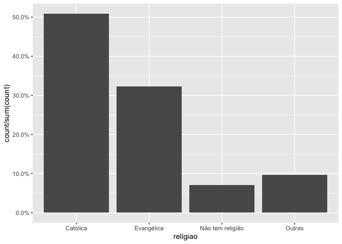
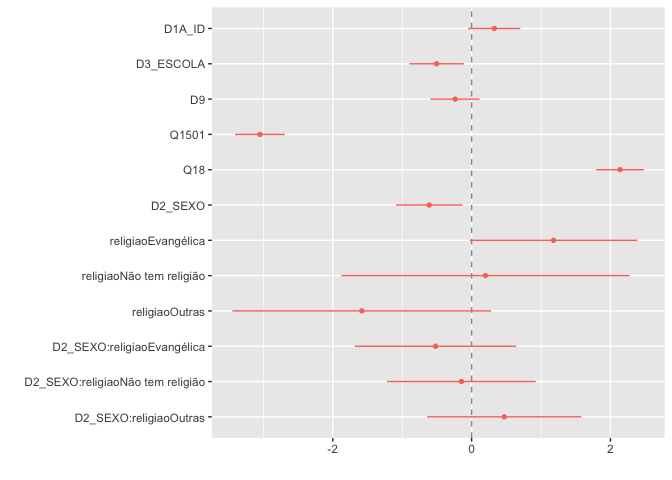
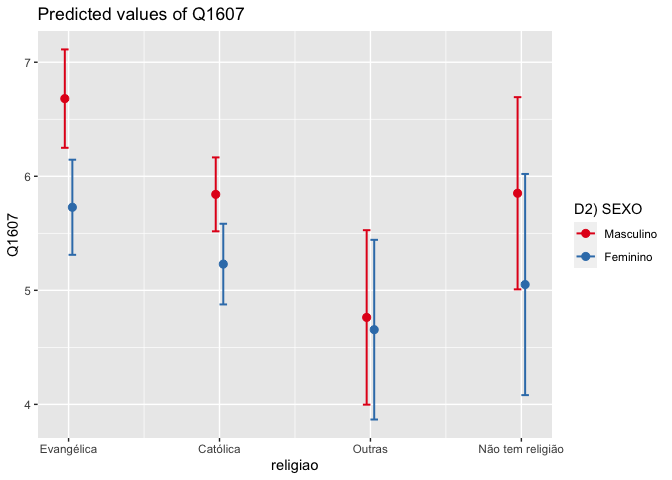

Exercicio 9
================
Gabriela Vilela

### Continuaremos com a utilização dos dados do ESEB2018. Carregue o banco da mesma forma que nos exercicios anteriores

``` r
library(tidyverse)
library(haven)
library(scales)

link <- "https://github.com/MartinsRodrigo/Analise-de-dados/blob/master/04622.sav?raw=true"

download.file(link, "04622.sav", mode = "wb")

banco <- read_spss("04622.sav") 

banco <- banco %>%
  mutate(D10 = as_factor(D10)) %>%
  filter(Q1607 < 11, 
         Q18 < 11,
         D9 < 9999998,
         Q1501 < 11)

banco$Q1607 <- as.numeric(banco$Q1607)
```

### Crie a mesma variável de religião utilizada no exercício anterior

``` r
Outras <- levels(banco$D10)[-c(3,5,13)]

banco <- banco %>%
  mutate(religiao = case_when(D10 %in% Outras ~ "Outras",
                              D10 == "Católica" ~ "Católica",
                              D10 == "Evangélica" ~ "Evangélica",
                              D10 == "Não tem religião" ~ "Não tem religião"))


ggplot(banco, aes(religiao, ..count../sum(..count..) )) +
  geom_bar() +
  scale_y_continuous(labels = percent)
```

<!-- -->

### Faça uma regressão linear avaliando em que medida as variáveis independentes utilizadas nos exercícios 7 e 8, idade(D1A\_ID), educação (D3\_ESCOLA), renda (D9), nota atribuída ao PT (Q1501), auto-atribuição ideológica (Q18), sexo (D2\_SEXO) e religião (variável criada no passo anterior) explicam a avaliação de Bolsonaro (Q1607), mas com uma interação entre as variáveis religião e sexo. Exiba o resultado da regressão e interprete os valores dos coeficientes \(\beta\)s estimados.

``` r
Regressao1 <- lm(Q1607 ~ D1A_ID + D3_ESCOLA + D9 + Q1501 + Q18 + D2_SEXO + religiao + religiao * D2_SEXO, data = banco)

summary(Regressao1)
```

    ## 
    ## Call:
    ## lm(formula = Q1607 ~ D1A_ID + D3_ESCOLA + D9 + Q1501 + Q18 + 
    ##     D2_SEXO + religiao + religiao * D2_SEXO, data = banco)
    ## 
    ## Residuals:
    ##    Min     1Q Median     3Q    Max 
    ## -8.942 -2.561  0.361  2.303  9.052 
    ## 
    ## Coefficients:
    ##                                    Estimate Std. Error t value Pr(>|t|)    
    ## (Intercept)                       6.114e+00  5.915e-01  10.338   <2e-16 ***
    ## D1A_ID                            1.065e-02  6.255e-03   1.703   0.0888 .  
    ## D3_ESCOLA                        -1.134e-01  4.491e-02  -2.524   0.0117 *  
    ## D9                               -3.632e-05  2.768e-05  -1.312   0.1897    
    ## Q1501                            -3.956e-01  2.370e-02 -16.696   <2e-16 ***
    ## Q18                               3.150e-01  2.607e-02  12.083   <2e-16 ***
    ## D2_SEXO                          -6.115e-01  2.438e-01  -2.508   0.0122 *  
    ## religiaoEvangélica                1.181e+00  6.146e-01   1.921   0.0549 .  
    ## religiaoNão tem religião          1.986e-01  1.059e+00   0.188   0.8512    
    ## religiaoOutras                   -1.583e+00  9.503e-01  -1.666   0.0960 .  
    ## D2_SEXO:religiaoEvangélica       -3.412e-01  3.895e-01  -0.876   0.3812    
    ## D2_SEXO:religiaoNão tem religião -1.889e-01  6.979e-01  -0.271   0.7867    
    ## D2_SEXO:religiaoOutras            5.041e-01  6.067e-01   0.831   0.4062    
    ## ---
    ## Signif. codes:  0 '***' 0.001 '**' 0.01 '*' 0.05 '.' 0.1 ' ' 1
    ## 
    ## Residual standard error: 3.297 on 1449 degrees of freedom
    ## Multiple R-squared:  0.3028, Adjusted R-squared:  0.297 
    ## F-statistic: 52.44 on 12 and 1449 DF,  p-value: < 2.2e-16

Na interpretação do resultado da regressão, β representa a mudança da
variável dependente para cada mudança em unidades de X. Analisaremos a
seguir o valor de β para cada variável considerada na regressão.

O valor de β para D1A\_ID foi 1,065e-02, com erro padrão de 6,255e-03,
t-valor 1,703 e um alto p-valor de 0,0888, que indica baixa
significância estatística.

O valor de β para D3\_ESCOLA foi -1,134e-01, com erro padrão de
4,491e-02, t-valor de -2,524 e baixo p-valor de 0,0117, indicando haver
significância estatística.

O valor de β para D9 foi -3,632e-05, com erro padrão de 2,768e-05,
t-valor de -1,312 e alto p-valor de 0,1897, que indica baixa
significância estatística.

O valor de β para Q1501 foi -3,956e-01, com erro padrão de 2,370e-02,
t-valor de -16,696 e baixo p-valor \<2e-16, indicando haver
significância estatística.

O valor de β para Q18 foi 3,150e-01, com erro padrão de 2,607e-02,
t-valor de 12,083 e baixo p-valor \<2e-16, indicando haver significância
estatística.

O valor de β para D2\_SEXO (Feminino) foi -6,115e-01, com erro padrão de
2,438e-01, t-valor de -2,508 e baixo p-valor de 0,0122, indicando haver
significância estatística.

O valor de β para religiao - Evangélica - foi 1,181, com erro padrão de
6,146e-01, t-valor de 1,921 e alto p-valor de 0,0549, que indica baixa
significância estatística.

O valor de β para religiao - Não tem religião - foi 1,986e-01, com erro
padrão de 1,059, t-valor de 0,188 e alto p-valor de 0,8512, que indica
baixa significância estatística.

O valor de β para religiao - Outras - foi -1,583, com erro padrão de
9,503e-01, t-valor de -1,666 e alto p-valor de 0,0960, que indica baixa
significância estatística.

Quanto às interações entre as variáveis:

O valor β da interação das variáveis D2\_SEXO (Feminino) e religiao
(Evangélica) foi -3,412e-01, com erro padrão de 3,895e-01, t-valor de
-0,876 e alto p-valor de 0,3812, que indica baixa significância
estatística.

O valor β da interação das variáveis D2\_SEXO (Feminino) e religiao (Não
tem religião) foi -1,889e-01, com erro padrão de 6,979e-01, t-valor de
-0,271 e alto p-valor de 0,7867, que indica baixa significância
estatística.

O valor β da interação entre as variáveis D2\_SEXO (Feminino) e religiao
(Outras) foi 5,041e-01, com erro padrão de 6,067e-01, t-valor de 0,831 e
alto p-valor de 0,4062, que indica baixa significância estatística.

Por fim, o rˆ2, foi de O R-squared de 0,3028, de modo que a variável
dependente é explicada pelo modelo em 30,28% dos casos.

### Interprete a significancia estatística dos coeficientes estimados

``` r
library(dotwhisker)

dwplot(Regressao1,
vline = geom_vline(xintercept = 0, colour = "grey60", linetype = 2))
```

<!-- -->

A análise do gráfica dos coeficientes permite observar o impacto
positivo ou negativo causado por cada variável no modelo, bem como a
interpretação da significância estatística. Caso o intervalo de
confiança da variável ou categoria da variável venha a cruzar a linha
trcejada (zero), diz-se não haver significância estatística. Por outro
ladom haverá significância caso o intervalo de confiança não cruze a
referida linha de interpretação.

Nesse sentido, pode-se afirmar que possuem significância estatística no
modelo as variáveis: D3\_ESCOLA, Q1501, Q18, D2\_SEXO (Feminino).

Quanto às interações entre variáveis:

Entre D2\_SEXO (Feminino) e religiao (Evangélica), observa-se que o
intervalo de confiança cruza a linha de interpretação, de modo que se
pode concluir não haver significância estatística.

Entre D2\_SEXO (Feminino) e religiao (Não tem religião), observa-se que
o intervalo de confiança cruza a linha de interpretação, de modo que se
pode concluir não haver significância estatística.

Entre a variável D2\_SEXO (Feminino) e a variável religiao (Outras),
observa-se que o intervalo de confiança cruza a linha de interpretação,
de modo que se pode concluir não haver significância estatística.

### Faça um gráfico que mostre a interação entre as duas variáveis. Interprete o resultado apresentado

``` r
library(sjPlot)


plot_model(Regressao1, type = "pred", 
           terms = c("religiao", "D2_SEXO"), 
           ci.lvl = 0.95)
```

<!-- -->

A partir da análise gráfica, é possível observar a interação entre as
variáveis religiao e D2\_SEXO em relação à variável dependente (Q1607)
relativa às notas atribuídas a Jair Bolsonaro pelos respondentes.
Pode-se perceber que os intervalos de confiança para as categorias
“feminino” e “masculino” da variável D2\_SEXO diferem bastante em
relação às religiões evangélica e católica. Já quanto à categoria
“outras” da variável regiao, a resposta da avaliação por homens e
mulheres foi praticamente a mesma. Quanto à categoria “não tem religião”
da variável regiliao observa-se que há uma certa coincidência das
respostas de homens e mulheres. Em todos os casos nota-se que Jair
Bolsonaro foi melhor avaliado pelos homens, embora na categoria “outras
religiões” a diferença seja muito pequena. Outro ponto que merece
destaque é o fato de que a categoria pela qual Bolsonaro foi melhor
avaliado foi a dos evangélicos, de ambos os sexos.
